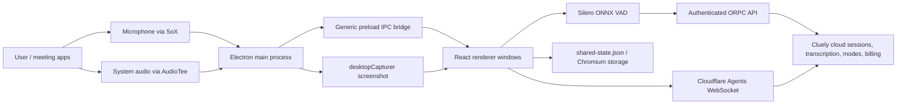

# Cluely architecture

## Observed system

Cluely 2.1.19 is a universal Electron 40 desktop client with a minified ESM main process, a 314-byte context-bridge preload, hashed renderer chunks, two macOS audio executables, local ONNX voice-activity detection, and cloud RPC/chat services. This classification is observed from the executable/framework inventory, `package.json`, `dist-electron/main.js`, and `dist-electron/preload.mjs`; see [identity-and-integrity.txt](evidence/identity-and-integrity.txt) and [static-bundle-map.txt](evidence/static-bundle-map.txt).

The cloud-side boxes are interface observations, not reconstructed server internals. Static resources expose client calls and shapes, but no server implementation.

## Main process and windows

The main process owns application lifecycle, control/chat/settings/notification windows, global shortcuts, drag/resize behavior, permissions, login-item state, screen capture, microphone/system-audio processes, deep links, local shared state, and updates. The strongest evidence is `dist-electron/main.js:15374-16940` as indexed in [static-bundle-map.txt](evidence/static-bundle-map.txt).

Windows are always-on-top style overlays. `setContentProtection` follows the invisible/capture state (`main.js:15374,15475,15591,15660,15845-15847`). Navigation and redirects are constrained to the original renderer origin, and a window-open handler sends valid `https:` and `mailto:` destinations to the OS while denying other window creation (`main.js:15796-15813`). No explicit `nodeIntegration`, `contextIsolation`, or renderer `sandbox` option appeared in the observed `BrowserWindow` options; Electron defaults are therefore an inference, not a verified explicit hardening decision.

## Renderer and IPC boundary

The preload exposes unrestricted channel-level `ipcRenderer.on`, `send`, and `invoke` wrappers plus `platform` to every renderer (`preload.mjs`, one line). Main-process handlers are wrapped in a sender-origin check (`main.js:16668-16688`), which is a meaningful defense. The registered surface remains broad: state patching/reset, update control, permission requests, window movement/bounds, login-item/settings actions, auth-token consumption, audio/session control, and screenshot capture (`main.js:16780-16846`). This is a generic transport boundary rather than a capability-specific typed bridge.

## Audio and transcription flow

The main process launches node-record-lpcm16/SoX for 48 kHz mono microphone capture and AudioTee for system audio, batches system chunks at roughly 50 ms, and broadcasts raw chunks to renderer windows (`main.js:16025-16122`). The renderer runs Silero VAD through ONNX Runtime locally, creates WAV payloads, limits transcription to four concurrent requests, and invokes `transcription.transcribe` over ORPC. It suppresses the local-speaker path while remote/system speech is active to reduce echo (`transcription-C5LDIt8L.js` around bytes 421943-422942). Audio is therefore gated locally but transcribed in Cluely's cloud; no fully local STT path was observed.

## Session and chat flow

Creating a session calls the server and returns a session ID plus `chatAgentName` (`use-create-session-QredbwKK.js`). The renderer connects to a Cloudflare Agents/PartySocket-style room at `wss://api.v2.cluely.com/agents/chat-agent/<name>?_pk=<random-uuid>`, queues/reconnects, and resumes streams (`chat-BH3ET_qx.js` around bytes 260700-271200). Static code does not expose an explicit WebSocket Authorization header beyond the random `_pk`; cookie-based or server-side authorization is unknown.

Completed transcript entries are periodically sent through `sessions.update` (roughly every ten seconds), with a 60-second heartbeat. User chat messages can include the current transcript in an `<audio_transcript>` section; screenshots and partial audio have dedicated agent upload methods (`chat-BH3ET_qx.js` around bytes 745240-746800). The main process has a ten-minute transcript/message inactivity end condition (`main.js:16124-16157`), while a renderer countdown contains a five-minute value. This is a static inconsistency whose actual production behavior needs runtime/server validation.

## Data and state

On macOS, the main process sets `userData` to `appData/cluely-v2-april22` and logs to a sibling `cluely-v2/main.log` (`main.js:16939-16940`). A plain `shared-state.json` holds sanitized onboarding, permissions, display behavior, shortcuts, theme, and entitlement labels; it is written using temporary-file-plus-rename semantics (`main.js:16451-16589`). Chromium storage holds Clerk authentication/session material and renderer localStorage; exact cookie encryption/keychain behavior is not visible statically. No `safeStorage` or Keychain API call was found in application code. See [DATA-AND-NETWORK.md](DATA-AND-NETWORK.md).

## Scheduling, recovery, and updates

Observed client scheduling is timer-based: transcript updates, heartbeats, session/calendar refreshes, post-processing polls, and an hourly update check. There is reconnect/stream-resume logic and bounded transcription concurrency, but no durable local job queue, lease, idempotency key, or crash-recovery journal was found. Server-side queue semantics are unreachable from the DMG and must remain unknown.

The updater is `electron-updater` configured for a Cloudflare R2/S3 release bucket, then overridden to `https://desktop-glass-releases.v2.cluely.com`. It checks immediately and hourly, downloads updates, and can call `quitAndInstall`. On first initialization the app also enables login-item startup (`main.js:15886-15905`).

## Startup boundary and bounded probe

Production code calls `app.moveToApplicationsFolder()` at `main.js:16938` before normal readiness. A single eight-second direct-binary probe was run only after validating an inherited macOS sandbox that denied writes outside a new `/private/tmp` root, denied both Applications locations, denied outbound network, and denied Apple events. It produced no app stdout/stderr or profile files, did not create an installed app, and was terminated as a process group. It did create LaunchServices bundle registration before readiness; the mounted bundle alone was unregistered and zero matches were verified afterward. This confirms a pre-readiness registration/stall but not a completed app move or UI. Full provenance is in [runtime-assessment.txt](evidence/runtime-assessment.txt).

## Unknown server/runtime behavior

- Actual server authorization for the agents WebSocket and every RPC procedure.
- Cloud persistence schemas, encryption at rest, queueing, leases, idempotency, and retention.
- Live feature flags, production entitlements, endpoint responses, and billing amounts.
- Actual permission prompts, cookie/keychain handling, updater behavior, and login-item mutation.
- Visual layout and the claimed screen-share invisibility across capture products.
