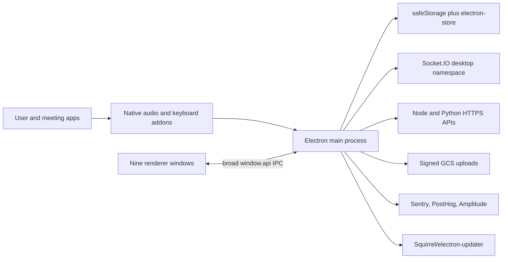

# Final Round architecture

## Executive view

Final Round 2.4.0 is a thin arm64 Electron 39.2.7 desktop client. Electron main owns authentication, HTTP/socket transport, native audio capture, screenshot capture/upload, session orchestration, payments, telemetry, updates, and persistence. Nine React renderer entrypoints invoke those services through near-identical, broad preloads. The product is primarily a cloud-backed interview copilot: native local audio/VAD and local UI state feed remote session, ASR, assistant, file, reporting, and billing services. [Architecture evidence](evidence/architecture-static.txt)

The diagram is directly supported by package metadata, the preload/main service graph, and endpoint inventory; server internals behind the cloud nodes are unknown. [Architecture evidence](evidence/architecture-static.txt) [Network evidence](evidence/network-static.txt)

## Process model

Observed packaged components are the main Electron process, crashpad, GPU/renderer/plugin/general helpers, Squirrel ShipIt, and three first-party native addons. The approved unauthenticated run reached main, crashpad, GPU, network utility, and one renderer before termination. It immediately created isolated Chromium storage/cache, `audio-capture.json`, and local Sentry session/queue files. [Identity evidence](evidence/identity.txt) [Runtime evidence](evidence/runtime-unauthenticated.txt)

`app.requestSingleInstanceLock()` prevents a second primary instance (`main:20913-20919`). `frai` is registered as a protocol handler during startup, then deep links dispatch OAuth callback and payment success/cancel paths with five-second duplicate suppression (`main:7126-7235`). Runtime confirmed the LaunchServices mutation. [Runtime evidence](evidence/runtime-unauthenticated.txt)

## Renderer and IPC boundary

The app has nine entry pages: main, intro, launch setup, session config, pill, audio indicator, interview assistant, capture halo, and coach video. BrowserWindow construction uses `contextIsolation: true` and `nodeIntegration: false`; it does not explicitly set `sandbox` (`main:6129-6248`). Navigation is limited to packaged file/dev URLs, new windows are denied, and external URLs are handed to the OS after a scheme-only allowlist (`main:6719-6740`, `main:7246-7295`).

The material weakness is capability scope. Every widget preload exposes the same surface: access-token/user/payment/resume/report/settings reads; file, resume, screenshot, clipboard, external-open, permission, subscription, and stealth commands; and a wide event set (`preload:47-260`, `preload:388-392`). Main validates sender file URL/path but does not enforce a per-window channel allowlist (`main:6278-6408`). Renderer identity is self-declared over an internal IPC channel (`main:7757-7761`). Consequently, a compromised widget has a much larger main-process capability set than its UI role needs. This is a direct static boundary observation; exploitability was not tested. [Security evidence](evidence/security-static.txt)

The default Electron session is shared; no custom session partition was found. Permission handling allows media, display capture, and notifications without per-window origin/role binding (`main:6742-6765`). Per-entry CSPs and navigation controls reduce web injection exposure but do not compensate for excessive post-compromise IPC authority. [Architecture evidence](evidence/architecture-static.txt)

## Authentication and secrets

OAuth uses external-browser login, S256 PKCE, random state, and a ten-minute pending-flow lifetime, then handles `frai://callback` (`main:9990-10001`, `main:10387-10560`). Access/ID tokens remain in memory. Refresh token and cached user are stored with a wrapper around Electron safeStorage (`main:10049-10385`).

The wrapper's degraded path is unsafe: when safeStorage is unavailable, it records plaintext in electron-store (`main:7787-7884`). The precise macOS Keychain ACL was not inspected. The broad renderer IPC also includes `auth:getAccessToken`, so any renderer that passes packaged-file sender validation can retrieve a bearer token (`preload:47-103`, main IPC/auth handlers). [Security evidence](evidence/security-static.txt)

## Audio, transcript, and assistant path

The client configures 16 kHz mono PCM for STT, 48 kHz stereo for recording, bounded buffers, and Core Audio taps on macOS 14.2+ with ScreenCaptureKit fallback on macOS 13+ (`main:3516-3649`). `audio_capture.node` links the expected media frameworks and retains symbols/strings for Core Audio taps, ScreenCaptureKit, TCC, aggregate devices, and WebRTC AEC. A bundled Silero ONNX model gates speech locally with a bounded drop-oldest queue (`main:6041 onward`). [Architecture evidence](evidence/architecture-static.txt)

The Socket.IO client uses WebSocket-only transport and a bearer token in socket auth, reconnects with exponential jitter, and reissues ASR state on reconnect (`main:5562-5945`). Inbound Zod checks are warning-only: invalid payloads still reach handlers (`main:5731-5753`). Interview messages are held in an in-memory per-session map capped at 100 and cleared on teardown (`main:12082-12346`). Server report/transcript persistence exists through API calls, but the backing model is opaque. [Network evidence](evidence/network-static.txt)

## Screenshot and visual context path

The desktop captures the chosen display with `desktopCapturer`, enables content protection across app windows, waits 150 ms, converts to JPEG with a 1920-pixel maximum and quality 85, then returns base64 (`main:16503-16576`). The interview service uploads that base64 to a Python API (`main:12120-12129`). Production does not keep a local screenshot file in this path; development has a debug-write branch. [Feature evidence](evidence/features-static.txt)

## Session lifecycle and failure semantics

Launch checks privilege, closes the first server-reported active session, creates a new session, connects room/ASR, waits up to 25 seconds for transport, loads settings, and rolls back tracked side effects on failure (`main:15808-16135`). An in-memory XState machine covers idle/launching/active/ending/failed and uses 30-second watchdogs plus best-effort teardown (`main:16287-16496`).

This is competent single-session orchestration, but no local durable queue, lease, idempotency key, crash checkpoint, or safe resume journal appears in the complete first-party storage/service inventory. Closing an active session before launch is not equivalent to crash recovery. Socket reconnect restores transport/ASR, while some busy code/system-design requests are dropped rather than replayed. Backend-only recovery remains unknown. [Architecture evidence](evidence/architecture-static.txt)

## Storage map

Observed local namespaces are `auth`, `device`, `capability-preferences`, `shortcut-state`, `audio-capture`, `speech`, `stealth`, `pill-widget`, and development-only network debug. Chromium also creates standard Cookies, Local/Session Storage, DIPS, cache, GPU cache, Crashpad, and Sentry SDK files under user data; the bounded run confirmed those path classes. [Runtime evidence](evidence/runtime-unauthenticated.txt)

The client persists device ID, refresh token/cached user, capture/shortcut/capability/stealth/widget preferences, and Chromium session state locally. Live interview message state is memory-only. Remote sessions, goals, resumes, reports, screenshots, subscription state, and likely transcripts flow through cloud APIs. [Data/network document](DATA-AND-NETWORK.md)

## Feature flags and environment

Production endpoints, public authentication/analytics client identifiers, update channel, build SHA, VAD gating, and distribution/channel data are compiled into main (`main:3352-3460`). `E2E_CDP_PORT` can enable remote debugging even in a packaged app (`main:20932-20942`). The audit redacted public ingestion identifiers and did not attempt to activate debugging. [Network evidence](evidence/network-static.txt) [Security evidence](evidence/security-static.txt)

## Architecture unknowns

- Server-side session queues, data model, encryption, retention, idempotency, authorization, and report generation.
- SafeStorage's effective Keychain item/access-control details.
- Authenticated renderer transitions, audio permission behavior, and update verification in a real production run.
- Original unminified source, build pipeline, dependency lockfile, SBOM, and native-addon source provenance.
