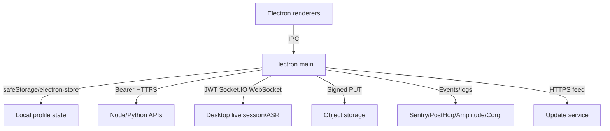

# Final Round data and network map

## Trust-boundary summary

The desktop combines local device/profile state with cloud-owned interview sessions, ASR/assistant transport, resume/report APIs, object uploads, billing, and telemetry. The client code reveals request destinations and shapes, but not backend authorization, databases, encryption, retention, deletion, or queue semantics. Those server properties remain `UNKNOWN`. [Network evidence](evidence/network-static.txt)

## Local data

Observed electron-store namespaces are auth, device, capability preferences, shortcut state, audio capture, speech, stealth, pill widget, and development network debug. Runtime also confirmed standard Chromium Cookies, Local/Session Storage, DIPS, caches, Crashpad, Sentry session/scope/queue, and `audio-capture.json` under user data. Raw runtime payloads were not opened or retained. [Architecture evidence](evidence/architecture-static.txt) [Runtime evidence](evidence/runtime-unauthenticated.txt)

| Data | Local treatment | Evidence/limit |
|---|---|---|
| Access/ID token | Memory only | `main:10049-10385` |
| Refresh token/cached user | safeStorage ciphertext in electron-store; plaintext fallback if unavailable | `main:7787-7884` |
| Device ID | Persistent encrypted random value | `main:11280-11409` |
| Capture/shortcut/stealth/UI preferences | electron-store namespaces | main storage inventory |
| Live interview messages | In-memory per-session map, max 100, cleared at teardown | `main:12082-12346` |
| Chromium web state | Default shared user-data session | runtime file inventory |
| Reports/transcripts/resumes/goals | Cloud API-backed; local persistence not observed beyond cache/UI state | service endpoint inventory |

The safeStorage fallback is an explicit confidentiality downgrade and should not be copied. The exact Keychain item ACL is unknown. [Security evidence](evidence/security-static.txt)

## Production destinations

- Core Node API: `https://prod-finalroundai.frai.pro/api`
- Python API: `https://prod-finalroundai.frai.pro`
- Socket: `https://prod-finalroundai.geofrai.pro`, namespace `/desktop`, path `/core/socket.io`
- Authentication: `clerk.finalroundai.com`
- Updates: `https://releases.finalroundai.com/latest`
- Telemetry: Sentry ingest, PostHog US ingestion, Final Round Amplitude proxy, and Corgi metrics
- Video coach: Daily/Pluot-related CSP resources
- File upload: server-generated Google Cloud Storage signed URLs

These are compiled first-party destinations from `main:3352-3460`, CSPs, service calls, and `app-update.yml`. Public client/ingestion identifiers were observed but redacted from this audit. [Network evidence](evidence/network-static.txt)

## Visible API surface

| Domain | Visible operations |
|---|---|
| Sessions | create/add, launch, active list, end, get, ready/archive lists, update, transcription metadata, last-used config |
| Goals | create/read/update/delete |
| Files/resumes | list, native select, signed upload URL, access URL, phone audio, resume list/upload/delete |
| Reports | list, document, transcript, regenerate |
| Preferences/models | read/update interview settings; model list |
| Screenshot | base64 interview screenshot upload |
| Payments | plans, checkout/customer session, privilege, subscription, customer portal |
| Support | contact form |

Sources are the first-party main service implementations summarized in [network evidence](evidence/network-static.txt). The list is not proof that every endpoint is currently enabled server-side.

## Authentication and request metadata

HTTP uses bearer access tokens obtained through the auth provider. The Socket.IO connection sends a bearer token in its `session` auth field and application/device headers (`main:5562-5644`). Requests add a persistent device ID, platform, OS, app/build/distribution, timezone, screen resolution, and macOS hardware model; checkout can also emit a browser fingerprint for fraud handling (`main:11280-11409`, `main:12683-12699`). [Network evidence](evidence/network-static.txt)

The socket is WebSocket-only and manually reconnects with exponential jitter. Its runtime payload validation is warning-only and does not stop handlers (`main:5731-5753`). HTTP calls generally use ten-to-thirty-second timeouts and no default retry. These decisions are suitable for live-session responsiveness but are not a durable work queue. [Architecture evidence](evidence/architecture-static.txt)

## Telemetry and privacy

Sentry initializes with logs enabled, production tracing sample rate 0.5, and error sample rate 1.0 (`main:6409-6456`). PostHog and Amplitude identify authenticated users with ID, email, and name (`main:10489-10501`, `main:21458-21469`). Local electron-log file output is disabled, but sanitized structured logs are forwarded to Sentry (`main:5100-5194`).

The redactor operates primarily on key names and does not include the generic key `text` (`main:3765-3805`). Transcript-final logging sends an 80-character text prefix, while assistant-final logging sends the full answer through that key (`main:12104-12115`, `main:12251-12255`). Therefore the static call path can place interview content into Sentry logs. Actual production transmission/scrubbing was not validated; the bounded run only confirmed creation of a local Sentry queue under blocked outbound networking. [Security evidence](evidence/security-static.txt)

## Upload boundaries

Resume uploads use a native picker, local PDF/DOCX inspection, then a signed object-storage URL. Local inspection fails open on read/parse errors (`main:11485-11561`). Screenshots are compressed in memory and uploaded as base64 through the Python API (`main:16503-16576`, `main:12120-12129`). Whether servers perform malware scanning, content validation, lifecycle deletion, or signed-URL scoping is unknown.

## Updates

The generic updater polls after one minute and every four hours, does not auto-download, and installs on quit after the user flow (`main:5997-6021`, `main:6882-7124`). The current artifact is signed/notarized. Feed integrity, rollback protection, and production signature rejection were not exercised. [Manifest](MANIFEST.md)

## Feature flags/configuration

Build channel, distribution, endpoints, update channel, build SHA, VAD gating, and public analytics/auth client configuration are compiled into main (`main:3352-3460`). Development debugging is conditionally enabled by environment, including packaged remote debugging via `E2E_CDP_PORT` (`main:20932-20942`). No remote feature-flag service was identified beyond server-returned capabilities/settings.

## Bluey implications

- Keep Bluey's account/identity scoped storage and AES-GCM profile snapshots; do not adopt a plaintext secret fallback. [Bluey map](evidence/bluey-code-map.txt)
- Apply value-aware transcript/answer redaction before any telemetry sink, with telemetry off by default for raw content.
- Enforce schemas at the remote boundary; malformed live events should be rejected or quarantined, not passed to handlers.
- Preserve Bluey's durable receipts/idempotency/lease design for job submissions; Final Round's memory-centric live-session lifecycle is not a substitute.
- Add an explicit user-facing telemetry/privacy inventory and retention controls before copying Final Round-style rich event instrumentation.
