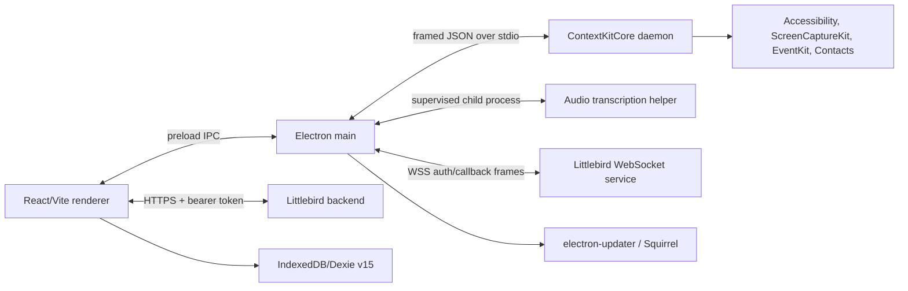

# Littlebird architecture

## System shape

Littlebird 0.81.11 is a mixed Electron/native macOS application. Electron owns UI, authentication, renderer persistence, telemetry, WebSocket connectivity, updating, and helper supervision. A Swift `ContextKitCore` daemon handles cross-application context and meeting/calendar-related native work. A second Swift helper handles audio transcription when feature-enabled. Evidence: E-LB-ARCH-001, E-LB-ARCH-004, E-LB-ARCH-005, E-LB-ARCH-008.

This diagram reflects statically reachable client control flow. Server internals were not available.

## Electron boundary

The package entrypoint is `dist-electron/main/index.js`; preload is `dist-electron/preload/index.mjs`; renderer bundles are React 19/Vite/TanStack assets. The signed asar contains 70,445 paths and production source maps with original sourcesContent. Evidence: E-LB-ARCH-001 through E-LB-ARCH-003.

Main, meeting, and notification windows explicitly disable Node integration and enable context isolation. External windows are denied and HTTP(S) links are sent to the system browser. However, no window explicitly enables `sandbox`, no CSP was found, and preload exposes generic `ipcRenderer.on/off/send/invoke` without channel allowlisting. Sensitive main handlers lack a common sender-origin validator. Evidence: E-LB-ARCH-007 and E-LB-SEC-004.

## ContextKit process and data flow

Main launches `ContextKit-cli --daemon` and exchanges framed JSON over stdio. It queues messages while the helper starts, assigns 10-second callback timeouts, and retains critical state for replay after the helper pings ready. Replay ordering covers authentication, user/subscription, feature flags, exclusions, observer settings, calendar, and iMessage configuration. A PID file and process-identity check protect stale cleanup. Unexpected exits receive at most five exponential-backoff restarts. Evidence: E-LB-ARCH-004.

The native binary and its 46 bundled parser resources show an accessibility-tree pipeline with per-application/browser parsers, a generic fallback, screenshot/JSON context collection, redaction/exclusion structures, EventKit, and meeting capture. This is implementation evidence of intended behavior, but not proof of capture accuracy or redaction completeness. Evidence: E-LB-ARCH-008.

## Audio helper

`LittlebirdAudioTranscription` starts only when `LB_AUDIO_TRANSCRIPTION_PROCESS_ENABLED=true`. It has a PID file, capped restart backoff, and a 30-second healthy-period reset. Linked frameworks include AVFoundation, Speech, Network, CoreData, CryptoKit, SQLite, and GRDB-related code. Evidence: E-LB-ARCH-005 and E-LB-ID-008.

## Network and synchronization

Main maintains an authenticated WSS connection with callback correlation, ping/inactivity detection, reference counting, exponential reconnect, and sleep/resume recovery. Reconnect rejects pending callbacks, and no durable outbound queue was found. Renderer uses bearer access tokens, validates WSS payloads, assigns a per-window source ID, persists through IndexedDB, and maintains local search. Evidence: E-LB-ARCH-006.

This reliability design is suitable for an interactive assistant where the backend remains authoritative, but it is not equivalent to a durable job runner: the helper queue, critical-state map, and WebSocket callback table are in memory. Full-process failure can lose pending work. Evidence: E-LB-ARCH-004 and E-LB-FEAT-008.

## Local persistence

Renderer uses Dexie database `littlebird`, schema version 15, with tables for threads, messages, journals, meetings, projects, files, arenas, MCP grants, user configuration, and sync metadata. `BroadcastChannel('littlebird-sync')` coordinates windows. Database upgrade clears local data for a full bootstrap; a corrupt-open recovery deletes and recreates the database. No IndexedDB encryption layer was found. Evidence: E-LB-ARCH-009.

Electron auth uses a separate `electron-store` record and the native helpers maintain PID/config state under Electron `userData`. Secret-storage concerns are detailed in [SECURITY.md](SECURITY.md).

The bounded launch confirmed that main resets `userData` to the macOS `appData/Littlebird` location, overriding the supplied `--user-data-dir` for early stores/Crashpad. Isolation therefore required redirecting that exact newly created path into the disposable profile. This behavior should be considered when designing test harnesses and enterprise data-location controls. Evidence: E-LB-RUN-002 through E-LB-RUN-004.

## Local tool automation

An Axon path accepts backend-originated tool frames, validates inputs with Zod, evaluates local allow/ask/deny policy, issues consent requests with read/update/destroy risk categories and expiration, executes the local tool, and returns a result. This is a meaningful human-authorization boundary, but it is general local-tool automation—not an ATS adapter/state machine. Evidence: E-LB-FEAT-008.

## Updates and flags

`electron-updater` points to architecture-specific paths under `https://downloads.littlebird.ai`; channel selection is feature-access controlled (`latest`, `beta`, `alpha`). Auto-download and downgrade are enabled, differential download is disabled, and checks occur every 15 minutes. Installation waits for active meetings to finish and cleans up helpers first. Evidence: E-LB-ARCH-011.

Production/development behavior is environment-controlled, including backend/public/WSS endpoints, telemetry SDKs, audio helper enablement, remote debugging, and other feature flags. Values that function as credentials or client tokens are intentionally excluded from this audit.
