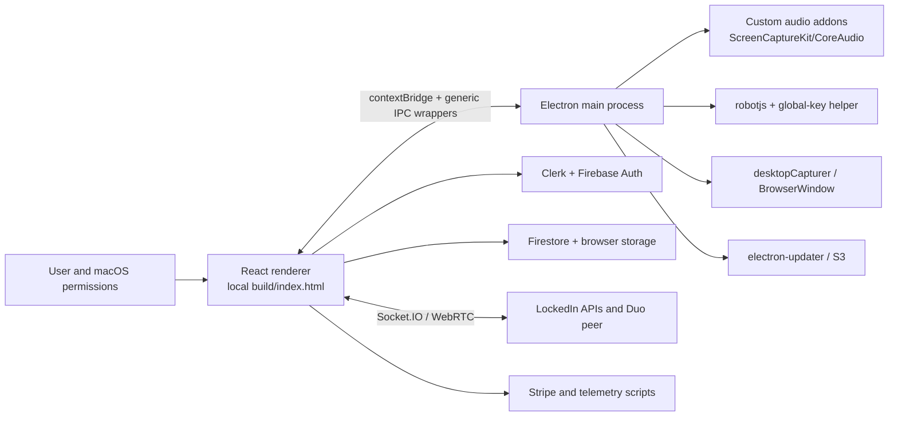

# LockedIn architecture

## Executive model

LockedIn 1.7.5 is an Electron/React desktop client organized around a privileged Electron main process, a sandboxed/context-isolated but broadly bridged renderer, native audio/input helpers, Firebase/Clerk identity and persistence, first-party interview APIs, Socket.IO/WebRTC real-time sessions, and S3-driven updates. The process composition, renderer sandbox, unauthenticated sign-in route, offline fallback, and profile footprint were confirmed in one approved isolated launch; server implementation and authenticated runtime policy remain unavailable. Sources: [main-process evidence](evidence/electron-main-observations.md), [preload evidence](evidence/preload-ipc-observations.md), [renderer evidence](evidence/renderer-features.md), and [runtime evidence](evidence/runtime-unauthenticated.md).

## Technology and package layout

- `package.json` names `public/electron.js` as the main entrypoint and includes React 18, Firebase, Clerk, `electron-updater`, `socket.io-client`, robotjs, global-key listener, PDF/DOCX tooling, Recharts, and other renderer packages. The ASAR inventory and verified hashes are in [asar-inventory.txt](evidence/asar-inventory.txt).
- The main and preload sources are readable bundled JavaScript. The renderer is a minified Create React App-style bundle with no first-party source map. `build/electron.js` and `build/preload.js` are duplicated under `public/build` as packaged resources. This limits component-level attribution but not stable-literal/call-shape analysis ([renderer evidence](evidence/renderer-features.md)).
- Native modules provide architecture-specific system-audio capture, robot input automation, global-key handling, filesystem notifications, and PDF canvas support ([native-components.txt](evidence/native-components.txt)).

## Process boundaries

### Main process

The main process owns windows, permissions/status checks, audio capture, display capture, global shortcuts, log reads, updater state, deep links, external URL opening, and remote input execution. It creates the main window with Node integration disabled and context isolation enabled. Although no explicit `sandbox: true` appears in the BrowserWindow options, the runtime renderer command contained `--enable-sandbox`; this is now an observed protection rather than an uncertainty. It also creates cursor and document windows; the document window shares the default Electron session and the same preload. Exact line ranges are catalogued in [electron-main-observations.md](evidence/electron-main-observations.md).

The main process keeps the app alive when windows close, restarts failed/unresponsive renderers within fixed bounds, and auto-checks for updates. Audio capture has separate liveness/restart thresholds. Runtime confirmed the explicit auto-update check still runs when `ELECTRON_NO_UPDATER=1` is present; blocked egress prevented completion. These are local resilience loops, not durable server-side job queues (`app.asar:public/electron.js:89-234,441-701,903-930,2218-2463`; [runtime evidence](evidence/runtime-unauthenticated.md)).

### Preload and renderer

The preload exposes many named capabilities plus generic `send`, `on`, `invoke`, and listener-removal wrappers. The renderer therefore has access to any registered main-process channel that does not independently reject it. The main window is context-isolated, but this broad capability bridge is the practical trust boundary; see [preload-ipc-observations.md](evidence/preload-ipc-observations.md).

The local renderer supplies authentication, dashboard/session workflows, audio/transcript state, prompt/preset UI, documents, reports, Duo, billing, and settings. It also loads live third-party scripts from `build/index.html`; no static CSP was found ([renderer-features.md](evidence/renderer-features.md)).

### Native helpers

The custom audio layer links AudioToolbox/CoreAudio/AVFoundation/ScreenCaptureKit and exports create/start/stop/callback functions. Robotjs exposes mouse/keyboard/screen primitives. The global-key helper is a child process that the packaged application is wired to chmod and spawn. The approved launch loaded/found the arm64 audio addon but did not start capture or request permission; robotjs, MacKeyServer, PDF native paths, and remote input were not invoked. Architecture asymmetries are captured in [native-components.txt](evidence/native-components.txt).

## Primary workflows and data flow

### Authentication and onboarding

1. Browser authentication returns via the `locked-in:` protocol.
2. The main process parses a Firebase custom token and Clerk user ID, then sends them to the renderer.
3. The renderer signs into Firebase and stores the last Clerk user ID locally.
4. Firebase Auth/Firestore and first-party API calls use identity tokens.

Steps 1-3 are statically observed (`public/electron.js:2466-2585` and the renderer auth calls). Token lifetime, server exchange validation, replay prevention, and logout revocation are unknown. See [storage-inventory.md](evidence/storage-inventory.md).

The isolated unauthenticated launch reached `build/index.html#/sign-in` and made no auth transition. It also registered the custom protocol at startup. Scoped unregister was attempted, but LaunchServices retained stale path records after detach; no global database cleanup was used because that could affect unrelated applications ([runtime evidence](evidence/runtime-unauthenticated.md)).

### Live session

1. The renderer checks `/check_running_session` and queries active Firestore sessions.
2. Native microphone/system audio and/or transcript sources feed the session.
3. Socket.IO connects WebSocket-only with a Firebase token and bounded-delay, unbounded-attempt reconnect behavior.
4. Prompts, presets, priority questions, documents, and screenshots provide model context.
5. Chat history, session state, reports, and surveys are written/read through Firestore and APIs.

The client proves these call paths and UI states, not server-side completion or retention behavior. Evidence: [renderer-features.md](evidence/renderer-features.md), [network-inventory.txt](evidence/network-inventory.txt), and [storage-inventory.md](evidence/storage-inventory.md).

### Duo helper and remote input

The renderer creates a WebRTC peer connection from server-provided ICE configuration. A `remote-control` data channel accepts JSON input events and, when renderer state allows control, forwards them through preload IPC to main-process robotjs execution. This chain is observed in static resources. Helper authentication, consent, session binding, audit logs, replay protection, and revocation are **unknown**, and the audit did not exercise the capability ([renderer-features.md](evidence/renderer-features.md); `public/electron.js:2935-3102`).

### Documents and resume review

The renderer uploads/indexes documents, sends job context to `resume_review`, and links to a separate resume web product. Static artifacts do not establish local structural resume diffs/export or an application-specific document pipeline. Evidence: [renderer-features.md](evidence/renderer-features.md) and [network-inventory.txt](evidence/network-inventory.txt).

## Persistence model

Firestore collections hold user preferences, presets, prompts, sessions/chat history, events, and files. Browser local/session storage holds auth SDK persistence and helper/UI state. The main process writes logs and uses the Electron updater cache. No app-specific encrypted database, `safeStorage`, or Keychain integration was found. Exact observed versus inferred storage is separated in [storage-inventory.md](evidence/storage-inventory.md).

## Network and configuration

The static client references LockedIn production APIs, app/resume domains, S3/CloudFront object delivery, Firebase/Clerk, Socket.IO/WebRTC, Stripe, and multiple analytics/attribution services. Endpoint paths and field-name-only request shapes are recorded in [network-inventory.txt](evidence/network-inventory.txt). During isolated runtime, Firestore and update/model-configuration attempts failed through the deliberately closed proxy; a socket snapshot found no live remote TCP/UDP connection.

Configuration is selected from packaged `.env.local` names, including Clerk/Firebase identifiers and an endpoint switch. Values are excluded. The updater separately reads `app-update.yml`. No evidence of a local feature-flag service or signed runtime configuration was found.

## Scheduling, idempotency, and recovery

Observed recovery is client-session oriented: renderer reload limits, audio restarts, WebSocket reconnects, a running-session preflight, and update retry/reporting. No static evidence establishes server worker leases, durable queues, idempotency keys, final-side-effect journals, or replay-safe job execution. LockedIn may implement backend mechanisms not shipped in the DMG; they remain unknown, not absent server-side. Static evidence: [electron-main-observations.md](evidence/electron-main-observations.md) and [renderer-features.md](evidence/renderer-features.md).
