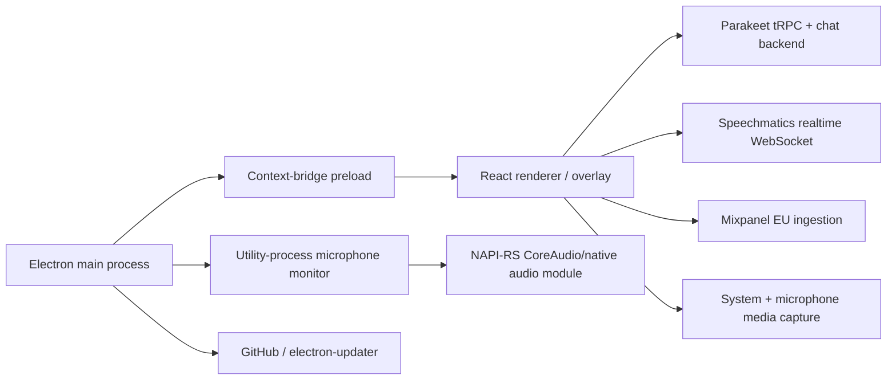

# ParakeetAI architecture

## Observed process model

The application is an Electron 38.8.6 desktop client with four trust-relevant execution areas. Evidence for entry points, bundle sizes/hashes, worker and native-module inventory is in [bundle-static.txt](evidence/bundle-static.txt).

The constrained unauthenticated run confirmed a main process plus GPU, network-service, renderer, and Node-utility helpers. CDP exposed a single renderer page at the packaged `file:` URL with an `Electron Isolated Context` and a separate default context. `require`, `process`, and `global` were undefined in the default world while the six-key `window.electron` bridge was present. Because the outer network sandbox required a harness-only `--no-sandbox`, that run confirms context isolation but does not establish production Chromium-sandbox enforcement. [runtime-unauthenticated.txt](evidence/runtime-unauthenticated.txt)

The main process creates a transparent, frameless, non-resizable overlay and loads a local renderer file. Static calls place it across workspaces and manage topmost/private behavior. The permission handler admits the Electron `media` permission; new-window requests are denied inside the app and handed to the operating system's external browser. These observations are in `app.asar::dist/main/main.js` around bytes 395000–396100; the exact member digest is in [bundle-static.txt](evidence/bundle-static.txt).

The 1,330-byte preload exposes `platform`, OS version, loopback-audio controls, a meeting-toast flag, and a generic `ipcRendererProxy` with arbitrary `invoke(channel, ...args)` and `on(channel, callback)` forwarding. The exact bridge offsets are 367, 434, 817, 907, 977, and 1087 in `app.asar::dist/main/preload.js`. There is no channel allowlist in that member. This makes the renderer-to-main boundary broad even though the renderer is loaded locally; the security consequence is analyzed in [SECURITY.md](SECURITY.md).

## Startup, lifecycle, and window behavior

Observed main-process behavior:

1. Register the `parakeetai` default protocol, request single-instance ownership, and route second-instance/deep-link payloads to the existing process (`dist/main/main.js`, bytes 397000–402000).
2. Create the overlay, tray/menu behavior, global shortcuts, update manager, protocol handlers, and optional login item.
3. Optionally fork `dist/main/mic-monitor-worker.js` through `utilityProcess.fork` (main byte 409435). The worker calls the native package to identify applications actively using microphone input.
4. Continue in the background when appropriate and present a meeting-start toast for configured communication applications.

The app does not ship a launch agent. Login-item persistence is an Electron API call. Update checks are driven by `electron-updater`/Squirrel; the static client schedules recurring checks and can install on quit. The release source is the GitHub repository named in `Resources/app-update.yml`. Static resources also contain server-driven severity/forced-update handling. This establishes client update mechanics, but not the remote repository's current security, release signing workflow, or rollback protections. [identity.txt](evidence/identity.txt), `app.asar::dist/main/main.js` bytes 413000–417000.

## Authentication and session initialization

Observed flow:

1. The desktop opens `<api-root>/auth/desktop?protocol=parakeetai` in the external browser.
2. A `parakeetai:` deep link carries base64-encoded JSON for either authentication or a call session. Static field names include `authToken` and `callSessionId` (`dist/main/main.js`, bytes 397495–398536).
3. Main-process code sets both `__Secure-next-auth.session-token` and `next-auth.session-token` cookies for the configured API origin, flushes the cookie store, and notifies the renderer. The cookies are secure and `SameSite=None`, but explicitly not HttpOnly (main bytes 433851–434140).
4. The renderer calls tRPC and `/api/chat` with credentials included. A manual-token fallback is present in the UI.

Production, staging, and local API roots are selectable by static configuration. An optional deployment-bypass token is encrypted through Electron `safeStorage` and base64-encoded before being persisted; other ordinary settings are stored as settings values. This describes only the client. Server token issuance, cookie validation, revocation, and session binding were not available. `app.asar::dist/main/main.js` bytes 432556–436500; [bundle-static.txt](evidence/bundle-static.txt).

## Live-call data flow

The observed user flow is interview/meeting assistance, not job-application automation:

1. The renderer creates a regular or interview call session. Interview setup can include company, job title/description or scraped job URL, a selected resume, supplemental documents, language, model, and additional instructions.
2. Renderer media code requests system/loopback audio and microphone audio. A bundled native audio processor supports echo processing. Speech audio is framed at 16 kHz.
3. The backend mints a Speechmatics token scoped through a call-session procedure. The renderer opens `wss://eu2.rt.speechmatics.com/v2` with that token in the `jwt` query parameter (renderer byte 149538).
4. Partial/final transcript state is held in the renderer. Batched final transcripts are sent through `callSession.transcription.createMany`; pending transcript context is also included when requesting `/api/chat`.
5. AI responses can be triggered manually, automatically after speech, by a direct text message, or by analyzing a captured screen. Past transcript and AI messages are queried from the backend and rehydrate the session.
6. Session status, metadata, heartbeat, extension/end, and takeover operations are expressed through the tRPC procedures listed in [bundle-static.txt](evidence/bundle-static.txt).

This is a client-visible flow. The DMG does not expose the backend queue, database, model routing, transcript encryption, or server-side idempotency design.

## Meeting detection

The `mic-monitor-worker.js` utility process polls a cross-platform native module. On macOS the shipped Rust source asks CoreAudio which processes and devices currently have active input. Static renderer/main resources map recognized bundle/process names for Chrome, Firefox, Zoom, Slack, Arc, Dia, Webex, Teams, Safari, WhatsApp, Aircall, FaceTime, Edge, VooV, Tuple, Brave, Comet, Discord, Vivaldi, ChatGPT Atlas, Zen, Dialpad, Dialpad Meetings, and Gather. The detector can show a toast when such an app begins/stops using the microphone. This list and behavior are observations from `app.asar::dist/main/main.js`, `dist/main/mic-monitor-worker.js`, and the unpacked native source; [bundle-static.txt](evidence/bundle-static.txt).

Inference: microphone-activity detection should reduce false positives compared with a frontmost-app-name heuristic. Static analysis cannot establish polling cost, false-positive/negative rate, OS-permission behavior, or parity of the Windows implementation.

## Concurrency, recovery, and duplicate boundaries

Observed session safeguards are live-call oriented:

- The client pings a plan session periodically and offers `callSession.takeOver`; UI text states takeover interrupts another device. This is visible at renderer byte 982007 and adjacent call sites.
- Start/restart/stop/recover actions are serialized by a client action queue.
- Speech liveness monitors last audio, warns before stopping, and has a bounded automatic-recovery budget that resets after stable recording.
- Backend transcript/AI history can rehydrate a session.
- Transcript segments remain local until `transcription.createMany` succeeds. A desktop crash can therefore lose the not-yet-persisted tail; no durable local transcript journal was observed.

No durable local job queue, execution lease, irreversible-submit marker, or application idempotency mechanism was observed because the product's static functionality is call assistance, not browser application submission. This is materially different from Bluey's Jobs workflow design; see [BLUEY-GAP-MAP.md](BLUEY-GAP-MAP.md).

## Storage boundary

Static mechanisms are Electron Settings, Chromium cookies/cache/LevelDB/session stores, updater state, and Electron logs. The isolated run concretely created those under `/tmp/parakeet-runtime-94e86fe1/profile` and its redirected HOME, including a 1,888-KiB profile, `settings.json`, an empty cookie database, updater UUID, local/session storage, caches, and `home/Library/Logs/parakeetai-desktop/main.log`; all were deleted afterward. Production default paths and file-protection classes were not measured. The backend appears to hold call sessions, transcripts, AI messages, documents, resumes, subscription state, feedback, and user state because the client queries/mutates those entities. That remains an API-shape inference, not a verified server schema. Full details are in [DATA-AND-NETWORK.md](DATA-AND-NETWORK.md).
