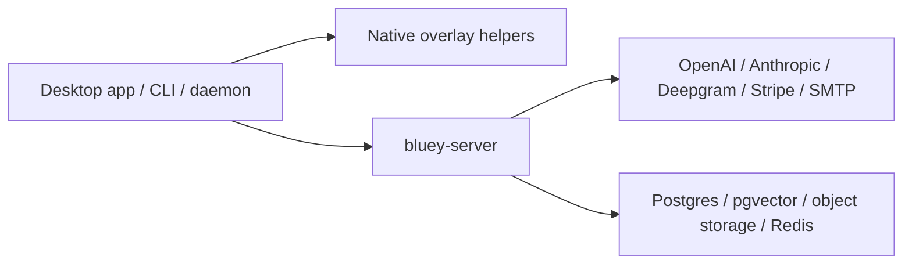

# Bluey End-To-End Agent Context

Last updated: 2026-05-25

This is the current, canonical handoff for a new Codex/Kiro-style agent joining
the Bluey repo. Read this before making product, backend, overlay, routing, or
deployment changes.

Code snapshot before this documentation pass:

- Branch: `feat/phase-3-round-12`
- Code tip: `3c13ed7 feat(server): add cloud stt fallback routing`
- Working tree note: `bluey-dev.db` may be untracked local data. Do not stage it.
- Latest full verification at the code tip: formatting, clippy, workspace
  tests, server tests, UI build, and `git diff --check` were green.

## Product Mental Model

Bluey is a lightweight native AI overlay for live work. The customer-facing
daily flow should feel like:

1. Install Bluey.
2. Run `bluey on`.
3. If the user is not linked, Bluey opens the browser link flow once and keeps
   the overlay/pill ready.
4. A compact Bluey pill appears on screen.
5. Clicking the pill opens the main overlay.
6. The user can listen, attach docs, analyze screen context, type questions,
   and get streaming answers.
7. Every recording/session is saved and can be reopened, renamed, searched, and
   synced.
8. `bluey off` stops the daemon.

The core promise is not "terminal commands forever". The CLI remains the launch
and support surface, but the normal product should be one command plus a polished
overlay.

Public domain target: `bluey.sh`. Use one public product domain unless there is
a clear operational reason to split subdomains behind the reverse proxy.

## Current Architecture

Bluey now has three layers:



Desktop layer:

- `bluey` CLI starts/stops/statuses the local daemon.
- `bluey-daemon` owns sessions, audio capture, STT, overlay IPC, cloud sync,
  local cache, balance polling, and managed LLM calls.
- Native macOS helpers handle overlay, system audio, and whisper.
- Windows helper code exists but is not production-shipped yet.

Server layer:

- `server/` is `bluey-server`, a Rust Axum service.
- It owns auth, device linking, wallet/billing, pricing, provider routing,
  cloud sync/RAG, usage, metrics, GDPR export/delete, and account operations.
- Provider keys live server-side. Do not put production OpenAI/Anthropic/
  Deepgram keys into the customer desktop.

Storage layer:

- Local: SQLite cache, settings, queued sync, and offline/dev state.
- Cloud target: Postgres plus pgvector for sessions, transcripts, document
  chunks, embeddings, billing/account state, audit records, and RAG.
- Redis: shared rate/capacity ledger when more than one server process exists.
- Object storage: screenshots, attached files, exports, and optional retained
  audio artifacts.

## Implemented Product Flow

### Launch

- `bluey on` starts the daemon and overlay.
- `bluey off` stops Bluey.
- `bluey status` reports local state.
- Login/linking is intended to be driven by `bluey on` when needed. CLI auth
  commands may exist for support/dev, but the product should not require users
  to learn separate commands.

Expected UX rule: if login is needed, open the link flow once and keep the pill
visible/ready. Do not repeatedly redirect or hide the product behind a browser.

### Overlay

The current design target:

- Compact pill appears by default.
- Click pill -> expanded overlay.
- Hide -> returns to pill.
- Close/quit should explain how to restore (`bluey on`) if it actually stops.
- Expanded overlay is movable and resizable within sensible min/max bounds.
- Header must never be cropped: navigation/history, balance, model route, and
  hide/close controls must fit dynamically.
- Transcript/history panes must scroll inside fixed regions. New transcripts
  must not grow the whole window.
- Overlay content should be capture-excluded in normal OS screen-capture paths.
- Debug capture-visible mode is for local smoke testing only and must never ship
  enabled.

Target main overlay layout:

- ChatGPT-like conversation area.
- User/system transcript and typed user prompts align to the right.
- Bluey answers align to the left.
- Attached files render as compact chips/cards above the composer.
- Bottom composer grows with typed text, like modern chat tools.
- Composer row contains attach, style, listen/stop, route/model selector, screen
  analysis, and send.
- "Vision" should be triggered by the Screen/Analyze button, not exposed as a
  normal route choice.
- "Local" should not appear in customer route choices. It is hidden fallback/dev
  infrastructure.
- Session drawer shows prior recordings, supports load/continue and inline
  rename.
- Style/instructions should be inline, not a modal that hides the app.

### Audio And STT

Implemented paths:

- Continuous streaming audio path in the daemon has an STT provider chain:
  Deepgram, OpenAI Realtime, LocalWhisper.
- Chunked server transcription path `/router/transcribe` now tries Deepgram
  first and falls back to OpenAI `gpt-4o-mini-transcribe`.
- Auto-stop exists for no-transcript idle periods to avoid wasting money.

Product rules:

- Mic/system transcripts stay source-labeled.
- Partial transcripts may be shown live, but final transcript segments must be
  stored and associated with the session.
- If there is no transcript for 5 minutes while listening, stop recording and
  refresh balance.

### Answers, Canvas, And Artifacts

Implemented direction:

- Managed answer calls go desktop -> server -> provider.
- Routing metadata and cost labels are threaded toward the UI.
- Server-side artifact metadata exists/has been discussed and should become the
  canonical signal for when to open canvas.

Product rules:

- Typed question should start answering in roughly 0.5-1.5 seconds when cached/
  warm.
- Audio question after speech ends should start in roughly 1-2.5 seconds.
- Screen analysis should start in roughly 2-5 seconds.
- Deep coding/system-design questions should show a useful first answer in
  roughly 2-4 seconds, with the full answer streaming longer if needed.
- If speculative draft/final is enabled, update the same answer card in place.
  Do not append a random second answer card that confuses the user.
- Canvas auto-opens only for artifact-style work: code, system design,
  architecture, docs/plans, tables, or screen-analysis artifacts.
- Chat remains the explanation/answer surface. Canvas is the structured artifact
  surface.
- For code changes, the answer should explain the plan and canvas should carry
  the full replacement or diff-like artifact. Do not emit tiny disconnected line
  fragments unless the artifact type explicitly calls for a patch.

## Managed Model Routing

Current source of truth: `docs/MODEL-ROUTING.md`.

Current managed lanes:

| Bluey lane | Provider/model | Use |
| --- | --- | --- |
| `instant` | OpenAI `gpt-4o-mini` | Easy questions and quick first response |
| `balanced` | Anthropic `claude-3-5-sonnet-latest` | Default technical/general answers |
| `deep` | Anthropic `claude-3-7-sonnet-latest` | Hard coding, system design, reasoning-heavy work |
| `vision` | OpenAI `gpt-4o` | Screenshot/screen/image context |

Current candidate fallback order:

| Lane | Candidate order |
| --- | --- |
| `instant` | OpenAI `gpt-4o-mini` -> Anthropic `claude-3-5-sonnet-latest` |
| `balanced` | Anthropic `claude-3-5-sonnet-latest` -> OpenAI `gpt-4o-mini` |
| `deep` | Anthropic `claude-3-7-sonnet-latest` -> OpenAI `gpt-4o` -> Anthropic `claude-3-5-sonnet-latest` |
| `vision` | OpenAI `gpt-4o` |

Current STT:

| Path | Primary | Fallback |
| --- | --- | --- |
| Continuous daemon STT | Deepgram `nova-3` | OpenAI Realtime `gpt-4o-mini-transcribe`, then LocalWhisper if enabled |
| `/router/transcribe` | Deepgram `nova-3` | OpenAI `gpt-4o-mini-transcribe` |

Current embeddings:

- OpenAI `text-embedding-3-small`

Important model/product rules:

- Codex is not a runtime model. Codex is the development/review agent.
- Gemini is not currently wired. It may be a good future vision/classifier
  candidate, but adding it requires pricing, routing, tests, and docs.
- Groq/Cerebras are mentioned in older strategy docs but are not active in the
  current managed route map.
- Do not silently change model names. Update pricing, routing docs, server
  dispatch, tests, and customer-facing labels together.
- If using "Auto", classify task type and route internally. Users should see
  simple lanes, not raw provider complexity.

## Capacity, Rate Limits, And 1000+ User Readiness

The current product direction is: users should not be blocked just because they
are active and paying. The main hard stop is wallet balance plus provider
capacity, not arbitrary per-account caps.

Implemented capacity layers:

1. Edge/IP buckets for unauthenticated abuse.
2. Provider/model buckets for OpenAI, Anthropic, Deepgram, OpenAI STT, and
   embeddings.
3. Optional emergency per-account guardrails, disabled by default.
4. Provider key pools via comma-separated env vars.
5. Redis shared ledger support for multi-instance capacity.

Key rule: provider key pools are for approved capacity across provider projects,
allocations, regions, or enterprise accounts. Do not frame this as evading
provider limits.

For 1000-10000 users:

- Set `BLUEY_REDIS_URL` before running more than one server instance.
- Keep provider buckets in Redis/shared ledger.
- Add provider key health scoring to the same ledger so unhealthy keys are
  avoided globally.
- Add regional provider allocation and queueing before adding Kubernetes.
- Kubernetes is not needed for the first production pass. A single DigitalOcean
  droplet or small app platform is fine for alpha; add regions/instances when
  metrics justify it.

Redis failure behavior:

- Default: local fallback for realtime availability.
- `BLUEY_RATE_LIMIT_REDIS_STRICT=1`: fail closed during Redis failure.

## Cloud Storage And RAG Direction

User expectation:

- Conversations, transcripts, docs, screenshots, style prompts, and knowledge
  base should survive across devices and sessions.
- Old sessions should load with their attached docs/chips and context.
- Cloud RAG should power cross-session memory.

Recommended storage shape:

- Local SQLite: fast writes, offline queue, cache, and dev support.
- Cloud Postgres: source of truth for sessions, transcript events, account,
  usage, and billing.
- pgvector: initial vector RAG; dedicated vector DB can come later if needed.
- Object storage: raw attachments/screenshots/exports.
- Redis: realtime capacity, short-lived session/token state, optional hot cache.

Installing Postgres/pgvector on user laptops is not the product path. Customers
should only run the desktop app and local SQLite cache. Heavy storage and RAG
belong in Bluey cloud.

## Required Environment And Keys

Server minimum:

```bash
BLUEY_PUBLIC_URL=https://bluey.sh
BLUEY_JWT_SECRET=...
OPENAI_API_KEY=...
ANTHROPIC_API_KEY=...
DEEPGRAM_API_KEY=...
```

Approved capacity pools:

```bash
OPENAI_API_KEYS=key1,key2,key3
ANTHROPIC_API_KEYS=key1,key2
DEEPGRAM_API_KEYS=key1,key2
BLUEY_REDIS_URL=redis://...
```

Billing:

```bash
STRIPE_SECRET_KEY=...
STRIPE_WEBHOOK_SECRET=...
```

Email:

```bash
BLUEY_SMTP_HOST=...
BLUEY_SMTP_USERNAME=...
BLUEY_SMTP_PASSWORD=...
BLUEY_SMTP_FROM="Bluey <hello@bluey.sh>"
```

Local development:

```bash
BLUEY_DEV_OVERLAY=1
BLUEY_DEV_BYOK=1
BLUEY_USE_MOCK_STT=1
```

Local overlay capture-visible smoke only:

```bash
BLUEY_HOST_OVERLAY_CAPTURE_VISIBLE=1
```

This flag must not be enabled in customer builds, release scripts, or production
documentation except as an explicit local QA warning.

## Security And Privacy Boundaries

Use honest language:

- Good: capture-excluded overlay, hardened auth, encrypted transport, private
  cloud storage, keychain tokens, server-side provider keys, audit logs.
- Bad: "unbacktraceable", "undetectable", or claims no admin/EDR/root tool can
  inspect software.

Important implemented/expected controls:

- Provider secrets stay server-side.
- Desktop stores only Bluey auth tokens in OS keychain/credential storage.
- Overlay IPC has session-token validation.
- Debug capture-visible flag is gated to dev and should be release-checked.
- User data and logs are sensitive; do not publish private docs/logs/session
  links publicly.
- Rate/capacity controls should protect providers and service health without
  surprising paying customers.

## Operational State

Useful docs:

- `docs/deploy/PHASE2-MAC-SMOKE.md` - Mac smoke test.
- `docs/deploy/PHASE3-SERVER-DEPLOY.md` - server deploy path.
- `docs/PRELAUNCH-CHECKLIST.md` - current launch gate list.
- `docs/PRODUCTION-READINESS.md` - product readiness status.
- `docs/DEPLOYMENT-SCALING.md` - scaling plan.
- `docs/MODEL-ROUTING.md` - model/provider source of truth.
- `docs/PRICING-MODEL.md` - pricing and markup.
- `docs/rounds/MANAGED-CAPACITY-RATE-LIMITING-FOR-KIRO.md` - latest capacity
  and STT fallback implementation handoff.

Operational artifacts:

- `ops/Caddyfile.example`
- `ops/bluey-api.service.example`
- `ops/backup-bluey-db.sh`
- install scripts/formulae under `ops/install` and `ops/Casks`

Do not treat docs as public-safe by default. Some contain internal paths,
deployment details, or review notes.

## Verification Commands

Default full local gate:

```bash
cargo fmt --all --check
cargo clippy --all-targets -- -D warnings
cargo build --all-targets --release
cargo test --all-targets
(cd server && cargo test)
(cd crates/cue-dashboard/ui && npm run build)
swift build -c release --package-path native/macos/cue-overlay
swift build -c release --package-path native/macos/cue-whisper
git -P diff --check
```

Mac smoke:

```bash
bash /tmp/bluey-internal-test/run-internal-test.sh
bluey doctor
bash scripts/observability-acceptance-smoke.sh
```

Then follow `docs/deploy/PHASE2-MAC-SMOKE.md`.

Debug overlay visible in screen recording:

```bash
./target/debug/bluey off
BLUEY_DEV_OVERLAY=1 BLUEY_HOST_OVERLAY_CAPTURE_VISIBLE=1 ./target/debug/bluey on
```

Return to normal:

```bash
./target/debug/bluey off
./target/debug/bluey on
```

## Current Known Gaps

Highest priority:

1. Complete a real managed-account Mac smoke for steps 4-10: streaming answer,
   cost label, canvas auto-open, attach docs, analyze screen, style prompt,
   session history, usage decrement, and cloud sync/RAG.
2. Polish overlay UI until it is visibly production-grade: compact pill,
   resizable non-cropping expanded window, scroll-contained transcript, and
   ChatGPT-like composer/conversation behavior.
3. Add provider key health scoring in Redis/shared ledger.
4. Add server-owned model/routing config endpoint so model swaps do not require
   desktop releases.
5. Replace any synthesized streaming fallback with true upstream-token streaming
   where still pending.
6. Finish bluey.sh web pages/link/reload/account/docs.
7. Stand up staging/prod server, SMTP, Stripe live, Caddy/TLS, backups, and
   monitoring.
8. Clean Windows QA: overlay parity, WASAPI, whisper.cpp, installer, and
   capture-exclusion behavior.

Important UX/product gaps:

- Answer style should sound human and ownership-oriented when the user wants
  it, not like a generic AI essay. Style prompt should control this.
- Canvas should be artifact-driven, not open for every answer.
- Attached docs should remain visible as chips and reload with sessions.
- Balance/cost labels should be aligned and current after each paid action.
- Do not show `local` to paid users.
- Do not expose `vision` as a normal route choice when Screen/Analyze already
  implies it.

## Round And Review Cadence

Use the Pinky-style cadence:

1. Implement a coherent round.
2. Write an implementation/recap handoff.
3. Reviewer writes a verdict doc.
4. If red, implement a fix wave and write a fix doc.
5. If green/yellow, merge or proceed according to the agreed contract.

Keep new work reviewable. Avoid massive mixed commits when a round can be split
into product UI, backend, deployment, or docs.

## What To Tell The Next Agent

Paste this:

```text
Read AGENT-HANDOFF.md first, then
docs/rounds/END-TO-END-AGENT-CONTEXT-2026-05-25.md.

Current branch is feat/phase-3-round-12. Do not stage bluey-dev.db.
The latest code work before the docs pass is 3c13ed7:
cloud STT fallback routing plus managed capacity/rate-limit updates.

Focus next on production UX and managed smoke:
1. Verify/fix the overlay so pill/header/composer/history/canvas never crop,
   transcript regions scroll, and the UI feels ChatGPT-grade.
2. Run Mac smoke steps 4-10 with a real managed account/server path.
3. If backend work is needed, preserve the managed model routing and capacity
   rules documented in docs/MODEL-ROUTING.md and this handoff.
4. Never ship BLUEY_HOST_OVERLAY_CAPTURE_VISIBLE=1 or provider keys in desktop.
```
