# ROUND-477: Competitive and Engineering Deep Audit

Date: 2026-07-12  
Branch: `codex/bluey-web-ui-parallel-20260704`  
Audited commit: `b551afe1194d`  
Backup thread: `019e133e-d92a-7830-8df0-3a050a4e22f6`

## Status

Read-only product, architecture, security, reliability, packaging, and competitive audit. No Bluey product code was changed and nothing was deployed in this round.

The worktree already contained parallel changes in `crates/cue-daemon/src/app.rs`, the compaction handoff, and `ROUND-476-MEDHA-OTTER-CONTEXT-QA.md`. They were left untouched.

## Executive Verdict

Bluey should not try to win by being another invisible interview answer overlay. That category is crowded, ethically fragile, and technically shallow. Most products reviewed are polished on the surface but have weak persistence, unsafe local APIs, poor streaming correctness, misleading privacy language, or incomplete cross-platform releases.

Bluey's strongest defensible product is:

> A consent-first live context bridge for engineering work that understands the current conversation, screen, files, repository, prior decisions, and approved work systems; answers with visible provenance; maintains durable workbench artifacts; and turns meetings into follow-through.

Bluey already has stronger managed routing, durable sessions, file/context ingestion, answer artifacts, billing ledgers, signed release manifests, and audit concepts than most references. It is not yet production-grade for paid multi-instance use because several correctness, billing, account-isolation, Windows-parity, and trust-contract issues are stop-ship.

The highest-value move is therefore not another model or button. It is to make the existing product reliable, source-aware, account-safe, fast, and honest end to end.

## Audit Scope

### Source repositories

Every repository under `cue/_refs` was reviewed by a dedicated read-only agent:

- `Aura-AI-master`
- `OpenCluely-main`
- `Vysper-main`
- `natively-cluely-ai-assistant-main`
- `pluely-master`
- `solveWatchAi-main`

### Live products and public material

- [Final Round AI](https://www.finalroundai.com/)
- [LockedIn AI](https://www.lockedinai.com/ai-copilot)
- [LockedIn AI information site](https://lockedin-ai.info/)
- [HireVue](https://www.hirevue.com/platform/ai-interviewer)
- [Parakeet AI](https://www.parakeet-ai.com/)
- [Littlebird](https://littlebird.ai/)
- [Cluely](https://cluely.com/)

### Public binary inspection

Static, read-only inspection was performed without launching the apps or granting permissions:

- Cluely `2.1.19`: universal Electron application, Developer ID signed, hardened runtime, notarized, stapled ticket, ASAR integrity, Squirrel/R2 updater, bundled audio tools.
- Parakeet AI `3.6.21`: universal Electron application, Developer ID signed, hardened runtime, notarized, stapled ticket, ASAR integrity, broad audio/file/network entitlements, arbitrary network loads enabled.
- Littlebird `0.81.11`: arm64 Electron application, Developer ID signed, hardened runtime, notarized, stapled ticket, 1.1 GB installed size, separate signed `ContextKitCore` and `LittlebirdAudioTranscription` helper apps, bundled `rg`, local category SQLite, S3 alpha updater.

No authentication was bypassed, no protected application data was accessed, and no competitor binary was executed.

### Bluey

- Desktop daemon, macOS overlay, Windows overlay, CLI, local storage, STT, RAG, answer streaming, and session lifecycle.
- Server routing, billing, trials, account auth, sync, R2, Postgres, pgvector, Valkey/Redis, web search, metrics, exports, deletion, and operations.
- Public landing, download, trial, account, billing, history, legal, support, and release surfaces.
- Live local visual inspection of the compact pill and expanded overlay without sending a new paid request.

## Competitive Landscape

| Product | Strongest customer value | Weakness or risk | Bluey lesson |
|---|---|---|---|
| Final Round AI | Full interview lifecycle: preparation, mocks, live copilot, coding/system design, reports, resume and job context | Bluey cannot out-feature it quickly as an interview-only suite | Use role/job grounding and post-session coaching, but do not copy the covert-assessment lane |
| LockedIn AI | Broad Copilot + Coach model, coding and behavioral support, post-interview scoring, many languages, IDE integration | Breadth dilutes a unique technical moat | Keep Auto simple and add coaching as a session outcome, not as a crowded control surface |
| Parakeet AI | Clear onboarding, screen/audio/documents, automatic question detection, notes, multi-device offering | Strong exam/proctoring claims create reputation and policy risk | Copy preflight simplicity and visible readiness, not stealth positioning |
| Cluely | Polished movable overlay, simple assist shortcut, meeting continuity, aggressive pricing | Invisibility is already a commodity and commercial binary still has a broad Electron/network surface | Bluey must win on context quality, provenance, reliability, and trust |
| Littlebird | Legitimate full-context memory across active apps and meetings, exclusions, routines, prompt library, no-training positioning | Large application and broad OS access create a high trust burden | Closest strategic benchmark: semantic context timeline, exclusions, and durable cross-work memory |
| HireVue | Employer-side consent, governance, structured assessment, explainability, audit trail | Different buyer and workflow | Treat it as the governance bar for any use near employment decisions |

## Reference Repository Findings

### Natively: strongest technical reference

Worth adopting:

- Native dual-channel audio with explicit microphone/system source labels.
- Immediate listening UI while slower initialization continues asynchronously.
- STT provider adapters, generation IDs, bounded preconnect buffers, reconnect status, and watchdogs.
- Local intent classification, explicit response shapes, anti-repetition, and selective context windows.
- Worker-offloaded local vector retrieval and a read-only phone companion.

Do not copy:

- Plaintext key logging, OAuth without PKCE/state, automatic cloud embeddings without separate consent, weak signing, broad IPC, privacy/runtime contradictions, and covert positioning.

### Pluely: compact overlay mechanics

Worth adopting:

- Compact dynamic overlay and native panel behavior.
- Multi-monitor and device-pixel-ratio-aware crop selection.
- VAD pre-roll, adaptive noise floor, maximum segment length, and local conversation persistence.

Do not copy:

- Plaintext “secure” storage, disabled CSP, synthetic audio state, buffered pseudo-streaming, broken attachment promises, or unsigned releases.

### solveWatch: confidence and progressive rendering

Worth adopting:

- Confidence-weighted tentative vs committed transcript presentation.
- Whisper prewarm, provider cooldowns, explicit token/cost metrics, and final markdown render after text-node streaming.

Do not copy:

- Unauthenticated `0.0.0.0` services, unrestricted CORS/socket control, SSRF, sensitive PCM/log storage, destructive screenshot-directory cleanup, unbounded global context, and answer concatenation across provider failures.

### OpenCluely and Vysper: prompt packs and split output

Worth adopting:

- Small prompt packs, cropper mechanics, keyboard-first overlay control, and a split explanation/code view.

Do not copy:

- TLS verification bypass, unconditional permission grants, unsafe markdown/IPC, plaintext key logs, focus-stealing behavior, false screen-share guarantees, no true LLM streaming, and non-durable settings.

### Aura: preflight and queue visibility

Worth adopting:

- Readiness preflight, shared conversation context, screenshot queue, smart scroll, and “new content” affordance.

Do not copy:

- XSS-to-credential theft, unauthenticated local APIs, global cross-session vision state, intrusive app hiding, no durable state, and multi-second application-side STT waits.

## What Bluey Already Does Better

- Native macOS overlay quality is materially ahead of all six source references.
- Managed billing-final validation, stable request IDs, cached-final recovery, and STT reservation/refund foundations are strong.
- Durable turns, responses, context artifacts, and versioned workbench concepts exceed most competitors' ephemeral chat state.
- Managed multi-provider pre-output failover and shared cooldown concepts are stronger than single-provider competitors.
- Signed manifest and hash verification are a good release foundation.
- Account-scoped server object keys, transactional sync batches, backup/restore tooling, and redacted support bundles show mature intent.
- The current humanized interview response inspected locally was more natural and grounded than older screenshots.
- The compact pill is genuinely compact; the expanded surface has clear Listen, Answer, Screen, Attach, Tone, Auto/Quick/Thorough, and Auto-send controls.

## Stop-Ship Findings

### P0.1 Runtime work is not bound to a stable session epoch

`AudioRuntime` has an audio token but no immutable meeting ID. STT finals and answer completion write to whatever meeting is current at completion time. A session or account switch can therefore place session A work into session B.

Evidence:

- `crates/cue-daemon/src/app.rs:1649`
- `crates/cue-daemon/src/app.rs:7892`
- `crates/cue-daemon/src/app.rs:8470`
- `crates/cue-daemon/src/app.rs:8726`
- `crates/cue-daemon/src/app.rs:15615`

Required fix:

- Introduce a runtime epoch containing `account_id`, `meeting_id`, `audio_session_id`, and `answer_generation`.
- Every asynchronous transcript, answer, artifact, usage, and audit write must match the epoch captured at dispatch.
- Session/account changes cancel or finalize the old epoch before activating the new one.

### P0.2 Stop then Answer can lose the last words

The daemon has a final-transcript wait path, but native macOS and Windows submissions send literal buffered text rather than invoking that protocol. Stopping audio only starts asynchronous draining. The final STT words can arrive after Answer has already captured the prompt.

Evidence:

- `crates/cue-daemon/src/app.rs:4053`
- `crates/cue-daemon/src/app.rs:7705`
- `native/macos/cue-overlay/Sources/cue-overlay/main.swift:9811`
- `native/macos/cue-overlay/Sources/cue-overlay/main.swift:13322`
- `native/windows/cue-overlay/main.c:1810`

Required fix:

- Replace the magic prompt with an explicit `answer_current_transcript` command.
- Capture a transcript high-water mark.
- Stop/drain both sources, wait for final ACK or a bounded timeout, then send exactly through that high-water mark.
- Advance the consumed cursor only to the submitted mark, never to the meeting's later transcript length.

### P0.3 Windows drops or truncates real answers

Windows uses fixed buffers: 2,048 wide characters for body rendering, 4,096 bytes for JSON extraction, and 8,192 bytes for `fgets`. The daemon emits cumulative bodies on each delta, so long NDJSON events are fragmented or discarded.

Evidence:

- `native/windows/cue-overlay/main.c:71`
- `native/windows/cue-overlay/main.c:2081`
- `native/windows/cue-overlay/main.c:2180`

Required fix:

- Dynamic framed NDJSON parsing with structured JSON.
- Incremental append/patch events instead of full cumulative-body events.
- Protocol contract tests shared across macOS and Windows.
- Windows support for context IDs, multiple cards, artifacts, sessions, canvas versions, source labels, and scroll/select parity.

### P0.4 Local RAG is not account-partitioned

The local `rag_vectors.db` has no account/workspace owner column, retrieval scans all rows, and the coordinator does not reinitialize for a different account. This can expose account A context to account B on the same device.

Evidence:

- `crates/cue-daemon/src/rag_indexer.rs:127`
- `crates/cue-daemon/src/rag_indexer.rs:330`
- `crates/cue-rag/src/store.rs:43`
- `crates/cue-rag/src/store.rs:163`

Required fix:

- Add `account_id` and optional `workspace_id` to every local chunk.
- Filter every query and deletion by owner.
- Reset or swap the pipeline on authentication changes.
- Add account-switch, logout, delete, and migration tests.

### P0.5 LLM spend is not reserved before dispatch

LLM calls check trial/balance before provider dispatch but settle afterward. Concurrent calls can all pass the check. A non-streaming debit failure can be absorbed by Bluey after upstream spend already happened.

Evidence:

- `server/src/api/router.rs:4796`
- `server/src/api/router.rs:5538`
- `server/src/api/router.rs:6089`
- `server/src/api/router.rs:6492`

Required fix:

- One database-backed reservation state machine for LLM, embeddings, STT, web search, OCR/file processing, and trial seconds.
- Reserve maximum expected customer charge and upstream exposure atomically before dispatch.
- Settle actual usage independently of the client stream.
- Refund unused reservation and reconcile abandoned reservations by TTL worker.

### P0.6 Stream disconnects can escape settlement

Once output begins, a disconnected client can stop the settlement path while provider generation continues or has already incurred cost. Fresh request IDs make this directly abusable.

Evidence:

- `server/src/api/router.rs:321`
- `server/src/api/router.rs:5356`
- `server/src/api/router.rs:8990`
- `crates/cue-cloud-client/src/client.rs:94`

Required fix:

- Detach provider execution and settlement from the response body lifetime.
- Persist request/reservation state before streaming.
- Continue settlement on client disconnect.
- Store resumable output chunks and a final result keyed by request ID.

### P0.7 Stripe Auto Reload can charge without adding balance

The server confirms an off-session PaymentIntent and expects a webhook to credit it, but the Stripe webhook handles checkout completion and risk events, not `payment_intent.succeeded` crediting.

Evidence:

- `server/src/billing/topup.rs:239`
- `server/src/api/billing.rs:1322`

Required fix:

- Disable Stripe Auto Reload until `payment_intent.succeeded`, failure, refund, dispute, and reconciliation paths are complete.
- Use processor payment ID as an idempotency key.
- Require payment, ledger, balance, and receipt reconciliation before reporting success.

### P0.8 R2 uploads are unmetered and can orphan

Artifact and audit upload paths can write large objects without account quota, durable outbox ordering, complete entitlement checks, or guaranteed cleanup. Some paths write R2 before database indexing.

Evidence:

- `server/src/api/sync.rs:193`
- `server/src/api/sync.rs:242`
- `server/src/api/sync.rs:527`
- `server/src/api/mod.rs:235`
- `infra/queues/workers.yaml:74`

Required fix:

- Account/day and total-byte quotas.
- Content-addressed dedupe and stable object IDs.
- Database metadata/outbox first, idempotent object write second.
- Retention/delete worker with retries and tombstone reconciliation.
- R2 byte/error/backlog metrics and lifecycle rules represented in infrastructure code.

### P0.9 Public product and privacy promises conflict with runtime

Internal strategy says engineering meetings and rejects stealth. The homepage still says “stay unseen,” while production prompts contain live candidate behavior. The site says session saving is a choice and refers to a settings switch; signed-in sync defaults on and the only switch is hidden in CLI settings. Legal language also permits training on highly sensitive session content.

Evidence:

- `docs/owner/BLUEY-POSITIONING-AND-MARKETING-PLAN.md:9`
- `web/index.html:1233`
- `web/index.html:1248`
- `crates/cue-core/src/config.rs:72`
- `crates/cue-cli/src/app.rs:98`
- `web/index.html:155`

Required fix:

- Choose and enforce one product contract.
- Recommended: engineering meetings and live work context.
- Make cloud sync, raw audio retention, and product-training use explicit, separate choices with visible controls.
- Remove false or ambiguous invisibility, signing, privacy, and help claims.

## High-Priority Reliability Findings

### One answer blocks all overlay commands

The daemon's single event receiver awaits the complete answer path. Stop, close, session changes, and attachments can appear dead while a provider hangs.

Fix: spawn cancellable answer jobs, keep the control loop responsive, and serialize only state mutations.

### Streaming is quadratic and chunk-boundary-sensitive

Each delta is repeatedly sanitized, audited, cloned, and written as the full accumulated body. Audit JSONL is rescanned and flushed per token. Newlines can be removed based on arbitrary provider chunk boundaries.

Fix: append-only sequenced deltas, 16–33 ms UI coalescing, assembled-text sanitization, asynchronous audit writer, and periodic snapshots rather than full-body writes per token.

### Managed STT has no reconnect/outage buffer

The production relay task ends after one websocket error. If one source remains alive, the UI can still look as though both are listening.

Fix: per-source generation ID, bounded PCM ring buffer, jittered reconnect, replay within a short horizon, source-specific degraded state, and explicit recovery metrics.

### Local storage is not crash-safe

Meeting JSON is overwritten directly and one malformed archive can abort history loading.

Fix: write temp + fsync + atomic rename, checksum/version records, quarantine individual corrupt archives, and recover the rest.

### Click-through remains timing-sensitive

macOS toggles whole-window mouse acceptance on a timer and forwards globally observed scroll. Fast move-click and scroll events can race or double-deliver. Windows lacks a click-through feed scroll/select path.

Fix: deterministic hit testing and local event routing on both platforms, with explicit interactive regions and native scroll ownership.

## High-Priority Cloud Findings

- Credit expiry has no active runtime worker and Postgres expiry selection lacks row claiming/locking.
- Concurrent ledger entries can record stale before/after balances.
- Password reset does not revoke active sessions.
- Password-reset confirmation is unthrottled and performs bcrypt before token validation.
- Deep-link rows retain raw access/refresh tokens after exchange.
- Client token storage defaults to a plaintext account file rather than OS credential storage.
- Concurrent refresh attempts lack singleflight and can race one-use refresh rotation.
- Sync upserts can overwrite newer records with older state.
- Session tombstones retain child transcripts, answers, artifacts, and vectors.
- pgvector is provisioned but runtime retrieval loads up to 2,000 JSON embeddings and scores them in Rust.
- Account export/delete omits or incompletely handles ledgers, acceptances, trials, diagnostics, RAG, provider records, and R2 transaction boundaries.
- Valkey/Redis failures can fall back to process-local fail-open limiting; some web-search/provider guards remain process-local.
- Metrics omit provider attempts/failovers, reservations, settlement failures, R2 bytes, worker backlogs, DB pool wait, and backup/restore age.

## Product Experience Audit

### What is working

- The compact pill is small and understandable.
- The expanded overlay is visually more polished than the reviewed source projects.
- The current response typography has useful paragraph spacing and is easier to skim than earlier builds.
- Auto/Quick/Thorough is the correct amount of user-facing model control.
- Context files, live captions, Listen, Answer, Screen, Tone, and Auto-send are present without exposing providers.

### What is still confusing

- Header context is compressed into cryptic fragments such as `Medha resu...nscrip... +3`; use source chips or a one-line context ledger.
- Website onboarding crosses landing page, temporary credentials, terminal installer, OS permissions, browser sign-in, device approval, and account conversion before first value.
- The homepage hides the real product behind a terminal simulation.
- Download documentation exposes too many shortcuts and commands before the first success.
- Local history is richer than web history; cloud history is limited and view-only.
- Auto Reload behavior, pricing examples, dual-source STT cost, sync, retention, and training boundaries are not clear enough.
- README, INSTALL, architecture, changelog, CLI help, website, and current release have substantial drift.

## Bluey's Differentiated Product

### 1. Live Context Ledger

Every answer should visibly show what Bluey used and what it did not use:

`Current question · Mic · System audio · Resume.pdf · VS Code · ENG-482 · Web (3 sources)`

Selecting it opens provenance, recency, confidence, local/cloud boundary, and removal controls. This is more valuable than showing a raw model confidence percentage.

### 2. Engineering Context Timeline

With explicit consent and exclusions, collect semantic text and metadata from the active app rather than continuous screenshots by default:

- editor file/symbol and selected code
- browser page title/URL and accessible text
- terminal command/output summary
- ticket/PR/incident identifiers
- meeting transcript and speaker source
- user-attached files and screenshots

Users need app/domain exclusions, pause, delete-recent-context, retention controls, and a clear recording indicator. This is the legitimate lesson from Littlebird.

### 3. Meeting-to-Work Bridge

Before a meeting:

- load approved repo, ticket, PR, docs, and prior decisions
- prepare a compact context packet

During:

- answer with provenance
- update one durable code/design artifact
- capture decisions, risks, questions, and action items

After:

- generate a recap
- propose ticket/PR/doc updates
- require confirmation before pushing into approved tools

This is a stronger moat than interview answer generation because it closes the work loop.

### 4. Durable Workbench

- Coding requests create a complete executable artifact immediately.
- Follow-ups patch the existing artifact and preserve versions/diffs.
- System design follow-ups update the same architecture while preserving prior versions.
- Left pane carries the conversational explanation; right pane carries the current artifact.
- A disconnected stream preserves partial content and offers Continue from the same request.

### 5. Real-Time Speech Contract

- Show interim captions immediately.
- Keep committed and tentative text visually distinct without creating two caption lines.
- Source-label microphone and system audio.
- Use per-source generation IDs, reconnect buffers, and explicit degraded state.
- Stop→Answer waits for a finalization barrier and transcript high-water mark.
- Add per-account pronunciation dictionaries and context bias for names, technologies, and Indian English without excluding other English accents.
- Save the raw/final comparison only under the declared audit/retention policy.

### 6. Adaptive Provider Scheduler

AnswerPlan decides intent/evidence/output, not the provider name. A shared provider scheduler then uses:

- current EWMA time-to-first-token and completion latency
- recent 429/error/circuit state from Valkey
- model capability and context size
- expected cost and reserved balance
- vision/tool/search needs
- regional/provider availability

Simple questions should not pay the latency of RAG, web, deep reasoning, or a slow primary provider. Providers remain invisible to customers.

### 7. Trust Center

- Sync on/off with local/cloud explanation.
- Raw audio retention and training consent separated from product operation.
- App/domain exclusions and recent-context deletion.
- Data export, delete status, retention job status, and connected devices.
- Signed/notarized build status and exact release identity.
- No hidden process impersonation or unsupported “undetectable” claims.

## Desired End-to-End Architecture

```mermaid
flowchart LR
    A["Native mic and system audio"] --> B["Per-source VAD and ring buffer"]
    B --> C["Managed STT relay"]
    C --> D["Interim caption lane"]
    C --> E["Final transcript ledger"]
    F["Screen, files, active app, repo, tickets"] --> G["Account-scoped local context index"]
    E --> H["Runtime epoch and transcript high-water mark"]
    G --> I["AnswerPlan"]
    H --> I
    I --> J["Evidence gather: local, Postgres/pgvector, web"]
    J --> K["Atomic usage reservation"]
    K --> L["Valkey-aware provider scheduler"]
    L --> M["Sequenced answer deltas"]
    M --> N["Conversation and versioned workbench"]
    M --> O["Independent settlement and resumable final"]
    N --> P["Local durable session and audit outbox"]
    P --> Q["Transactional cloud sync"]
    Q --> R["Postgres metadata and pgvector"]
    Q --> S["R2 blobs, diagnostics, exports, backups"]
```

Key rule: Postgres is the source of truth for identities, sessions, ledgers, reservations, sync metadata, and job state. Valkey is shared transient coordination, never the canonical ledger. R2 stores bounded blobs and archives referenced by Postgres. Local storage remains useful offline state but is always account-partitioned.

## 30/60/90-Day Sequence

### Days 0–30: correctness and trust

1. Runtime epoch and transcript high-water-mark protocol.
2. Windows dynamic protocol and large-answer correctness.
3. Account/workspace partitioning for local RAG.
4. Atomic LLM/search/embed reservation and disconnect-independent settlement.
5. Disable Stripe Auto Reload until full webhook/reconciliation coverage.
6. R2 quotas, idempotent metadata/outbox, and retention worker.
7. Password-reset/session/token hardening.
8. Truth pass across website, legal, README, INSTALL, CLI help, and release docs.
9. Sync/training/audio choices exposed in a real Trust/Settings surface.

### Days 31–60: speed and daily usefulness

1. Cancellable answer jobs and responsive control loop.
2. Coalesced streaming and asynchronous audit pipeline.
3. Per-source STT reconnect buffers and finalization barrier.
4. Context ledger and missing-context prompts.
5. Versioned coding/system-design workbench.
6. Unified searchable local/cloud history with continue, rename, delete, recap, actions, and export.
7. One guided installer/onboarding wizard; trial begins only after readiness.
8. Real Postgres, Valkey, and R2 integration suites in CI/preprod.

### Days 61–90: defensible moat

1. Consent-based active-app semantic context timeline with exclusions.
2. Repo/ticket/PR/incident connectors and meeting context packets.
3. Post-meeting decisions/actions pushed to approved tools with confirmation.
4. Prompt/role playbooks and reusable routines.
5. Team workspaces, policy, retention, audit, and no-training controls.
6. Read-only mobile companion only after the desktop trust contract is solid.

## Measurable Release Gates

### Speech

- Interim caption latency: P50 under 250 ms, P95 under 500 ms after audio reaches the client pipeline.
- Stop→Answer tail loss: zero in a 1,000-case delayed-final stress test.
- Duplicate committed segments: under 0.1%.
- Source outage: visible within 1 second; reconnect without losing buffered audio in the supported horizon.

### Answers

- Quick-answer TTFT: P50 under 900 ms, P95 under 2 seconds.
- Balanced-answer TTFT: P50 under 1.5 seconds, P95 under 3.5 seconds.
- Completed stream rate: at least 99.5% excluding explicit user cancellation.
- Every failed stream has a durable request ID, partial state, settlement record, and Continue action.
- Coding prompt artifact completeness: 100% in the regression set.

### Context and accounts

- Zero cross-account local or cloud retrieval in isolation tests.
- Every answer reports the source IDs actually used.
- Session switch during audio/answer never writes to the new session.
- Remove/delete produces immediate local tombstone behavior and eventual verified cloud/R2 deletion.

### Billing and abuse

- Zero provider dispatch without a durable reservation.
- Zero successful processor charge without idempotent ledger credit or explicit reconciliation alarm.
- Client disconnect cannot skip settlement.
- R2 bytes and object count are bounded per account and observable.

### Platform parity

- Shared protocol fixture suite passes on macOS and Windows.
- Long answer, multiple cards, history, artifacts, context IDs, canvas, click-through, scroll, session restore, and account switch have parity tests.

### Operations

- Preprod runs against real Postgres, Valkey, and R2-compatible storage.
- Backup restore drill is automated and reports age/result.
- Metrics cover provider attempts, failovers, TTFT, completion, reservations, settlement, R2, queues, DB pool, sync lag, and deletion backlog.

## Anti-Patterns To Reject

- “Undetectable,” “stay unseen,” assessment cheating, or process-impersonation positioning.
- Browser scraping as a search provider.
- Exposing provider/model names as the main user experience.
- Full prompts, raw audio, screenshots, files, or credentials in operational logs.
- Unauthenticated localhost/LAN APIs or broad IPC without sender/schema validation.
- Waiting for final STT before showing captions.
- Pseudo-streaming a buffered full answer.
- Full cumulative answer bodies on every delta.
- Automatic cloud sync, training, embeddings, or retention hidden behind vague privacy text.
- A low fixed paid-user search count; use credits plus loop/spend/fraud circuit breakers.
- Shipping platform badges without protocol and behavior parity.

## Verification Performed

- Six repository-specific read-only agent audits.
- Dedicated Bluey desktop/runtime, backend/security, and product/UX audits.
- Bluey runtime source test suite reported passing for `cue-core`, `cue-llm`, `cue-router`, `cue-rag`, and `cue-daemon` all targets.
- Server library tests: 353/353 passed.
- `cue-cloud-client` tests: 24/24 passed.
- Existing integration harness was confirmed SQLite-only; no live Postgres, Valkey, or R2 services are provisioned in CI.
- Bluey compact and expanded overlays were inspected live; the original compact-pill state was restored afterward.
- Cluely, Parakeet, and Littlebird commercial applications were inspected statically for signing, entitlements, packaging, helper structure, and update configuration.
- Temporary audit mounts and downloaded Cluely artifacts were removed after inspection.

## Immediate Owner Decision

The next implementation round should begin with the P0 runtime/billing/account-isolation sequence, not another UI polish pass:

1. runtime epoch + transcript finalization protocol
2. Windows dynamic protocol
3. account-scoped local RAG
4. unified usage reservations + disconnect settlement
5. Stripe/R2 disable-or-harden gates

Only after those pass should Bluey add the context timeline and engineering-work connectors that create the product moat.
