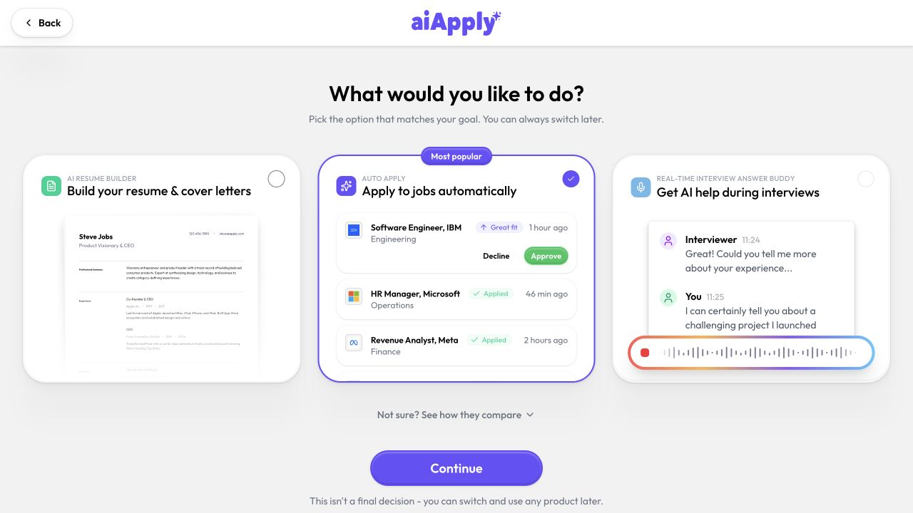
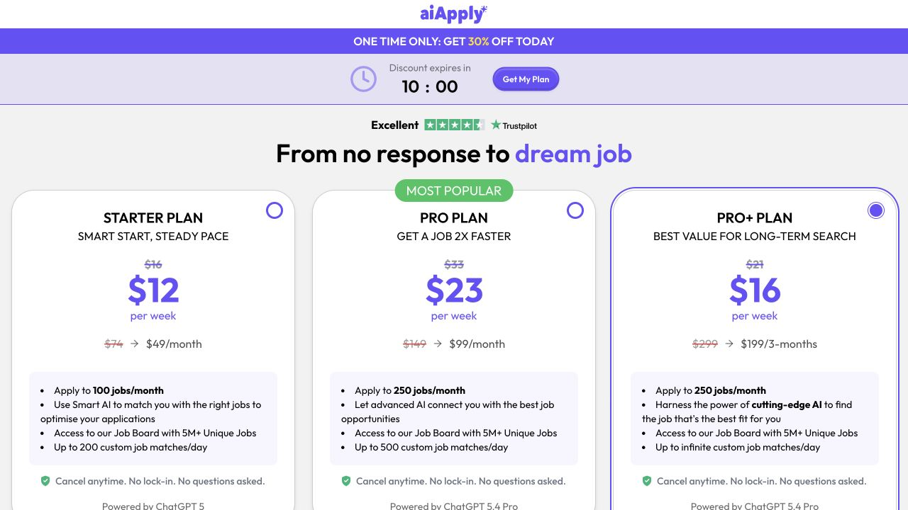
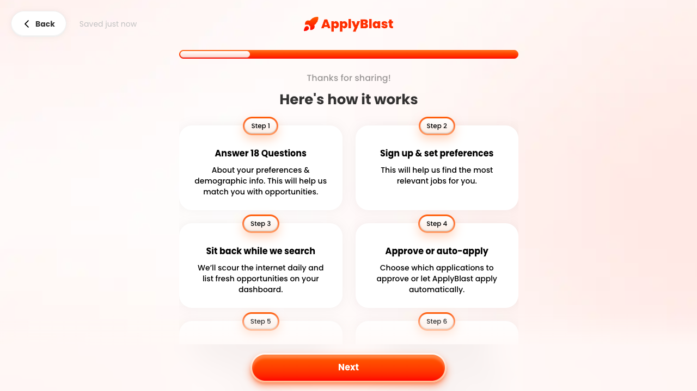
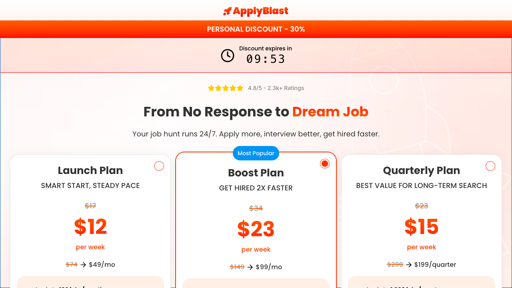
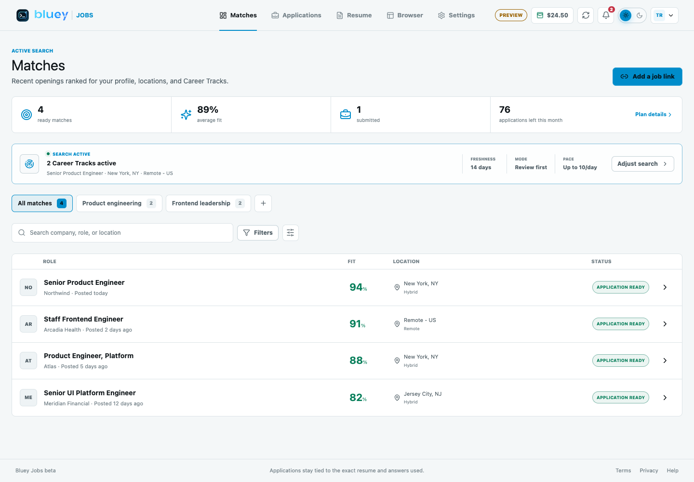
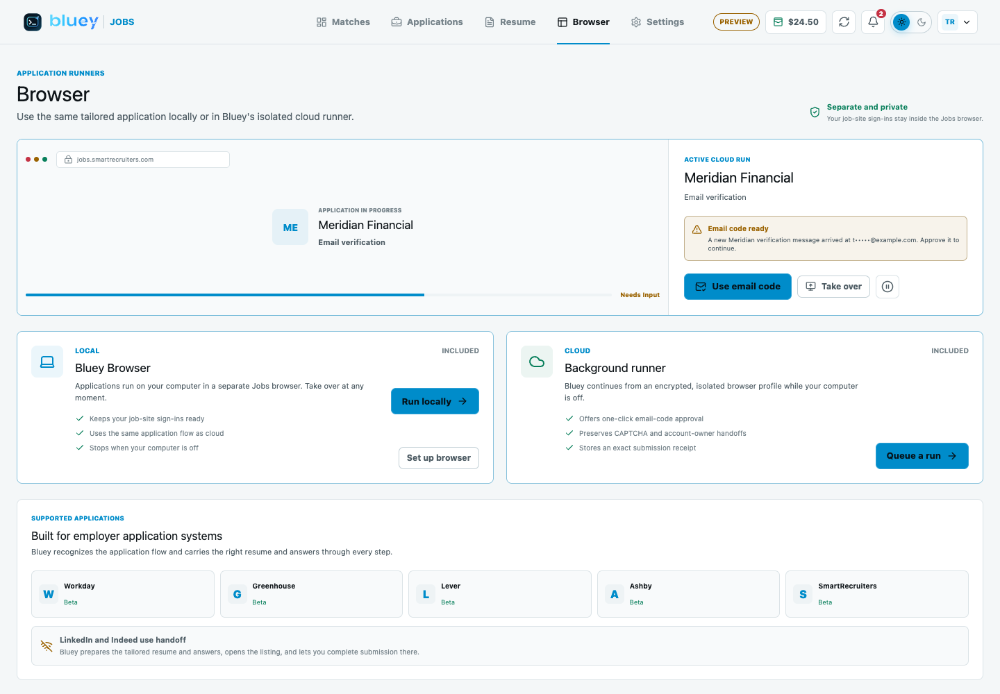

# Round 491 - Jobs Two-Portal Application Flow Deep Dive

Date: 2026-07-11

## Objective

Inspect AIApply and ApplyBlast as deeply as possible without payment or real job
submissions, then turn the findings into actionable Bluey Jobs improvements for
the next implementation agent.

Rules followed:

- Used the authorized mailbox `usetaptech@gmail.com`.
- Created/logged into test portal flows where possible.
- Did not buy anything.
- Did not submit real employer applications.
- Did not upload a real resume or private file.
- Did not bypass Cloudflare, CAPTCHA, hCaptcha, 2FA, or security checks.
- Removed temporary persistent browser profiles after inspection.

Evidence from this round is under:
`docs/rounds/ROUND-491-JOBS-TWO-PORTAL-APPLICATION-FLOW-DEEP-DIVE.assets/`

Round 485 remains the account/auth inspection companion:
`docs/rounds/ROUND-485-JOBS-ACCOUNT-PORTAL-INSPECTION.md`.

## Visual Appendix

AIApply product picker:

AIApply AutoApply checkout:

ApplyBlast how-it-works screen:

ApplyBlast checkout/paywall:

Current Bluey Matches preview:

Current Bluey Browser preview:

## Executive Summary

Both products sell "apply for me" but, without payment, neither exposes the
actual employer-submission dashboard. The accessible experience is a polished
conversion funnel: quiz, reassurance, social proof, plan selection, checkout.
This matters for Bluey because Bluey is technically deeper than both public
flows, but currently leads with a dense operations dashboard instead of a
simple, confidence-building first session.

The biggest Bluey gaps are not core automation plumbing. They are:

1. First-run narrative: Bluey needs to explain "how applying works" in one calm
   screen before showing many tabs.
2. Trust copy: Bluey needs plain "we use this answer in applications" helper
   text wherever facts may be submitted.
3. Guided activation: Bluey needs a tired-user path from resume -> preferences
   -> one sample packet -> review-first queue.
4. Conversion packaging: Bluey should show product value before payment, unlike
   ApplyBlast/AIApply, but it still needs clearer plan framing.
5. Application boundary visibility: Bluey should show which jobs are
   auto-submit, review-first, handoff-only, or unsupported before preparation.

## What "Trying To Apply" Revealed

### AIApply

Accessible path:

1. Home page.
2. Product picker.
3. Auto Apply quiz.
4. Email OTP.
5. Social-proof interstitial.
6. AutoApply checkout.

I could not verify the paid dashboard or actual employer application run:

- In-app browser reached OTP but the tab closed during auth redirect.
- Local Playwright hit Cloudflare security verification on sign-in.
- Direct later-step probing showed the flow goes to checkout, not a free apply
  dashboard.

Important screenshots:

- `aiapply-product-signup-entry.png`
- `aiapply-after-product-continue.png`
- `aiapply-quiz-step5.png`
- `aiapply-work-auth-dropdown.png`
- `aiapply-direct-step-22.png`
- `aiapply-after-social-proof-continue.png`

### ApplyBlast

Accessible path:

1. Home page.
2. Short quiz.
3. Email login.
4. 4-digit verification code.
5. Checkout/paywall.
6. Stripe payment form inspection only.

Verified account/login worked. Actual application dashboard was not available
without purchase:

- `/quiz/checkout` is the post-verification boundary.
- `/dashboard` asks to sign in again.
- `/jobs`, `/tracker`, `/settings`, `/account`, and `/app` were 404 or not
  available in the unpaid path.
- Opening the checkout payment route showed Stripe fields and subscription
  terms. No payment info was entered.

Important screenshots:

- `applyblast-pw-step0-us.png`
- `applyblast-pw-step1-auth.png`
- `applyblast-pw-step2-salary.png`
- `applyblast-pw-step4-role.png`
- `applyblast-pw-step7-title-filled.png`
- `applyblast-direct-stay-ahead.png`
- `applyblast-dashboard-or-after-code.png`
- `applyblast-stripe-or-pay-route.png`

## AIApply Flow Notes

### Product Picker

Screenshot: `aiapply-product-signup-entry.png`

AIApply starts by asking "What would you like to do?" with three visual cards:

- Auto Apply
- AI Resume Builder
- Real-Time Interview Answer Buddy

The Auto Apply card includes a fake mini-dashboard with employer rows and
"Decline" / "Approve" controls. That is a strong framing move: users see that
automation can still include review.

Bluey implication:

- Bluey should add a product-mode picker or first-run intent selector:
  "Organize my search", "Review applications before sending", and "Auto-submit
  safe matches".
- A small fake/sample application card would reduce fear before users reach the
  real Matches screen.

Affected modules:

- `jobs/portal/src/components/Onboarding.tsx`
- `jobs/portal/src/App.tsx`
- `jobs/portal/src/data/preview.ts`

### Quiz And Fact Collection

Screenshots:

- `aiapply-after-product-continue.png`
- `aiapply-job-title-filled.png`
- `aiapply-quiz-step5.png`
- `aiapply-work-auth-dropdown.png`

AIApply collects:

- employment status;
- desired title;
- target experience;
- salary;
- industry;
- work type;
- start date;
- relocation and city;
- work authorization by country;
- driver's license;
- gender identity;
- disability;
- veteran status;
- security clearance;
- email.

What is good:

- Most steps are one question.
- Progress state says "Saved".
- Salary helper copy says the value may be used if applications ask for
  expected salary.
- Work authorization helper copy says the status helps write accurate cover
  letters and application answers.
- Sensitive questions include skip/prefer-not-to-say options.
- Confirmation cards make a long quiz feel less punishing.

What is risky:

- The quiz asks sensitive demographic/disability/veteran questions before the
  user sees a strong privacy explanation.
- The email step had newsletter opt-in checked by default.
- The flow is long before dashboard value appears.

Bluey implication:

- Keep Bluey's existing correctness and provenance model, but add visible
  helper copy next to salary, authorization, sponsorship, demographic, and
  location facts.
- Bluey should not ask sensitive demographic questions before counsel-approved
  privacy copy and a clear skip path.
- Bluey should never default optional marketing/newsletter consent to checked.

Affected modules:

- `jobs/portal/src/components/Onboarding.tsx`
- `jobs/portal/src/views/SettingsView.tsx`
- `jobs/portal/src/types.ts`
- `server/src/api/jobs.rs`
- `server/src/db/jobs.rs`

Suggested copy:

- Salary: "If an employer asks for expected compensation, Bluey can use this
  value. It is not sent unless the application asks for it."
- Work authorization: "Bluey uses this only for application questions and cover
  letter language. You can leave it blank and answer per application."
- Sensitive fields: "Optional. Bluey will not guess this. If skipped and an
  employer requires it, the application pauses for you."

### Social Proof Before Checkout

Screenshots:

- `aiapply-direct-step-22.png`
- `aiapply-after-social-proof-continue.png`

AIApply inserts a social-proof page before checkout:

- "Supercharge Your Career with AI-Powered Job Matching"
- before/after comparison;
- "443 people received interview invitations";
- "152 people found jobs";
- masked email ticker;
- then checkout.

Checkout copy observed:

- One-time 30% discount.
- Starter `$49/month`, 100 jobs/month, 200 custom matches/day.
- Pro `$99/month`, 250 jobs/month, 500 custom matches/day.
- Pro+ `$199/3-months`, 250 jobs/month, "infinite" custom matches/day.
- "Cancel anytime. No lock-in. No questions asked."
- "Powered by ChatGPT 5" / "Powered by ChatGPT 5.4 Pro" claims.

Bluey implication:

- Bluey should use a proof screen, but it should prove the product through a
  sample packet, receipt, and safe-run checklist, not urgency timers or
  unverifiable masked email tickers.
- Avoid model-name marketing unless it is true, stable, and legally approved.

Affected modules:

- `jobs/portal/src/App.tsx`
- `jobs/portal/src/views/SettingsView.tsx`
- `jobs/portal/src/data/preview.ts`

## ApplyBlast Flow Notes

### Home Page Positioning

Screenshot: `applyblast-home.png`

ApplyBlast's strongest public copy:

- "Careful automation - protected reputation."
- "Spray-and-pray is the opposite of what we do."
- "We hard-filter every job against your salary floor, location, seniority, and
  dealbreakers."
- "Volume isn't the goal. Right-fit volume is."
- "Find hidden jobs" by scanning company hiring systems before listings get
  crowded on LinkedIn.

Bluey implication:

- Bluey has the technical substance to make stronger, safer claims:
  review-first, confirmed facts, no unsupported claims, receipts, intervention
  handoffs, and restricted-site policy.
- Current Bluey copy is accurate but too internal. Translate it into reputation
  protection language.

Affected modules:

- `jobs/portal/src/App.tsx`
- `jobs/portal/src/views/MatchesView.tsx`
- `jobs/portal/src/views/BrowserView.tsx`
- `jobs/automation/src/policy.ts`

Suggested copy:

- "Bluey does not spray applications. It prepares only jobs that pass your
  rules, then pauses when a fact or security check needs you."
- "Review-first by default. Auto-submit only on supported sites with confirmed
  answers and your threshold."

### Quiz

Screenshots:

- `applyblast-pw-step0-us.png`
- `applyblast-pw-step1-auth.png`
- `applyblast-pw-step2-salary.png`
- `applyblast-pw-step3-experience.png`
- `applyblast-pw-step4-role.png`
- `applyblast-pw-step7-title-filled.png`
- `applyblast-pw-step8-workplace.png`
- `applyblast-direct-available-start.png`
- `applyblast-direct-email.png`

Observed steps:

- living in the United States;
- authorized to work;
- minimum preferred salary;
- employment status;
- how-it-works explainer;
- experience level;
- positive recap;
- desired job title;
- work type;
- start date;
- email.

The best screen is the how-it-works explainer:

1. Answer 18 questions.
2. Sign up and set preferences.
3. Sit back while jobs are searched daily.
4. Approve or auto-apply.
5. Customize resume and cover letter.
6. Land interviews faster.

Bluey implication:

- Add this kind of screen early. The current Bluey Onboarding screen has the
  right controls but does not tell the user's story this simply.
- Bluey's version should be:
  1. Import or build a Career Profile.
  2. Set rules and dealbreakers.
  3. Review a sample packet.
  4. Connect an application email/inbox.
  5. Queue review-first applications.
  6. Watch receipts, interventions, and follow-ups.

Affected modules:

- `jobs/portal/src/components/Onboarding.tsx`
- `jobs/portal/src/data/preview.ts`
- `jobs/portal/src/views/MatchesView.tsx`
- `jobs/portal/src/views/ApplicationsView.tsx`

### Stay-Ahead Social Proof

Screenshot: `applyblast-direct-stay-ahead.png`

ApplyBlast uses a "Stay ahead with AI" page with:

- "Over 35,000 people have found jobs";
- "In the last 24 hours";
- interview invitation count;
- landed job count;
- masked email ticker.

Bluey implication:

- Do not copy unverifiable live counters.
- Copy the idea of showing momentum, but ground it in user-specific progress:
  "3 high-fit matches ready", "2 paused applications need you", "1 receipt
  stored", "0 guesses made".

Affected modules:

- new Today/Home surface;
- `jobs/portal/src/App.tsx`
- `jobs/portal/src/components/AppShell.tsx`
- `jobs/portal/src/views/ApplicationsView.tsx`
- `jobs/portal/src/views/MatchesView.tsx`

### Checkout

Screenshots:

- `applyblast-dashboard-or-after-code.png`
- `applyblast-checkout-public.png`
- `applyblast-stripe-or-pay-route.png`

ApplyBlast post-login lands directly on checkout:

- Launch: `$49/mo`, 100 jobs/month, up to 200 custom matches/day.
- Boost: `$99/mo`, 250 jobs/month, up to 500 custom matches/day.
- Quarterly: `$199/quarter`, 1,000 jobs/quarter, unlimited matches/day.
- Money-back guarantee: use credits; if no interview within 30 days, email
  within 7 days for one monthly-payment refund.
- Stripe page: "By clicking the button above, you agree to be charged $99
  today. Your subscription renews at $99/mo until canceled. You can cancel
  anytime from settings."

Bluey implication:

- Bluey should not hard-paywall before showing dashboard value. Instead:
  - let user inspect a sample packet;
  - show one real match list if possible;
  - gate actual queueing/runners by plan.
- Bluey pricing should keep its current simpler Free/Pro/Cloud structure, but
  add clearer unit labels:
  - applications/month;
  - reviewed vs auto-submit;
  - local browser;
  - cloud runner;
  - application emails/inboxes.

Affected modules:

- `jobs/portal/src/views/SettingsView.tsx`
- `jobs/portal/src/App.tsx`
- `server/src/db/jobs.rs`
- `server/src/api/jobs.rs`

## Code And API Observations

### AIApply

Observed through rendered page resources:

- Vite-style assets under `/build/assets/`.
- Marketing CSS: `marketing-DOK3K5dT.css`.
- Modules: `cta-redirect`, `floating-cta`, `home`.
- Sentry release: `v2.36.6`.
- Analytics/ad stack: PostHog/Coconut, Plausible, GTM, Cloudflare Insights,
  Cookiebot, ad pixels.
- Auth email included magic link:
  `/api/signin.php?email=...&verify_otp=...&magic_link=1`.

Do not copy:

- heavy ad/analytics stack into Jobs beta;
- default newsletter opt-in;
- Cloudflare challenge behavior as a product dependency.

### ApplyBlast

Observed public Next.js client routes/endpoints:

- Next.js app with route chunks under `/_next/static/chunks/app/...`.
- Email login endpoint: `/api/v1/auth/email/login`.
- Email verification endpoint: `/api/v1/auth/email/login/verify`.
- Current user endpoint: `/api/v1/auth/me`.
- Tracking endpoint: `/api/v1/track`.
- OAuth routes: `/auth/google/login`, `/auth/linkedin/login`.
- Checkout route:
  `/quiz/checkout/pay?priceId=...&email=...`.
- Stripe.js checkout embedded in the pay route.
- Bundle names reveal product surfaces: applications, jobs, saved jobs,
  waiting applications, matching jobs, admin application stats, admin next
  application for review.

Bluey implication:

- Bluey already has more explicit architecture. The next agent should focus on
  productizing it, not rebuilding the technical foundation.
- Add client-side event tracking for activation milestones, but keep event
  payloads privacy-safe and avoid raw resumes/answers/OTP/screenshots.

Affected modules:

- `jobs/portal/src/api.ts`
- `server/src/api/jobs.rs`
- `server/src/db/jobs.rs`

## Current Bluey Screens Compared

Screenshots captured from `http://127.0.0.1:5187/jobs/?preview=1`:

- `bluey-matches-desktop.png`
- `bluey-applications-desktop.png`
- `bluey-resume-desktop.png`
- `bluey-browser-desktop.png`
- `bluey-settings-desktop.png`
- `bluey-matches-mobile.png`

Bluey strengths:

- Real review-first and auto-submit settings.
- Exact resume versions per application.
- Intervention inbox.
- Receipts/evidence.
- Local and cloud runner distinction.
- Application emails and inbox limits.
- Plan entitlements are concrete.

Bluey misses compared with the two portals:

- No first-run story as simple as ApplyBlast's six-step explainer.
- No product-mode chooser as direct as AIApply's first screen.
- No emotional "you are safe, this is how we protect your reputation" language.
- No short "today's work" screen.
- No visible compatibility/status badge before packet preparation.
- No social proof or proof-of-work screen grounded in sample receipts.
- Plan UI exists but does not carry the same conversion clarity as competitor
  checkout pages.

## Recommended Implementation Backlog

### P0 - Dogfood UX Clarity

1. Add a first-run "How Bluey applies" explainer.
   - Customer value: makes automation understandable before users see five tabs.
   - Modules: `jobs/portal/src/components/Onboarding.tsx`,
     `jobs/portal/src/data/preview.ts`.
   - Size: small/medium.

2. Add "fact use" helper text for submitted answers.
   - Customer value: users understand which facts may be sent to employers.
   - Modules: `Onboarding.tsx`, `SettingsView.tsx`, `types.ts`.
   - Size: small.

3. Make review-first the named default.
   - Customer value: reduces fear of accidental employer submissions.
   - Modules: `MatchesView.tsx`, `ApplicationsView.tsx`, `BrowserView.tsx`.
   - Size: small.

4. Add application capability badges before prepare/queue.
   - Customer value: users know whether a job is auto-submit supported,
     review-first, handoff-only, or unsupported.
   - Modules: `jobs/automation/src/policy.ts`,
     `jobs/automation/src/standard-adapters.ts`,
     `jobs/portal/src/views/MatchesView.tsx`,
     `server/src/api/jobs.rs`.
   - Size: medium.

### P1 - Invited Beta Activation

1. Add a Today view.
   - Show: matches ready, paused applications, inbox connection needed, sample
     receipt, and next best action.
   - Modules: `App.tsx`, `AppShell.tsx`, `MatchesView.tsx`,
     `ApplicationsView.tsx`, `SettingsView.tsx`.
   - Size: medium.

2. Add a sample packet before payment/runner setup.
   - Show exact resume diff, answers, selected email identity, runner options,
     receipt preview, and what would pause.
   - Modules: `data/preview.ts`, `MatchesView.tsx`, `ApplicationsView.tsx`.
   - Size: medium.

3. Improve plan packaging.
   - Keep Free/Pro/Cloud, but show applications/month, browser mode, email
     identities, inbox connections, and what is not charged.
   - Modules: `SettingsView.tsx`, `server/src/db/jobs.rs`.
   - Size: small/medium.

4. Add privacy-safe activation analytics.
   - Events: onboarding started/completed, resume imported, first match
     reviewed, first packet prepared, first intervention resolved, runner
     queued, receipt opened.
   - Do not log raw resume, answers, OTPs, screenshots, or cookies.
   - Modules: `jobs/portal/src/api.ts`, `server/src/api/jobs.rs`,
     `server/src/db/jobs.rs`.
   - Size: medium.

### P2 - Public Launch Polish

1. Public "careful automation" page.
   - Ground claims in Bluey's actual constraints: no guessing, receipts,
     intervention handoffs, restricted-site policy.
   - Modules: static Jobs landing/entry in `jobs/portal/src/App.tsx`.

2. Public compatibility matrix.
   - Show Workday, Greenhouse, Lever, Ashby, SmartRecruiters as supported;
     LinkedIn/Indeed as handoff-only; planned ATS list separately.
   - Modules: `automation`, `portal`, `server`.

3. Trust and retention policy UI.
   - Jobs-specific data map, deletion/export scope, browser profile/cookie
     handling, email OAuth scope, receipts retention.
   - Modules: `SettingsView.tsx`, `server/src/api/jobs.rs`, legal pages.

## Non-Goals

- Do not copy urgency countdown timers unless tied to a real offer.
- Do not copy masked "live interview invites" tickers unless backed by real,
  auditable aggregate data.
- Do not force payment before showing any product value.
- Do not ask sensitive demographic questions without counsel-approved framing.
- Do not imply Bluey can bypass CAPTCHA, 2FA, assessments, or platform rules.
- Do not build hidden bulk-submit behavior. Bluey should win on quality,
  evidence, and user control.

## Suggested Next-Agent Task

Implement the P0 dogfood UX clarity package:

1. Add `How Bluey applies` to onboarding.
2. Add fact-use helper copy for salary, authorization, sponsorship, location,
   and sensitive facts.
3. Rename/reframe review-first default in Matches/Applications/Browser.
4. Add conservative application capability badges from existing automation
   policy metadata.

Keep code changes scoped to:

- `jobs/portal/src/components/Onboarding.tsx`
- `jobs/portal/src/views/MatchesView.tsx`
- `jobs/portal/src/views/ApplicationsView.tsx`
- `jobs/portal/src/views/BrowserView.tsx`
- `jobs/portal/src/views/SettingsView.tsx`
- `jobs/portal/src/data/preview.ts`
- `jobs/portal/src/types.ts`
- `jobs/automation/src/policy.ts`

Do not touch billing, runner, Temporal, or adapter execution logic for this
first UX pass.
