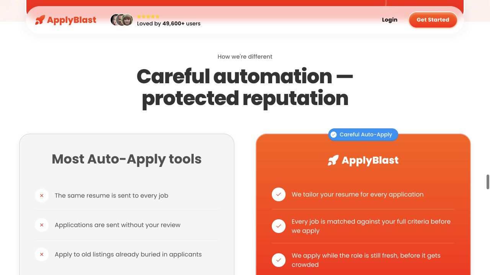
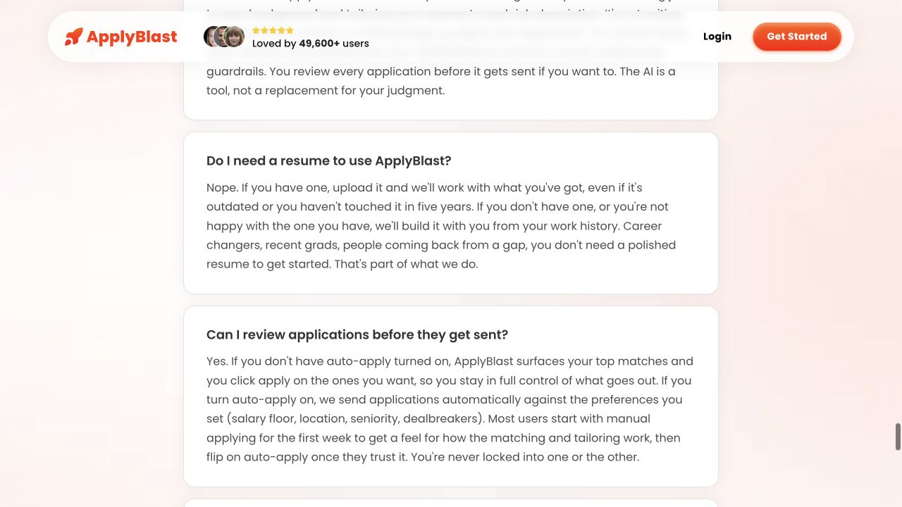
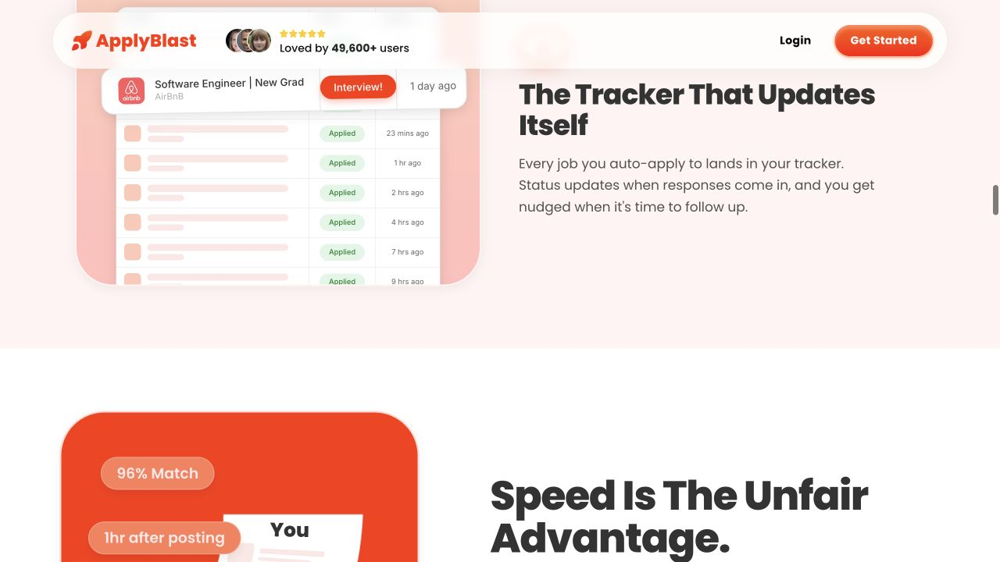
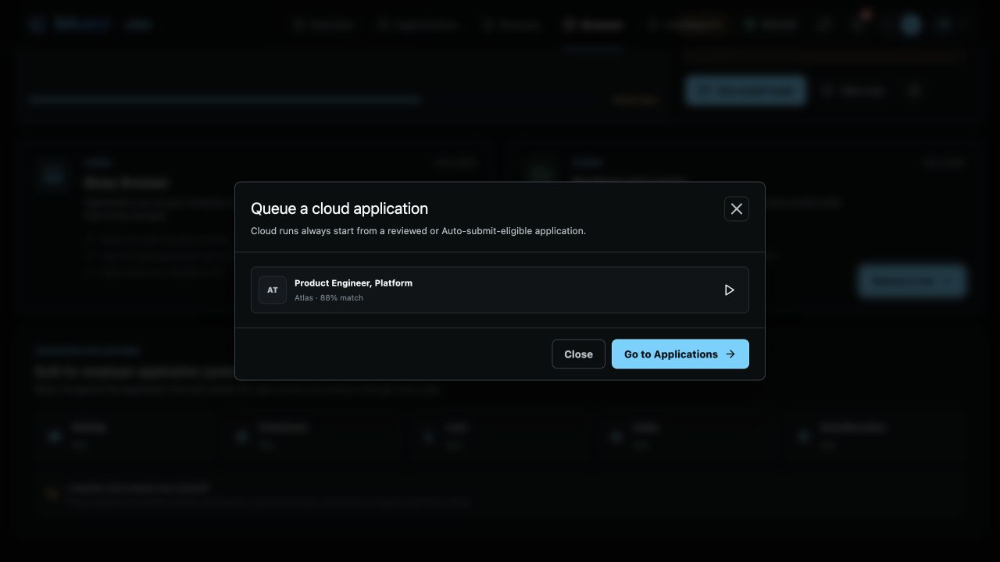
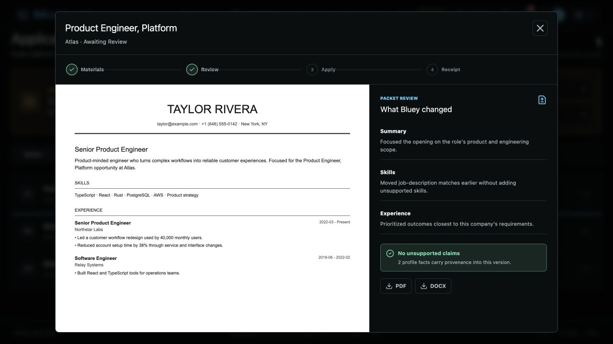
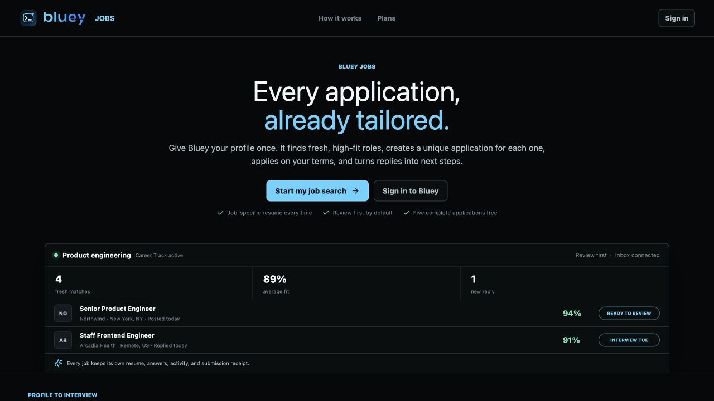

# Round 492 - Jobs Competitive Recheck And Implementation Handoff

Date: 2026-07-11

## Scope

This round rechecked AIApply, ApplyBlast, and the current Bluey Jobs branch after
Rounds 480-491. It focused on gaps that were previously missed, assumed to be
implemented, or described too generally for another agent to act on.

Rules followed:

- Used only the already-authorized `usetaptech@gmail.com` test account state.
- Did not purchase a plan or enter payment details.
- Did not submit a real employer application.
- Did not upload a real resume, connect LinkedIn, or transmit private files.
- Did not bypass Cloudflare, CAPTCHA, 2FA, paywalls, or site security.
- Inspected visible UI, public frontend bundles, and the current Bluey source.

Companion research remains in Rounds 480-491. This document supersedes those
rounds only where it explicitly corrects an assumption about current Bluey code.

## Bottom Line

Bluey already has a stronger public explanation, clearer Free/Pro/Cloud plans,
better receipt provenance, and safer intervention concepts than the earlier
audit credited. Do not spend the next round rebuilding the landing page or plan
cards.

The real priority is aligning the product promise with runtime enforcement:

1. The Browser screen can queue an `awaiting_review` application without the
   explicit approval action shown in Applications.
2. Most settings presented as hard rules are stored but not enforced by match
   scoring or Auto-submit eligibility.
3. Unknown public job sites default to `automate`, even though architecture says
   Auto-submit requires a known automatable employer form.
4. The packet review shows generic change text instead of the actual resume
   diff, answers, identity, cover letter status, and site capability.
5. Public UI claims cover letters, response tracking, follow-ups, and interview
   dates more strongly than the current end-to-end implementation supports.

These are more important than adding another polished dashboard view.

## Visual Evidence

AIApply authenticated onboarding now exposes a real import-to-kit entry after
sign-in. The two top-level steps visible in this account state are Import and
Application Kit.


ApplyBlast's strongest differentiation is not volume. It explicitly contrasts
generic bulk applying with tailored, filtered, fresh applications.



ApplyBlast gives users a trust ramp: begin manually, inspect matching and
tailoring, then enable Auto-apply after trust is earned.



ApplyBlast also makes post-submit value concrete with a self-updating tracker
and follow-up nudges.



Bluey's Browser dialog says runs start from a reviewed or Auto-submit-eligible
application, but the displayed Atlas packet is actually `awaiting_review` in
the preview fixture.



Bluey's packet review is visually strong, but the three "What Bluey changed"
items are hardcoded UI copy rather than the selected resume's real diff.



Bluey's public experience already has a good product story and plan framing.
The remaining issue is that some visible capability claims run ahead of the
implemented state model and integrations.



## New Competitor Findings

### AIApply Authenticated Onboarding

Direct URL observed after authentication:

- https://aiapply.co/app/onboarding

Visible UI:

- Import from a resume or LinkedIn.
- File support shown as PDF, DOC, DOCX, PNG, and JPG.
- A following Application Kit step.

Public bundle inspected:

- `https://aiapply.co/build/assets/Index-Dq9cDOc4.js`
- Component names include `Step1Import`, `Step3JobList`, `Step4Customize`, and
  `Step5Generating`.
- After import, the flow can show suggested jobs or accept the user's own job
  description.
- Customization includes job title, job description, a selected-job preview,
  and a five-position tone control from very casual to very formal.
- The generation progress names a resume, cover letter, follow-up email, and
  matching-job work.
- Generated kits route to `/app/onboarding/application-kit/{appKitId}`.

The browser-control surface did not expose a supported file-upload operation,
so no synthetic or real resume was transmitted. No employer submission was
attempted.

Product lesson for Bluey:

- An application kit should be the activation moment, not merely a hidden
  result after clicking Prepare.
- The kit should show the actual resume changes, answer set, identity, site
  capability, cover-letter choice, and expected handoffs before queueing.

### AIApply Credit Messaging Is Internally Inconsistent

The public Auto Apply FAQ says one credit equals one application, credits can be
purchased as needed, and unused credits never expire. The observed checkout in
Round 491 presented monthly subscription plans and monthly application limits.

Bluey lesson:

- Keep one unit and one renewal story everywhere.
- Distinguish included applications, overages, and period resets explicitly.
- Do not mix non-expiring credit language with expiring monthly allowances.

### ApplyBlast Trust Ramp

Direct URL:

- https://applyblast.com/

The public FAQ states that users can keep Auto-apply off, choose top matches
manually, and turn Auto-apply on later. It says most users begin manually for
the first week, inspect matching and tailoring, then enable automation once
they trust it. Users are not locked into either mode.

It also explicitly supports people without a polished resume, including recent
graduates, career changers, and people returning from a gap.

Bluey lesson:

- Do not present Review first and Auto-submit as equally mature choices during
  first-run setup.
- Recommend Review first, let the user inspect several real packets and at least
  one receipt, then offer Auto-submit as a deliberate upgrade in trust.
- Add a clearly named "I do not have a resume" path. Bluey technically allows
  manual entry, but the current onboarding does not frame that path clearly.

### ApplyBlast Tracker And Timing Story

ApplyBlast's public product scene shows:

- jobs entering the tracker automatically;
- statuses updating when responses arrive;
- follow-up nudges;
- interview state;
- match percentage and time after posting;
- tabs for Auto Apply, Preferences, Tracker, Jobs, and Chat.

Claims remain public marketing claims, not verified paid-dashboard behavior.
The useful lesson is the clarity of the product loop: find, tailor, apply, track,
follow up.

## What Bluey Already Does Well

Do not rebuild these from scratch:

- Public five-step profile-to-interview explanation.
- Clear Free, Pro, and Cloud plan framing.
- Browser-side resume import.
- Career Tracks for separate searches.
- Review-first and Auto-submit settings.
- Job-specific resume versions and checksums.
- Verified application email identities.
- Account, Career Track, and company-scoped answer memory.
- Local and cloud runner concepts.
- CAPTCHA, assessment, phone/app 2FA, and email-code interventions.
- Submission evidence, exact-resume references, and receipts.
- LinkedIn and Indeed handoff policy.
- Deterministic adapters for the named beta ATS providers.

The design direction is sound. The gaps below are consistency and depth gaps.

## P0 Findings

### P0.1 Review-First Can Be Bypassed From Browser

Evidence:

- `jobs/portal/src/views/BrowserView.tsx:89` says cloud runs start from reviewed
  or Auto-submit-eligible applications.
- `BrowserView.tsx:90` includes both `awaiting_review` and `queued` states in the
  cloud picker.
- `BrowserView.tsx:94-95` does the same for local runs.
- `jobs/portal/src/App.tsx:441-442` meters an `awaiting_review` application and
  calls the queue endpoint without first executing the explicit Applications
  approval transition.
- `server/src/api/jobs.rs:653-664` commits the packet and changes any non-queued
  application to `queued` inside the runner endpoint.

Impact:

- A user can skip the "Approve application" action while the UI still describes
  the product as Review first.
- The click that chooses a runner silently doubles as approval and metering.

Required correction:

- Browser runner pickers must list only `queued` applications.
- `awaiting_review` rows should link back to packet review with a clear action.
- The runner API should reject `awaiting_review` with a conflict response. The
  approval endpoint must be the only transition from `awaiting_review` to
  `queued`.
- Auto-submit packets may enter `queued` during preparation only after the full
  eligibility decision passes.

### P0.2 Most Hard-Rule Controls Are Not Enforced

Current scoring in `server/src/db/jobs.rs:1505-1554` starts at 45, adds points
for simple role, skill, and location overlap, and only labels compensation as
needing confirmation. Repository search found no runtime use of several stored
preference fields outside serialization, validation, and UI.

| User-visible control | Current behavior | Required behavior |
| --- | --- | --- |
| Maximum job age | Enforced before prepare/queue | Keep |
| Live availability freshness | Enforced before queue | Keep |
| Match threshold | Checked for Auto-submit | Keep, but only after hard filters |
| Target role | Adds score | Define exact include/exclude semantics |
| Location/workplace | Adds score | Hard-skip when policy says local-only or remote-only |
| Minimum salary | Stored; not parsed or enforced | Block known compensation below floor; pause when ambiguous |
| Excluded companies | Stored; no scoring/queue use found | Hard-skip before packet generation |
| Excluded titles | Stored; no scoring/queue use found | Hard-skip before packet generation |
| Employment types | Stored; no scoring/queue use found | Hard-skip incompatible types |
| Sponsorship | Stored; no eligibility use found | Pause or skip based on explicit user policy; never infer |
| One active application/company | Stored; no enforcement found | Reject duplicate active company application |
| Daily application limit | Displayed and stored; no queue enforcement found | Enforce atomically at queue/lease time |
| Review new claims | Toggle is stored; no behavior branch found | Enforce or hide until claim proposals exist |

The current Auto-submit predicate in `server/src/db/jobs.rs:1803-1806` checks
only requested mode, score threshold, empty `missing_requirements`, and a source
name that does not end in `_handoff`. That is not the hard-filter contract
described by `jobs/ARCHITECTURE.md`.

Required correction:

- Introduce one typed eligibility decision used by discovery, Matches, packet
  preparation, Auto-submit, and runner queueing.
- Return machine-readable hard failures, review reasons, and capability status.
- Make the server authoritative; UI badges must render the same decision rather
  than recreate policy in React.

### P0.3 Unknown Public Sites Default To Automate

`jobs/automation/src/policy.ts:28-35` hands off LinkedIn/Indeed, blocks unsafe or
private URLs, and marks every other public HTTP(S) URL as `automate`.

This conflicts with the architecture invariant that Auto-submit requires an
automatable employer form. A generic semantic runner can still attempt an
unknown form in Review mode, but unknown capability should not be equivalent to
certified Auto-submit support.

Required correction:

- Add capability states such as `certified`, `beta_review`, `handoff`,
  `unknown_review`, and `blocked`.
- Unknown sites should default to Review/handoff, never Auto-submit.
- Show capability before Prepare and again before queueing.
- Keep provider certification data separate from the visual static list in
  `BrowserView.tsx:78-81`.

### P0.4 Packet Review Is Generic Instead Of Auditable

`jobs/portal/src/views/ApplicationsView.tsx:201-206` hardcodes Summary, Skills,
and Experience explanations for every packet. The application row also hardcodes
`v1` at line 177.

The server-generated diff in `server/src/db/jobs.rs:1748-1753` is also a generic
description. Current tailoring at `server/src/db/jobs.rs:1934-1952` either keeps
the summary unchanged or appends one company/role sentence; skills are reordered
and experience remains unchanged.

Impact:

- The UI looks more tailored than the underlying packet currently is.
- Users cannot verify exact before/after changes from the review screen.

Required correction:

- Render `ResumeVersion.diff` rather than hardcoded text.
- Generate a structural diff with old/new values, moved items, removed items,
  and exact claim IDs.
- Show the real version number.
- Include final answers, selected application email, cover letter state, ATS
  capability, metering effect, and expected pause conditions in one kit review.
- Do not describe experience as prioritized unless the content actually changed.

### P0.5 Public Capability Copy Runs Ahead Of Implementation

The public Jobs entry currently says:

- every job receives an optional cover letter;
- Gmail/Outlook track updates, follow-ups, assessments, and interview dates;
- the preview displays `Interview Tue`.

Evidence:

- `jobs/portal/src/App.tsx:671-685`
- `JobApplication.cover_letter` is initialized as an empty string in preview
  and server preparation; no portal generator/editor was found.
- The current `ApplicationState` union in `jobs/portal/src/types.ts:3-12` stops
  at `submitted` or `failed`; it has no replied, interview, rejected, offer, or
  follow-up state.
- Evidence contracts can store status email and interview events, but the
  connected-inbox UI is still pending/beta and no complete provider-sync path
  was verified.

Required correction:

- Either implement each claim end to end or label it as beta/coming later.
- Until status sync is live, keep receipts/evidence wording but remove the
  impression of an automatically updating interview pipeline.

## P1 Product Gaps

### Guided Trust Ramp

Keep Review first as the default and recommend it for the first several packets.
After the user reviews real diffs and a receipt, show a contextual option to
enable Auto-submit for one Career Track. Do not place Auto-submit beside Review
first as an equally safe first-session choice.

### Application Kit As The Activation Moment

Before asking the user to configure a runner or upgrade, show a sample kit with:

- exact resume before/after;
- final answers and their memory scope;
- application email identity;
- cover letter choice;
- job and ATS capability;
- hard filters passed;
- what will pause;
- expected allowance/overage effect;
- sample receipt.

### Complete Career Profile Editing

`jobs/portal/src/views/ResumeView.tsx:136-138` edits only identity, headline,
location, phone, summary, skills, work authorization, and salary expectation.
Employment, education, projects, certifications, LinkedIn, portfolio, and fact
confirmation cannot be fully maintained after onboarding from this dialog.

Add complete section editing and explicit confirm/reject controls for imported
facts. Add helper text explaining when salary, work authorization, sponsorship,
and location can be sent.

### No-Resume And Quick-Start Paths

Make these explicit first-session choices:

1. Import a resume.
2. Import a LinkedIn profile only after clear consent and disclosure.
3. Build a Career Profile from work history.
4. Paste a job description and generate one sample kit before finishing every
   preference.

Bluey should not require a polished resume to demonstrate value.

### Outcome Tracker

Extend the state model only when inbox/calendar sync is real. Useful stages:

- submitted;
- employer response;
- recruiter screen;
- interview;
- rejected/closed;
- offer;
- no response;
- follow-up due.

Each automated transition must link to evidence. Manual status changes should
be distinguishable from provider-derived status.

### Today View

A Today view remains useful, but it is after the P0 invariants. It should show
only evidence-backed next actions:

- strong matches to review;
- packets waiting for approval;
- interventions;
- stale follow-ups;
- inbox connection needed;
- runner health;
- recent receipts.

## P2 Opportunities

- Public job-board and resume-example SEO after licensed discovery is ready.
- Company research and interview prep generated from the exact submitted packet.
- Follow-up drafts linked to status evidence.
- Resume scanner and translation only after the core apply/track loop is trusted.
- Privacy-safe aggregate proof based on Bluey-owned outcomes, not fabricated
  counters or masked activity tickers.

## Deliberate Non-Goals

- No CAPTCHA, Cloudflare, 2FA, assessment, or restricted-site bypass.
- No hidden bulk submission.
- No guaranteed interviews, response rates, or hiring claims.
- No default marketing consent.
- No urgency timer unless it reflects a real expiring offer.
- No claim that AI-generated content is undetectable.
- No copying competitor trackers until Bluey has evidence-backed status sync.

## Implementation Order

### P0-A - Restore The Review Boundary

Modules:

- `jobs/portal/src/views/BrowserView.tsx`
- `jobs/portal/src/App.tsx`
- `server/src/api/jobs.rs`
- portal component tests
- server API tests

Acceptance criteria:

1. `awaiting_review` never appears in a runner picker.
2. Queue API returns conflict for `awaiting_review`.
3. Explicit approval moves the packet to `queued` and meters it once.
4. A queued Auto-submit packet appears without a second approval.
5. Retries do not meter again.

### P0-B - Make Eligibility One Shared Contract

Modules:

- `server/src/db/jobs.rs`
- `server/src/api/jobs.rs`
- `jobs/automation/src/policy.ts`
- `jobs/automation/src/contracts.ts`
- `jobs/automation/src/standard-adapters.ts`
- `jobs/portal/src/types.ts`
- `jobs/portal/src/views/MatchesView.tsx`
- `jobs/portal/src/views/BrowserView.tsx`

Acceptance criteria:

1. Every hard-rule setting has a server test proving allow and block behavior.
2. Daily cap is transactionally enforced.
3. Duplicate-company policy is enforced across retries and Career Tracks.
4. Unknown ATS cannot become Auto-submit eligible.
5. The exact same decision and reason codes appear in Matches, packet review,
   queue API, and receipt.

### P0-C - Make Packet Review Truthful

Modules:

- `server/src/db/jobs.rs`
- `jobs/portal/src/views/ApplicationsView.tsx`
- `jobs/portal/src/views/ResumeView.tsx`
- `jobs/portal/src/data/preview.ts`
- `jobs/portal/src/types.ts`

Acceptance criteria:

1. Review screen has no hardcoded change descriptions.
2. Every visible diff item maps to stored before/after data.
3. Packet shows exact resume version, answers, identity, capability, and meter
   impact.
4. Empty cover letter is shown as "Not included", not implied as generated.
5. Unsupported claims cannot appear in Auto-submit packets.

### P0-D - Align Public Copy With Shipped Capability

Modules:

- `jobs/portal/src/App.tsx`
- `jobs/portal/src/views/SettingsView.tsx`
- Jobs privacy/trust copy where relevant

Acceptance criteria:

1. No cover-letter claim without a real generator/editor and receipt evidence.
2. No auto-updating tracker claim without provider sync and state transitions.
3. Beta/coming-later surfaces are labeled consistently.
4. Free/Pro/Cloud units match Settings and backend entitlements exactly.

### P1 - Earn Auto-Submit Trust

Modules:

- `jobs/portal/src/components/Onboarding.tsx`
- `jobs/portal/src/views/MatchesView.tsx`
- `jobs/portal/src/views/ApplicationsView.tsx`
- `jobs/portal/src/views/ResumeView.tsx`
- `jobs/portal/src/views/SettingsView.tsx`
- `jobs/portal/src/data/preview.ts`

Acceptance criteria:

1. First session explains the full apply loop inside authenticated onboarding.
2. No-resume path is obvious.
3. User sees one real/sample application kit before choosing automation.
4. Auto-submit activation references reviewed packets and capability constraints.
5. Sensitive fact-use helper text is visible at entry and reuse points.

## Verification Performed

- `jobs/portal`: `npm test` passed, but it currently covers only one document
  utility test and no React workflow behavior.
- `jobs/portal`: `npm run build` passed. Vite reported existing chunks larger
  than 500 kB.
- `jobs/automation`: 51 tests passed.
- `server`: targeted queue freshness test passed.
- Current browser preview was manually checked for Matches, Applications,
  packet review, Browser, runner picker, and public entry states.

## Prompt For The Implementation Agent

```text
Repository: /Users/uno/Downloads/cue-bluey-jobs
Branch: codex/bluey-jobs-20260710

Read first:
- docs/rounds/ROUND-492-JOBS-COMPETITIVE-RECHECK-AND-IMPLEMENTATION-HANDOFF.md
- docs/rounds/ROUND-491-JOBS-TWO-PORTAL-APPLICATION-FLOW-DEEP-DIVE.md
- jobs/ARCHITECTURE.md

Other work may be in progress. Preserve and integrate existing changes; do not
revert another agent's files.

Implement in this order:
1. P0-A restore the review boundary.
2. P0-C render a truthful packet review using actual diff/version/answers/
   identity/capability data.
3. Add UI support for the shared eligibility decision from P0-B. If the server
   contract is not ready, do not recreate it independently in React; keep the
   UI conservative and mark unknown sites Review only.
4. P0-D align public claims with capabilities that are actually end to end.
5. Then implement the P1 authenticated onboarding trust ramp and no-resume path.

Do not begin with a new landing page or Today dashboard. Do not expand
Auto-submit until salary, location/workplace, excludes, sponsorship, duplicate
company, daily cap, and ATS capability are enforced server-side.

Required tests:
- awaiting_review is never runnable;
- explicit approval is required and meters once;
- real diff/version renders in packet review;
- unknown ATS is Review only;
- each visible hard filter has an allow/block test;
- no cover-letter or status-sync claim appears without shipped support.

Run portal tests/build, automation tests, focused server tests, and visual checks
for desktop and mobile. Write the next numbered round document. Do not commit or
push unless the user explicitly asks.
```
