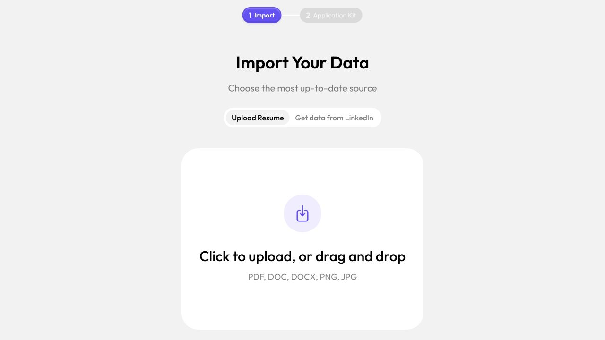
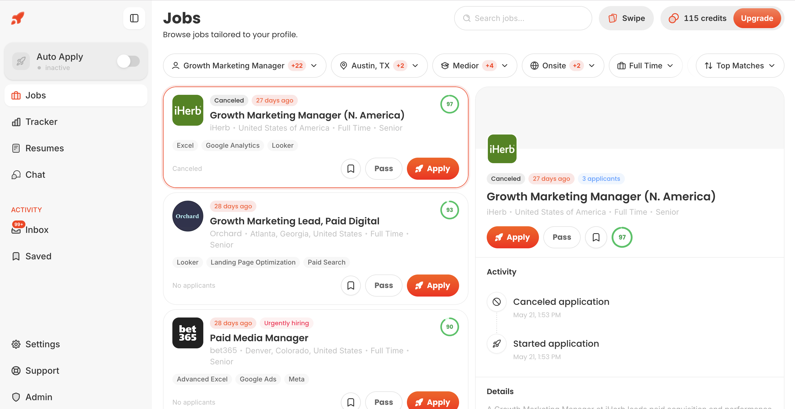
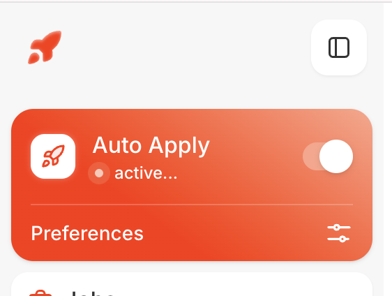
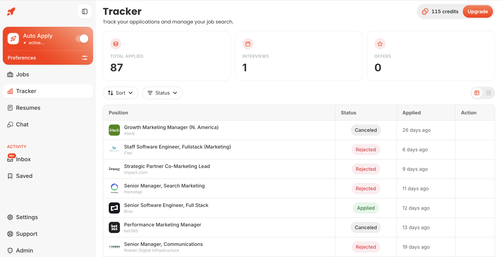
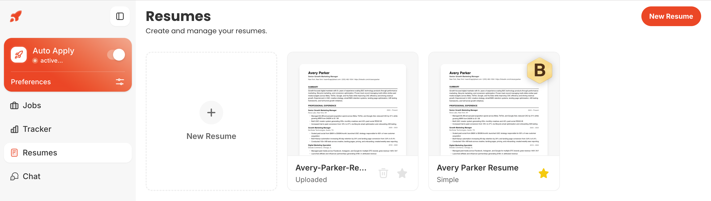
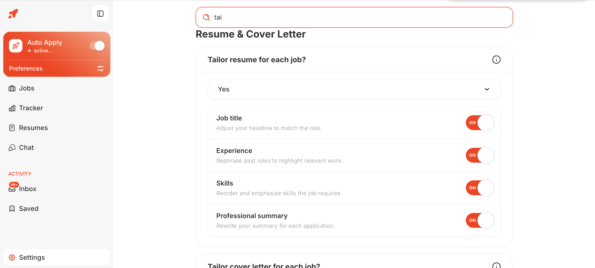
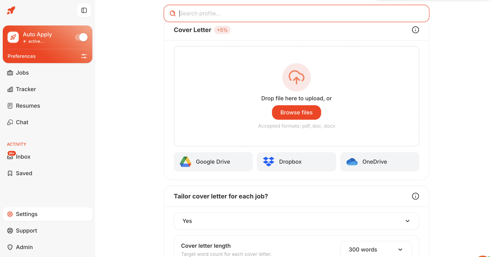
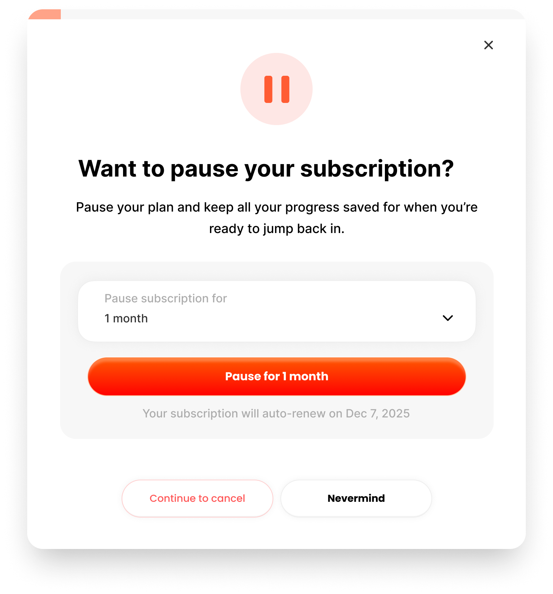

# Round 494 - Jobs Competitor Automation Logic Audit

Date: 2026-07-11

Repository snapshot: `4607a3e7315c` on `codex/bluey-jobs-20260710`, plus the
uncommitted Round 493 implementation present in the shared worktree.

## Scope And Guardrails

This round goes deeper than the visual comparison in Rounds 491-492. It maps
the public product contracts and measurable behavior of AIApply and ApplyBlast,
then compares those contracts with the current Bluey Jobs source after Round
493.

Research stayed inside these boundaries:

- public pages, public help-center articles, public frontend assets, and the
  previously authorized account journey;
- no purchase, payment entry, or real employer application;
- no CAPTCHA, 2FA, Cloudflare, paywall, or site-rule bypass;
- no protected endpoint calls, credential extraction, or attempts to discover
  private infrastructure;
- no claim that minified client routes reveal a competitor's private backend;
- no product-code edits in this round.

The useful target is the competitor's **product contract**: what enters the
system, what states the user sees, what can be controlled, what evidence comes
back, and how failures are handled. Their exact scraping code, browser fleet,
models, job-source contracts, and retry internals remain private unless they
publish them.

## Bottom Line

Round 493 closed important Bluey safety gaps, but the deeper audit found six
new P0 issues below the UI:

1. The public match-ingestion endpoint trusts caller-supplied authority fields,
   including source/certification, score, availability, and verification time.
2. Public ATS discovery exists as a tested library but is not wired to a real
   scheduled discovery worker or ingestion loop in this branch.
3. The five named ATS adapters are one shared generic form strategy with small
   selector differences; their tests use the same synthetic form fixture.
4. Cloud-runner ownership, preserved intervention sessions, locks, and result
   replay are process-local, leaving restart and multi-replica gaps.
5. The strongest receipt-completeness validator is not enforced at the server
   persistence boundary, and final screenshot paths are stripped without an
   implemented object-upload replacement.
6. Daily-limit and duplicate-company eligibility are read/check decisions, not
   atomic queue reservations; the daily count also counts prepared packets by
   UTC creation day rather than actual submission attempts in the user's time
   zone.

Competitors are clearer about queue control, rejection feedback, multiple
resume baselines, cloud processing, generated application mailboxes, and the
post-submit inbox. Bluey can be substantially better by combining those useful
ideas with server-authoritative provenance, measured ATS certification,
fault-tested idempotency, and evidence-graded outcomes.

## Evidence Levels

| Label | Meaning |
| --- | --- |
| Verified UI | Seen in a public or authorized visible flow |
| Verified public client | Present in publicly served browser JavaScript; no protected route was called |
| Verified first-party documentation | Stated in the vendor's current official help, terms, or privacy pages |
| Inference | A reasonable architecture hypothesis, explicitly not a verified fact |
| Unknown | Cannot be established from public evidence |

## Visual Evidence

### AIApply Import To Application Kit

The authenticated AIApply screenshot captured in Round 492 shows the clean
activation contract: import a resume or LinkedIn profile, then produce an
Application Kit. It is referenced here rather than duplicated.



The screenshots below come from ApplyBlast's official help center articles,
updated June 16, 2026. They are stronger evidence than marketing mockups, but
they may still use a support/demo account and do not prove current behavior for
every paid customer.

### Jobs Command Center

ApplyBlast uses a dense list/detail workspace with role, location, seniority,
workplace, employment-type, and sort filters. Jobs have a match score, age,
skills, Apply, Pass, Save, and activity history. The screenshot also exposes a
useful weakness: a canceled 27-day-old listing is still visually close to an
Apply action. Bluey should keep availability separate and authoritative.



### Auto-Apply Control

Auto Apply is a single prominent mode with an adjacent Preferences entry, and
the official guide says it can be switched off at any time.



### Tracker And Outcome Summary

The tracker shows totals for applied jobs, interviews, and offers, plus
Canceled, Rejected, and Applied rows. This is easy to scan, but it combines
execution and hiring outcomes into one status column. Bluey can do better with
separate execution, availability, and hiring-outcome dimensions.



### Multiple Resume Baselines

ApplyBlast supports multiple uploaded/generated resumes and a starred default.
Its help article says Auto Apply uses the default and tailoring requires moving
an upload into an editable ApplyBlast ATS template.



### Granular Tailoring Controls

Users can independently allow job-title, experience, skills, and summary
changes. Bluey's Factual/Enhance choice is simpler, but it does not yet provide
this level of section control.



### Cover-Letter Source And Length

ApplyBlast accepts local PDF/DOC/DOCX files and exposes Google Drive, Dropbox,
and OneDrive import. Its guide says a user can generate a tailored letter,
upload one as style context, use the uploaded letter unchanged, choose length,
or submit no letter when optional.



### Cancellation Retention Pattern

The account guide shows a one-month pause option before cancellation. This is a
retention idea, not a core automation feature. Bluey should only offer a pause
when billing, active-run behavior, and data retention are completely clear.



## AIApply Public Product Contract

### User Flow

Verified public/onboarding behavior:

1. Resume or LinkedIn import.
2. Structured profile and search preferences.
3. Suggested jobs or a user-provided job description.
4. Job selection and application-kit customization.
5. Generation of a resume, cover letter, follow-up email, and matching jobs.
6. Review/hybrid/automatic application handling.
7. Queue, packet, answer review, and application tracking.

The activation moment is the application kit, not merely a match card. That is
worth adopting.

### Public Client Route Map

These routes were found in currently served public JavaScript. They describe
the browser client's expected contract; they do not prove how the private
services implement the work.

Onboarding:

- `POST /app/onboarding/import-linkedin`
- `POST /app/onboarding/ingest`
- `POST /app/onboarding/save-global-details`
- `POST /app/onboarding/suggest-jobs`
- `POST /app/onboarding/fetch-matched-jobs`
- `POST /app/onboarding/generate-application-kit`
- `POST /api/onboarding/check-job-title`

Auto Apply uses a same-origin proxy base at `/app/auto-apply/proxy/v1` and has
client contracts for:

- queue state and queued jobs;
- approve/reject per job;
- queue pause status with structured reason and free text;
- adding a job by internal job ID or external job details;
- explicit `ats_not_supported` and `job_already_in_queue` outcomes;
- latest matching-run status;
- packet retrieval with cover letter and CV URL;
- final-answer review per question;
- tailored-resume rendering;
- issue reporting with conflict/idempotency handling;
- preferred-answer create/read/delete;
- additional-question retrieval and preferred answers;
- rejection-profile categories and edits;
- application mode persisted as automatic/hybrid;
- generated application mailbox local-part and domain settings.

### Useful AIApply Logic

**Job-level approval and rejection**

The user can approve or reject individual queued jobs. Rejection can include a
reason, details, and a preference edit. Public client code exposes rejection
profiles for at least job-title and skill categories. This closes the loop
between bad recommendations and future matching.

**Answer review as learning**

Answers are not only stored. The client supports per-question review states and
additional-question answers. Bluey has scoped Answer Memory now, but not yet a
complete proposed-answer -> review -> confirmed reuse lifecycle.

**Structured pauses**

Queue status can include `pause_reason` and `pause_reason_text`. Bluey has
per-run interventions, which are stronger for a specific form, but still needs
an account/track-level pause state such as user pause, no credits, source
degraded, too many mismatches, or runner incident.

**Responsive queue state**

The public client caches queue/session state for roughly ten minutes and uses a
cross-tab invalidation signal. Bluey should use server events or short polling
with stale-state labels rather than copying this exact cache duration, but the
product lesson is that queue feedback must feel immediate.

**Application mailbox**

The public client supports choosing a generated mailbox local part and domain.
AIApply's privacy policy describes mailbox metadata and a retention window.
This gives the product an integrated reply loop, but it also creates substantial
privacy, deliverability, export, and deletion duties.

### AIApply Privacy And Trust Details

Its March 21, 2026 privacy policy says:

- AutoApply includes prompts, drafts, submissions, application content, and
  mailbox metadata;
- automated ranking, selection, and form filling run at the user's direction;
- Review Mode avoids automatic submission decisions;
- model providers receive minimum necessary prompt data and are instructed not
  to train on prompts or outputs;
- application data is transmitted as provided, without automatic redaction;
- account/security logs have stated retention ranges;
- mailbox retention is described, but the policy currently says "at least 1
  months" in one section and three months in the summary.

The mailbox inconsistency is exactly the kind of trust error Bluey should avoid.
AIApply's public credit language is also inconsistent across observed pages and
checkout: some pages say credits never expire while plan surfaces describe
period allowances.

### What AIApply Does Not Reveal Publicly

- exact job-source inventory and licensing;
- whether discovery is ATS APIs, licensed feeds, crawling, or a combination;
- queue scheduler and browser-fleet design;
- ATS-by-ATS completion and intervention rates;
- retry fences around the irreversible Submit click;
- how match scores are calibrated;
- whether every stated mailbox/deletion control is available in every plan;
- how many applications labeled submitted have strong employer-side evidence.

Public production auth JavaScript also contains test-oriented branches. They
were not exercised and their exact trigger details are intentionally omitted.
Bluey should add a production-bundle CI scan that rejects test bypass hooks,
silent-login branches, and non-production credentials.

## ApplyBlast Public Product Contract

### Authentication And Onboarding

Public login supports Google, LinkedIn, and email-code authentication. The
email route is `POST /api/v1/auth/email/login` and the public form invokes
reCAPTCHA. This round did not attempt to solve or bypass it. Round 491 already
documented the authorized onboarding-to-checkout journey without payment.

The public homepage and onboarding describe preferences for role, salary,
location, seniority, workplace, and dealbreakers. Manual use remains available
when Auto Apply is off.

### Cloud Automation And Queue

ApplyBlast's official June 2026 status guide says:

- applications are processed on its servers, so the browser can be closed;
- `Reviewing` means the application is still being processed before employer
  submission;
- most Reviewing applications move automatically to Applied in under 24 hours;
- some employer flows take longer;
- Auto Apply continuously searches and submits while active;
- a user can manually choose an Apply action from Jobs while Auto Apply is off.

This verifies a cloud queue and processing contract. It does not reveal the
worker implementation, retry rules, or supported ATS list.

### Resume And Cover-Letter Logic

Official help states:

- users can keep multiple resumes and choose one default;
- Auto Apply uses the default resume;
- an uploaded resume must be converted to an ApplyBlast ATS template before it
  can be edited/tailored;
- tailoring can adjust headline/job title, experience wording, skill order and
  emphasis, and professional summary;
- changes are intended to remain truthful to the source resume;
- a tailored cover letter is generated when an employer requests one;
- an uploaded cover letter can be style context or used unchanged;
- if tailoring is off and no upload exists, no cover letter is sent;
- cover-letter length is configurable.

The editable-template constraint is technically sensible: reliable structured
changes require a structured document model. Bluey already stores structured
resume content and can preserve more provenance than a converted template.

### Tracker, Inbox, And Outcomes

Official help states:

- every application appears in Tracker with status, date, and job details;
- job detail can show communication, status updates, and related events;
- Inbox contains employer messages and can filter read/unread and application
  status;
- messages to the ApplyBlast application inbox are forwarded to the user's
  personal email;
- documented statuses include Reviewing, Applied, Interview, Offer, and
  Rejected;
- an application cannot be modified after submission.

The useful contract is a unified apply-and-reply loop. The weakness is that one
status field can obscure whether a row describes automation state, job
availability, or hiring outcome.

### Terms And Privacy Signals

Current official Terms/Privacy, effective January 28, 2026, say:

- ApplyBlast may prepare, complete, and submit applications at the user's
  direction;
- system-generated email aliases may be used to send/receive employer and
  platform messages;
- related email, attachments, headers, timestamps, confirmations, and responses
  may be stored and processed;
- sensitive information may be shared with employers, ATS providers, and job
  platforms when required by the application;
- anti-bot, fraud-detection, and reCAPTCHA systems may cause delays, failures,
  restrictions, or enforcement actions;
- actions may be queued, batched, delayed, throttled, or rejected;
- a maximum of 1,000 applications per user per calendar month is stated, with
  lower temporary limits possible;
- credits expire and do not roll over under the current terms;
- deletion is requested by email, with no precise general retention schedule;
- data already sent to an employer/platform cannot be deleted by ApplyBlast;
- the User Content license is broad, perpetual, irrevocable, transferable, and
  sublicensable for operating/improving/providing the service and legal needs.

Bluey should be more specific and narrower about model training, support access,
retention, browser profiles, and user-content licensing.

### What ApplyBlast Does Not Reveal Publicly

- exact job-source contracts or scraping strategy;
- exact ATS coverage and certification criteria;
- form-filling model, selectors, or browser framework;
- browser/session isolation between application emails;
- behavior after worker restart during Reviewing;
- duplicate-submit prevention after response loss;
- evidence used to declare Applied when no employer email exists;
- match-score features and calibration;
- whether rejection feedback retrains matching;
- per-provider success, intervention, and stale-job rates.

## What We Can Responsibly Infer

The following are architecture hypotheses, not competitor facts:

```text
Job sources / company ATS feeds
              |
              v
       normalize + dedupe
              |
              v
      profile match + filters
              |
              v
     resume / answer generation
              |
              v
       durable cloud queue
              |
              v
   ATS browser/form workers -----> intervention or manual review
              |
              v
   application mailbox + tracker
```

The evidence supports this broad product pipeline, but not any particular
scraper, model, browser vendor, database, queue, or anti-bot technique.

## What Bluey Already Does Better

After Round 493, Bluey has important advantages worth preserving:

- review-first packets cannot be queued until explicitly approved;
- unknown public sites no longer default to unattended automation;
- stored hard filters are evaluated server-side;
- application identity and browser profile are frozen into the run packet;
- each job gets an exact resume version and structural diff;
- answer memory has company > Career Track > account precedence;
- unknown questions and security challenges create interventions instead of
  guessed answers;
- local and cloud runners share one adapter contract;
- receipt types include exact packet, document hashes, adapter version,
  browser profile, events, and confirmation fields;
- private-network and credential-bearing browser destinations are blocked;
- LinkedIn and Indeed remain user-controlled handoffs;
- public copy was reduced to capabilities implemented end to end.

The next work should strengthen authority and reliability rather than redesign
the landing page.

## P0 Findings

### P0.1 Public Match Ingestion Trusts Authority Fields

Evidence:

- `server/src/api/jobs.rs:404-415` accepts a full `JobPosting` from an
  authenticated customer and only validates company/title plus URL syntax.
- `server/src/api/jobs.rs:2193-2206` rewrites only LinkedIn/Indeed sources.
- `server/src/db/jobs.rs:1380-1428` otherwise trusts caller source, status,
  availability, posted/verified timestamps, and any nonzero match score.
- `server/src/db/jobs.rs:1800-1818` treats any source ending in `_certified` as
  certified.
- `jobs/portal/src/views/MatchesView.tsx:229-235` supplies `active`, a current
  posted time, and a current verification time for a pasted link without a
  server verification request.

Impact:

- a client bug or crafted authenticated request can mark its own posting
  certified, recently verified, highly matched, active, and requirement-free;
- capability is data supplied by the caller instead of server-owned policy;
- live-verification and Auto-submit invariants are not authoritative even
  though the UI presents them as server decisions.

Required change:

- Replace public `POST /api/jobs/matches` input with a narrow `UserJobInput`
  containing only URL, optional pasted description, company/title/location,
  and selected Career Track.
- Force `source=pasted_link`, `availability=unknown`, `last_verified=null`, and
  recompute score/reasons/missing requirements on the server.
- Move discovered-source ingestion to a worker-authenticated endpoint.
- Store certification in a server-managed registry keyed by provider, host/
  tenant, adapter version, test suite version, certification time, and expiry.
- Never encode certification in a mutable source string.
- Perform a server-owned live preflight immediately before queue reservation.

Acceptance tests:

1. A public request containing `source=greenhouse_certified` is rejected or
   rewritten to `pasted_link`.
2. Caller-supplied match score, reasons, missing requirements, availability,
   and verification timestamps are ignored.
3. A pasted job cannot become runner-capable until a server verifier and
   certification registry both authorize it.
4. A worker-ingested certified job preserves signed provenance and cannot be
   mutated through the customer endpoint.

### P0.2 Discovery Is A Library, Not An End-To-End Loop

Evidence:

- `jobs/automation/src/public-ats.ts` implements safe, bounded public ATS reads
  for Greenhouse, Lever, Ashby, SmartRecruiters, and Workday.
- Repository usage of `PublicAtsDiscoveryProvider` is limited to the automation
  package and its tests.
- `server/src/api/jobs.rs:34-165` has match CRUD but no discovery-worker
  ingestion/status route.
- No `jobs/discovery` worker package or scheduler invokes the provider.
- The portal nevertheless displays `SEARCH ACTIVE` and says Career Tracks stop
  or start discovery.

Impact:

- internal dogfood cannot receive continuous real matches from this branch;
- an active Career Track is currently a configuration/UI state, not proof of a
  running discovery loop;
- freshness, closure detection, source health, and queue lag cannot be measured.

Required change:

- Add a discovery worker and source registry.
- Schedule active Career Tracks, resolve them to licensed/public sources, apply
  per-host rate limits, persist normalized postings, and mark missing postings
  closed after a provider-specific grace window.
- Track source cursor, last success, next run, failure streak, rate-limit state,
  jobs seen/new/changed/closed, and ingestion provenance.
- Expose honest track health: Active, Waiting for sources, Running, Degraded,
  Paused, or Credentials required.

Acceptance tests:

1. An active track schedules a deterministic source sync.
2. Re-running the same feed creates no duplicates.
3. A changed posting updates one canonical record and provenance history.
4. A disappeared/closed posting becomes unavailable after the defined grace
   rule and can never queue.
5. One failed source does not erase healthy-source results.
6. Portal status reflects scheduler truth rather than the `active` toggle alone.

### P0.3 Named ATS Adapters Are Generic, Not Certified

Evidence:

- `jobs/automation/src/standard-adapters.ts:52-101` gives each provider a few
  selectors but uses one `StandardAtsAdapter` implementation.
- Workday has no provider-specific selectors beyond the common set.
- `PlaywrightBrowserPage.controls()` at
  `jobs/automation/src/playwright-page.ts:19-63` reads only native input,
  textarea, and select elements.
- Custom ARIA comboboxes, contenteditable fields, button-based radio groups,
  date/address widgets, nested application frames, and upload wrappers are not
  represented.
- `PlaywrightBrowserPage.locator()` calls `.first()` at line 16, silently
  choosing the first match for ambiguous selectors.
- Challenge recognition is body-text regex matching at
  `standard-adapters.ts:112-140` and `358-360`.
- `jobs/automation/tests/standard-adapters.test.ts:11-36` runs the same three
  synthetic native fields for all five providers.

Impact:

- the tests prove adapter selection and a basic generic form loop, not real ATS
  compatibility;
- dynamic controls can be missed or misclassified;
- the first generic Apply/Continue/Submit button can be the wrong control;
- provider-specific account creation, validation errors, optional EEO,
  duplicate-candidate handling, and confirmation evidence are untested.

Required change:

- Create true provider adapters with explicit state machines and typed page
  recognition for Greenhouse, Lever, Ashby, SmartRecruiters, and Workday.
- Keep semantic filling as Review-only.
- Add a richer field model for ARIA widgets, multiselect, date, address,
  contenteditable, custom file controls, and grouped choices.
- Require selector uniqueness or a provider-scoped container before any
  irreversible action.
- Capture provider validation messages and application IDs.
- Certify an adapter version only against owned sandboxes or authorized test
  tenants; never test final submission on random live employers.

Acceptance matrix:

| Scenario | GH | Lever | Ashby | SmartRecruiters | Workday |
| --- | --- | --- | --- | --- | --- |
| Basic direct application | Required | Required | Required | Required | Required |
| Custom screening questions | Required | Required | Required | Required | Required |
| Native and custom select/radio | Required | Required | Required | Required | Required |
| Resume plus optional/required letter | Required | Required | Required | Required | Required |
| Optional and required EEO | Required | Required | Required | Required | Required |
| Validation error then correction | Required | Required | Required | Required | Required |
| Candidate account/login branch | N/A or tested | N/A or tested | N/A or tested | Tested | Tested |
| CAPTCHA/2FA pause | Tested detection | Tested detection | Tested detection | Tested detection | Tested detection |
| Duplicate application | Required | Required | Required | Required | Required |
| Closed/expired job | Required | Required | Required | Required | Required |
| Ambiguous confirmation | Must not claim submitted | Must not claim submitted | Must not claim submitted | Must not claim submitted | Must not claim submitted |

### P0.4 Cloud Idempotency And Intervention State Are Process-Local

Evidence:

- `jobs/runner/src/server.ts:48-55` keeps locks, active browser runs, and active
  identity scopes in in-memory maps/sets.
- initial and resume results are encrypted files under one runner data root;
  there is no distributed ownership/lease in the server.
- a preserved browser is recovered only from `activeRuns` at lines 86-89.
- `executeRun()` can click Submit, capture evidence, and build a receipt before
  the request result is durably written at lines 71-76 and 177-244.
- Temporal retries the entire activity up to four times at
  `jobs/workflows/src/workflows.ts:12-20`.
- there are profile/result-store unit tests, but no runner-server or workflow
  crash/restart/fault-injection tests.

Impact:

- a runner restart during `needs_input` loses the in-memory browser handle and
  resume returns not found;
- two runner replicas can restore and mutate the same identity profile unless
  routing and storage happen to keep them together;
- a crash after employer submission but before result persistence can cause an
  activity retry with no durable knowledge of the irreversible click;
- local encrypted files are request replay on one node, not global exactly-once
  execution.

Required change:

- Create a durable runner-session record with owner instance, identity scope,
  lease version, heartbeat, expiry, browser endpoint, and recovery state.
- Acquire identity/profile leases through Postgres or Valkey with fencing
  tokens; object-store profile snapshots must use compare-and-swap generations.
- Keep a durable step journal with `planned`, `started`, `side_effect_unknown`,
  `confirmed`, and `reconciled` states.
- Before retrying Submit after an uncertain result, reconcile using the same
  browser page, ATS application history when authorized, confirmation URL/text,
  and mailbox evidence. Never blindly click again.
- Make intervention IDs deterministic per run + step + question fingerprint.
- Add worker-drain and restart recovery; release/expire plaintext profiles on a
  watchdog even if a process dies.

Fault-injection acceptance tests:

1. Crash before navigation: retry starts normally, one charge.
2. Crash after file upload: retry resumes/rebuilds without duplicate submit.
3. Crash immediately after Submit click: state becomes side-effect-unknown and
   reconciliation occurs before any second click.
4. Crash after confirmation but before receipt persistence: retry stores one
   receipt and no second application.
5. API response lost after receipt persistence: retry returns the same receipt.
6. Runner restart during CAPTCHA/question intervention: the session recovers or
   fails explicitly without claiming the browser is preserved.
7. Two replicas request the same identity: one fenced owner, never concurrent.

### P0.5 Receipt Completeness Is Not Enforced At Persistence

Evidence:

- `jobs/automation/src/packet-guards.ts` has
  `assertSubmissionReceiptComplete()`, requiring identity, browser profile,
  exact resume, confirmation, and a screenshot for Submitted.
- Repository search finds that function used only in its unit test.
- `server/src/api/jobs.rs:1905-2016` accepts internal receipt status
  `submitted`, substitutes `Application submitted` when confirmation text is
  absent, and does not parse the typed bundle through the completeness guard.
- the cloud runner writes local document/screenshot paths into the receipt;
  `sanitize_receipt_storage()` removes local screenshot paths unless they were
  replaced by `jobs/` or `r2://` keys.
- object upload is still an external release gate.

Impact:

- the canonical server boundary is weaker than the shared receipt contract;
- a buggy worker can persist Submitted without the intended evidence set;
- the UI may show a storage key even when the corresponding object was never
  uploaded;
- the intended exact-resume chain proves which version was selected, but not
  yet the actual bytes delivered to the employer.

Required change:

- Deserialize and validate a versioned receipt schema at the worker endpoint.
- Verify account, application, job, run, resume version, identity, browser
  profile, adapter/certification version, document hashes, and confirmation.
- Upload evidence before persistence and verify object existence/checksum.
- Never manufacture confirmation text.
- Store evidence strength: browser-confirmed, provider-ID-confirmed,
  email-confirmed, user-confirmed, or uncertain.
- A side-effect-unknown run remains a separate state until reconciled.

Acceptance tests:

1. Missing/mismatched resume, identity, profile, confirmation, or required
   screenshot is rejected.
2. A nonexistent evidence object is rejected.
3. Receipt replay is idempotent and returns the original record.
4. A weak or ambiguous page cannot transition to Submitted.
5. The final receipt exposes the hash of the actual uploaded PDF/DOCX bytes.

### P0.6 Hard Limits Need Atomic Reservations And Clear Semantics

Evidence:

- `evaluate_job_eligibility()` loads all applications before calculating
  duplicate-company and daily-limit results at
  `server/src/db/jobs.rs:1532-1549`.
- the duplicate check and daily count at lines 1691-1727 are not a transaction
  with packet creation or queue reservation.
- daily count uses `created_at_ms`, includes every nonfailed prepared packet,
  and resets at UTC midnight.
- queueing re-evaluates, then commits/meters/assigns a run in separate calls at
  `server/src/api/jobs.rs:715-875`.

Impact:

- concurrent prepare/queue requests can both pass a read-time limit;
- Review-first packets can consume the daily application pace before they are
  approved or attempted;
- users outside UTC can see surprising reset behavior;
- application allowance, daily safety pace, and actual employer submissions
  are conflated.

Required change:

- Define separate counters: prepared packets, metered kits, queued attempts,
  confirmed submissions, and plan credits.
- Reserve an application-attempt slot atomically with queue transition.
- Enforce company cooldown with a database constraint/reservation key, not a
  list scan.
- Store the account time zone and a calculated period key.
- Release reservations only for explicitly safe pre-submit failures; never
  recycle a side-effect-unknown attempt automatically.

## P1 Product And Technical Gaps

### P1.1 Rejection Feedback Does Not Improve Matching

AIApply supports job reject reasons and preference edits. ApplyBlast exposes a
prominent Pass action. Bluey's Matches view filters `status=skipped` but has no
visible Pass/reject action, reason taxonomy, or learning event.

Add:

- Not interested with optional reasons: title, seniority, industry, location,
  compensation, company, skills mismatch, sponsorship, duplicate, low quality,
  already seen, and other;
- `never show this company/title pattern` as an explicit separate action;
- reversible preference proposals, never silent filter mutation;
- per-track and account-level feedback scopes;
- a visible "Bluey changed this preference because..." audit entry.

Modules: `MatchesView.tsx`, portal types/API, `server/src/api/jobs.rs`,
`server/src/db/jobs.rs`, discovery ranking.

### P1.2 Answer Memory Needs Fingerprints And Review State

Round 493 added the right scope precedence. The current key is normalized
question text, while execution uses label/name substring matching. Small wording
or option changes can miss or overmatch.

Add a question fingerprint containing provider, tenant/form ID when available,
normalized prompt, input type, option schema, and semantic family. Store answer
provenance, last reviewed time, uses, failures, and version. Fuzzy reuse should
be proposed for review until confidence is measured; sensitive answers should
remain explicit and independently scoped.

### P1.3 Separate Execution, Availability, And Hiring Outcome

Current `ApplicationState` ends at Submitted/Failed. ApplyBlast's one-column
tracker is easy to scan but semantically overloaded.

Use three dimensions:

```text
Execution: preparing | awaiting_review | queued | running | needs_input |
           side_effect_unknown | submitted | failed | cancelled

Job availability: active | closed | expired | unknown

Hiring outcome: awaiting_response | employer_response | recruiter_screen |
                interview | offer | rejected | withdrawn | role_closed |
                no_response
```

Every automatic outcome transition needs evidence source, external event ID,
confidence, and timestamp. Manual changes remain visibly manual.

### P1.4 Multiple Baselines And Granular Tailoring

ApplyBlast's multiple source resumes and default are useful. Bluey has one
Career Profile plus job-specific versions and Career Tracks.

The stronger Bluey design is a baseline resume per Career Track, with explicit
section permissions:

- headline;
- summary;
- skills order;
- bullet order;
- bullet rephrasing;
- project selection;
- page-length target;
- cover-letter mode and length.

Every change must remain structural, diffable, fact-linked, and reversible.
Do not claim experience rewriting while Bluey's current Enhance mode only
appends a targeting sentence and reorders skills.

### P1.5 Mailbox And Calendar Buttons Are Not Integrations Yet

The current mailbox endpoint creates a `pending` database row; it does not
return an OAuth authorization URL or complete a provider callback. Calendar
save similarly refuses non-disconnected status. The Settings dialog still says
"Continue with Gmail/Outlook."

Until provider OAuth is built, disable these commands or label them Request
access. Before beta, implement scopes, state/PKCE, callback, encrypted refresh
tokens, webhooks/polling, disconnect/revoke, alias mapping, message evidence,
and deletion/export behavior.

### P1.6 Account/Track Queue Controls

Add structured control above individual interventions:

- pause/resume account or one Career Track;
- daily limit and current reserved/submitted counts;
- pause reason and next retry;
- source health and last successful discovery;
- runner health and queue age;
- pending reviews/interventions;
- unsupported ATS and duplicate as first-class outcomes.

Do not hide degraded automation behind a generic Active toggle.

### P1.7 Outcome Inbox And Follow-Up

After real Gmail/Outlook workers exist, add an Inbox linked to applications and
receipts. Classify messages conservatively into confirmation, rejection,
recruiter response, assessment, interview, offer, and unknown. Show the source
message and let users correct classifications. Follow-up reminders should be
evidence-based and drafted, never silently sent.

## P2 Opportunities

- Google Drive, Dropbox, and OneDrive document import after OAuth/security
  review; local upload remains sufficient for beta.
- A Bluey relay alias as an optional alternative to connecting a personal
  mailbox, with explicit forwarding, retention, export, and deletion controls.
- Company/recruiter context and interview preparation generated from the exact
  submitted packet.
- A mobile intervention inbox for quick question answers and browser takeover.
- Responsible aggregate proof from Bluey-owned outcome data, with sample size
  and methodology.
- Subscription pause only after billing and data behavior are unambiguous.

## Bluey's Stronger Product Loop

Bluey should not compete on "more applications." It should compete on a
measurable, inspectable loop:

```text
Discover with provenance
  -> verify availability
  -> apply hard rules
  -> rank with explainable evidence
  -> show an exact application kit
  -> learn from approve/pass feedback
  -> atomically reserve and queue
  -> preflight the certified ATS
  -> fill or intervene without guessing
  -> reconcile uncertain side effects
  -> issue an evidence-graded receipt
  -> connect employer outcomes to the exact packet
```

The product should always answer:

1. Why did Bluey show this job?
2. Why is it eligible or blocked?
3. What exactly will be sent?
4. Which fact and answer source was used?
5. What is the ATS capability and measured confidence?
6. What happened in the browser?
7. What evidence proves submission?
8. What did Bluey learn from the user's decision?

## Proposed Core Contracts

These are design sketches, not implementation requirements verbatim.

```ts
interface UserJobInput {
  canonicalUrl: string;
  pastedDescription?: string;
  company?: string;
  title?: string;
  location?: string;
  trackId: string;
}

interface JobSourceProof {
  sourceId: string;
  provider: "licensed" | "greenhouse" | "lever" | "ashby" |
            "smartrecruiters" | "workday" | "user_link";
  providerTenant?: string;
  fetchedAt: string;
  sourceUpdatedAt?: string;
  contentHash: string;
  availability: "active" | "closed" | "unknown";
  verifier: "worker" | "runner_preflight";
}

interface CapabilityCertification {
  provider: string;
  tenantPattern: string;
  adapterVersion: string;
  fixtureSuiteVersion: string;
  certifiedAt: string;
  expiresAt: string;
  allowedMode: "review_only" | "auto_submit";
}

interface JobFeedback {
  jobId: string;
  decision: "approved" | "passed";
  reasons: string[];
  detail?: string;
  proposedPreferenceChanges: Array<{
    field: string;
    before: unknown;
    after: unknown;
    accepted: boolean;
  }>;
}
```

## Measurement Plan

Initial internal SLOs should be measured by provider and adapter version, not
blended into one flattering number.

| Metric | Definition | Initial gate |
| --- | --- | --- |
| Discovery freshness p95 | source change to Bluey visibility | Measure first; target under 15 minutes for direct ATS APIs |
| Availability false-positive rate | Bluey says active but queue preflight says closed | Under 0.5% before public launch |
| Canonical duplicate rate | duplicate live rows shown to one account | Under 1% |
| Hard-rule violation rate | queued jobs violating confirmed hard filters | Exactly 0 |
| Top-match approval rate | reviewed top recommendations approved by user | Calibrate by track; do not publish early |
| Wrong-fit pass rate | passed for title/seniority/skills mismatch | Trend down after feedback |
| Certified completion rate | submitted without manual takeover / started runs | Report by ATS/version |
| Intervention rate | runs requiring user input / started runs | Report by kind and ATS |
| Intervention recovery | resumed runs completing after input | Above 90% before broad beta |
| False Submitted rate | Submitted with failed/absent independent evidence | Exactly 0 in audits |
| Duplicate employer submission | more than one submit side effect per run | Exactly 0 under fault injection |
| Receipt completeness | final receipts passing typed validator | 100% |
| Time to first kit | onboarding start to first reviewable application kit | Under 5 minutes for a valid resume |
| Queue age p95 | queue reservation to runner start | Display and alert; set after capacity test |
| Outcome evidence coverage | automatic outcomes linked to provider evidence | 100% for automatic transitions |

## Ranked Roadmap

### P0 Before Internal Dogfood

1. Narrow public match input and make source/score/verification/certification
   server-owned.
2. Wire one real scheduled discovery path end to end and make Career Track
   health truthful.
3. Make daily/company rules atomic attempt reservations with explicit counters.
4. Enforce typed receipt completeness and real object evidence at persistence.
5. Add distributed runner ownership plus crash-after-submit reconciliation.
6. Keep all providers Review-only until each has provider-specific adapters and
   an authorized certification suite.

### P1 Before Invited Beta

1. Approve/Pass with reason feedback and audited preference proposals.
2. Question fingerprints and answer-review lifecycle.
3. Separate execution, availability, and hiring-outcome state.
4. Track-specific baseline resumes and granular tailoring permissions.
5. Real Gmail/Outlook OAuth, evidence ingestion, disconnect, deletion, and
   correction flow.
6. Structured account/track pause and source/runner health UI.
7. Jobs-specific privacy, retention, model-provider, and responsible automation
   disclosures.

### P2 Before Public Launch

1. Five ATS certifications with fault-injection and ongoing canary monitoring.
2. Production takeover gateway, signed installers, object storage, and regional
   recovery.
3. Evidence-backed outcome tracker and follow-up reminders.
4. Export/delete for resumes, packets, answer memory, identities, profiles,
   receipts, screenshots, and mailbox references.
5. Public status/capability page with current provider coverage and known limits.

### Later Experiments

- optional Bluey relay mailbox;
- cloud-drive imports;
- interview preparation from submitted packets;
- privacy-safe aggregate outcomes;
- subscription pause;
- mobile intervention triage.

## Explicit Non-Goals

- copying competitor code, hidden APIs, or private infrastructure;
- evading CAPTCHA, 2FA, anti-bot systems, assessments, or platform rules;
- arbitrary high-volume crawling or employer spam;
- claiming exact-once delivery when evidence is uncertain;
- guessing demographic, work-authorization, sponsorship, or legal answers;
- silent preference changes based on rejection feedback;
- fabricated interview rates, job counts, activity tickers, or urgency;
- calling a generic selector loop a certified ATS adapter;
- treating a generated email alias as a harmless feature without retention and
  user-control obligations.

## Source Index

AIApply first-party pages and public assets:

- https://aiapply.co/auto-apply
- https://aiapply.co/product/auto-apply/form
- https://aiapply.co/privacy-policy
- https://aiapply.co/terms-of-service
- https://aiapply.co/build/assets/Index-Dq9cDOc4.js
- https://aiapply.co/build/assets/useOnboardingApi-BrpkOkMK.js
- https://aiapply.co/build/assets/Form-DVPVkN1e.js
- https://aiapply.co/build/assets/useAutoApplyApi-C3HPPEJ-.js

ApplyBlast first-party pages and help articles:

- https://applyblast.com/
- https://applyblast.com/login
- https://applyblast.com/terms
- https://applyblast.com/privacy
- https://help.applyblast.com/en/articles/13014552-jobs-tab-and-dashboard
- https://help.applyblast.com/en/articles/15521604-how-resumes-work-in-applyblast
- https://help.applyblast.com/en/articles/15521692-resume-cover-letter-tailoring
- https://help.applyblast.com/en/articles/15525742-understanding-application-statuses
- https://help.applyblast.com/en/articles/12844035-manage-subscription

## Prompt For The Implementation Agent

```text
Repository: /Users/uno/Downloads/cue-bluey-jobs
Branch: codex/bluey-jobs-20260710

Read first:
- docs/rounds/ROUND-494-JOBS-COMPETITOR-AUTOMATION-LOGIC-AUDIT.md
- docs/rounds/ROUND-493-JOBS-RUNNER-GUARDS-HARD-FILTERS-AND-PACKET-REVIEW.md
- jobs/ARCHITECTURE.md
- jobs/OPERATIONS.md

Preserve all existing work. Other agents may still have uncommitted changes.
Do not revert or rewrite unrelated product files.

The new P0 order is:
1. Replace public JobPosting ingestion with a narrow UserJobInput. Ignore all
   caller source/certification, match score, availability, verification time,
   reasons, and missing-requirement fields. Certification must come from a
   server-owned registry, never a `_certified` source suffix.
2. Make daily/company eligibility an atomic attempt reservation at queue time,
   with user-time-zone period keys and separate prepared/metered/queued/
   submitted counters.
3. Enforce the typed receipt bundle at the server persistence boundary. Do not
   invent confirmation text; verify actual uploaded document/screenshot keys
   and hashes.
4. Design and test a durable runner lease plus side-effect-unknown state before
   claiming cloud retry safety. Add crash-after-submit reconciliation and
   multi-replica tests.
5. Keep every ATS Review-only until provider-specific fixtures/state machines
   and authorized certification tests exist.
6. Wire one honest end-to-end discovery worker before showing Search Active.

Do not start with a landing-page redesign, Swipe UI, generated mailbox, or
outcome dashboard. Do not copy competitor code or probe protected endpoints.

Required regression tests:
- a customer cannot spoof `_certified`, score, availability, or verification;
- concurrent queue requests cannot exceed daily/company rules;
- missing/mismatched receipt identity, resume, evidence object, confirmation,
  or screenshot is rejected;
- crash after Submit never causes a blind second click;
- two runner replicas cannot own one identity profile;
- active Career Track status reflects a real scheduled source sync;
- named ATS capability remains Review-only without a current certification.

Write the next numbered round document. Run focused Rust, automation, runner,
workflow, portal, and visual tests. Do not commit or push unless explicitly
requested.
```
