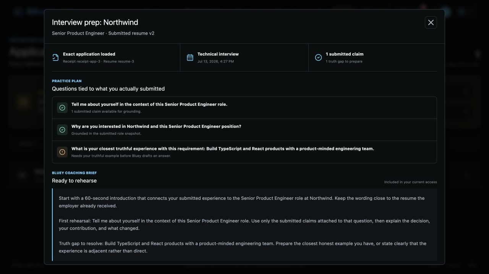
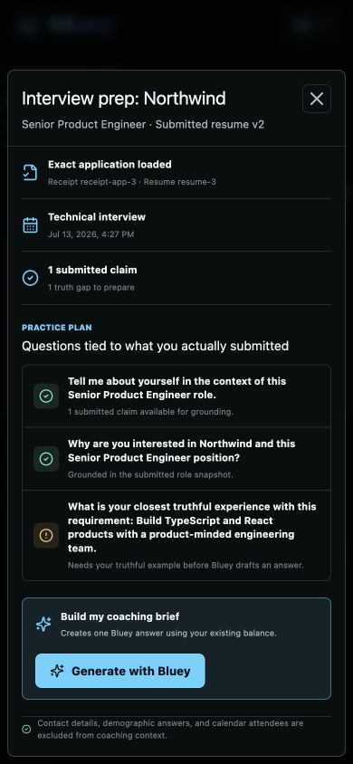
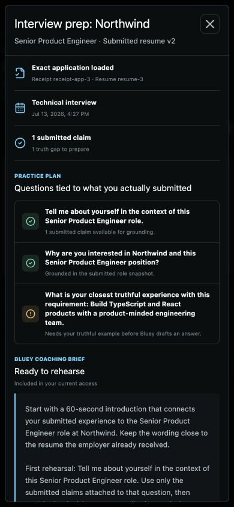

# Round 495 - Jobs Application To Interview Prep

Date: 2026-07-11

Repository: `/Users/uno/Downloads/cue-bluey-jobs`

Branch: `codex/bluey-jobs-20260710`

This round implements the first Bluey Jobs differentiator that competitors do
not present as one trustworthy loop: a confirmed application can become an
interview-preparation brief grounded in the exact material sent to the
employer.

## Product Contract

From a Submitted application, the customer can now:

1. Open **Prepare interview** beside the submission receipt.
2. See the frozen receipt ID, submitted resume version, interview event, and
   count of usable submitted claims.
3. Review a practice plan whose questions point either to submitted evidence
   or an explicit truth gap.
4. Deliberately generate one Bluey coaching brief using the shared Bluey
   balance.
5. Keep contact information, demographic answers, compensation answers,
   authorization details, and calendar attendees out of coaching context.

The north-star behavior is consistency: Bluey prepares the customer to discuss
what the employer actually received, not a newer profile or a newly generated
resume.

## Visual Result

### Desktop Coaching Brief



### Mobile Practice Plan



### Mobile Coaching Brief



The 390 x 844 check has no horizontal overflow. The 374 px modal remains
inside the viewport, and its long coaching result scrolls internally.

## Authoritative Architecture

The portal does **not** send a job description, resume, answers, claims, or a
prompt to the model endpoint. It sends only:

```http
POST /api/jobs/applications/{application_id}/interview-prep
{}
```

The authenticated Jobs API then:

1. Loads the tenant-scoped application.
2. Requires the application and final receipt to both be Submitted.
3. Verifies receipt schema, account, application, run, job, resume version, and
   submitted claim IDs.
4. Requires the submitted resume document hash/storage key, confirmation, and
   screenshot evidence.
5. Cross-checks the receipt against the application evidence ledger.
6. Uses `receipt.job`, never the mutable current match row.
7. Uses `receipt.packet.answers`, never current Answer Memory or mutable
   `application.answers`.
8. Loads `receipt.packet.resumeVersionId`, never the newest resume.
9. Removes contact fields and sensitive application answers.
10. Sends the minimized source manifest through Bluey's existing managed
    completion service, preserving account checks, routing, usage, billing,
    balance deduction, and idempotency.

The request ID is deterministically derived from the receipt fingerprint and
prompt schema version. A replay of the same successful preparation returns the
same billed completion instead of creating another charge.

## Response Contract

```json
{
  "schema_version": 1,
  "id": "prep-...",
  "application_id": "...",
  "content": "...",
  "generated_at_ms": 0,
  "grounding": {
    "receipt_id": "...",
    "receipt_fingerprint": "...",
    "resume_version_id": "...",
    "resume_checksum": "...",
    "resume_document_sha256": "...",
    "answer_keys_used": [],
    "answer_keys_omitted": []
  },
  "provider": "...",
  "model": "...",
  "cost_cents": 0,
  "balance_cents_after": 0,
  "trial_seconds_remaining": 0,
  "cost_label": "...",
  "confidence": 0.0
}
```

No browser-supplied grounding field is accepted by this endpoint.

## Core Preparation Contract

`jobs/automation/src/interview-prep.ts` adds a deterministic client-safe packet
for the practice-plan UI. It:

- requires an evidence-complete submitted receipt;
- rejects a resume version other than the submitted version;
- rejects missing user-entered claims and permits an imported claim only when
  it was present in the exact submitted resume;
- removes contact, demographic, compensation, authorization, sponsorship, and
  immigration information;
- extracts role requirements without treating generic marketing copy as a
  requirement;
- maps requirements to submitted claims using transparent token overlap;
- produces a Truth Gap when no submitted evidence supports a requirement;
- never turns a Truth Gap into a fabricated answer.

This packet controls the visible practice plan. The server independently
rebuilds the actual model grounding from canonical storage.

## Files Added

- `jobs/automation/src/interview-prep.ts`
- `jobs/automation/tests/interview-prep.test.ts`
- `jobs/portal/src/lib/interview-prep.ts`
- `jobs/portal/src/lib/interview-prep.test.ts`
- `jobs/portal/src/components/InterviewPrepDialog.tsx`
- `server/src/api/jobs_interview_prep.rs`
- `docs/rounds/ROUND-495-JOBS-APPLICATION-TO-INTERVIEW-PREP.assets/*`

## Existing Files Extended

- `jobs/automation/src/index.ts`
- `jobs/automation/package.json`
- `jobs/portal/package.json`
- `jobs/package-lock.json`
- `jobs/portal/src/api.ts`
- `jobs/portal/src/data/preview.ts`
- `jobs/portal/src/styles.css`
- `jobs/portal/src/views/ApplicationsView.tsx`
- `server/src/api/jobs.rs`
- `server/src/api/mod.rs`
- `server/src/api/router.rs`
- `server/src/db/jobs.rs` (stale Jobs fixtures aligned with current policy)
- `server/tests/integration_e2e.rs` (current limiter and UUID contracts)

The shared worktree also contains unrelated and concurrent Round 493/494
receipt, reservation, runner, workflow, and portal changes. This round does not
claim ownership of those edits.

## Verification

Broad verification completed on July 11, 2026:

- Jobs JavaScript workspaces: 80 tests passed (automation 64, browser 6,
  runner 4, portal 6).
- All Jobs workspace TypeScript checks and package builds passed.
- Portal production Vite build passed; its existing chunk-size warning remains.
- Server: 301 unit tests and 55 integration tests passed. The latter includes
  all 52 `integration_e2e` cases plus the ConnectInfo and GDPR cleanup suites.
- `cargo check --bins` and `cargo fmt -- --check` passed in `server/`.
- Desktop coaching-brief visual verification passed.
- Mobile 390 x 844 visual and horizontal-overflow verification passed.
- The portal dialog remained inside a 390 px viewport with internal scrolling
  and no page-level horizontal overflow.

Two pre-existing integration fixtures were aligned with current server
contracts during broad verification: the explicit immediate-rejection limiter
test now disables short waiting, and the sync round-trip uses a UUID session ID.

## Trust Tests

Coverage proves that:

- a current or browser-modified job cannot replace `receipt.job`;
- a newer resume cannot replace the submitted resume version;
- current application answers cannot replace receipt packet answers;
- receipt claim IDs must match the submitted resume claim set;
- cross-application calendar events are ignored;
- calendar attendee metadata is omitted;
- email, phone, demographic, compensation, and authorization values are
  omitted;
- a missing receipt screenshot, employer confirmation, exact resume evidence,
  trusted object key, or document hash blocks preparation;
- an unsupported requirement creates a truth gap instead of a story.

## Remaining Work

This is a complete first coaching brief, not the final interview product.

1. Persist a first-class `jobs_interview_preps` artifact keyed by application,
   receipt fingerprint, and prompt schema. Router idempotency currently protects
   billing replay, but the prep is not listed as a durable Jobs artifact.
2. Add a multi-turn mock-interview session that retains the same immutable
   grounding manifest and records customer-approved notes.
3. Attach a prep action automatically when a real inbox/calendar worker creates
   an interview event. Generation must remain an explicit customer action.
4. Add direct-handoff answer capture when the customer submits outside a Bluey
   runner. Bluey must label manually entered answers as unavailable otherwise.
5. Add verified company research as a separate cited source. Do not blend web
   claims into the submitted-application evidence silently.
6. Display the server grounding fingerprint and exact document hash in the
   receipt/prep detail for advanced auditability.
7. Add an authenticated HTTP integration test around the endpoint with a fake
   managed completion provider. Current coverage tests the source loader and
   route compilation without calling a paid provider.

## Still-Open P0 Gates

Round 495 does not close the other Round 494 launch gates:

- end-to-end discovery scheduling and honest source health;
- provider-specific ATS state machines and authorized certification;
- distributed runner leases and crash-after-submit reconciliation;
- production OAuth workers for inbox/calendar outcomes;
- full production object-store and multi-replica fault drills.

## Handoff Prompt

```text
Read ROUND-495-JOBS-APPLICATION-TO-INTERVIEW-PREP.md and preserve the
server-authoritative trust boundary.

Extend this into a durable multi-turn mock-interview experience. The browser
must continue sending only application_id. Ground every turn in the same
receipt fingerprint, exact resume version/checksum, receipt-owned job snapshot,
and privacy-minimized receipt answers. Do not use current workspace matches,
current profile text, newer resumes, or current Answer Memory as replacements.

First add a tenant-scoped jobs_interview_preps/session model and authenticated
tests with a fake completion provider. Then expose session continuation in the
existing InterviewPrepDialog. Do not add company web research until cited
research provenance is a separate explicit source.
```
