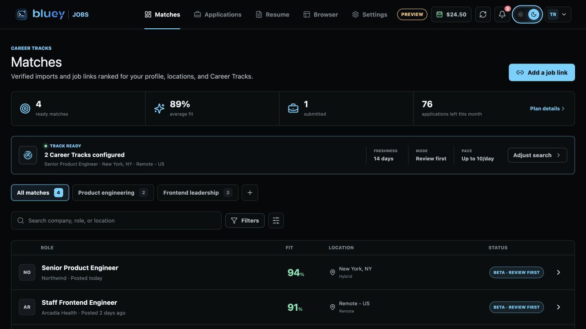
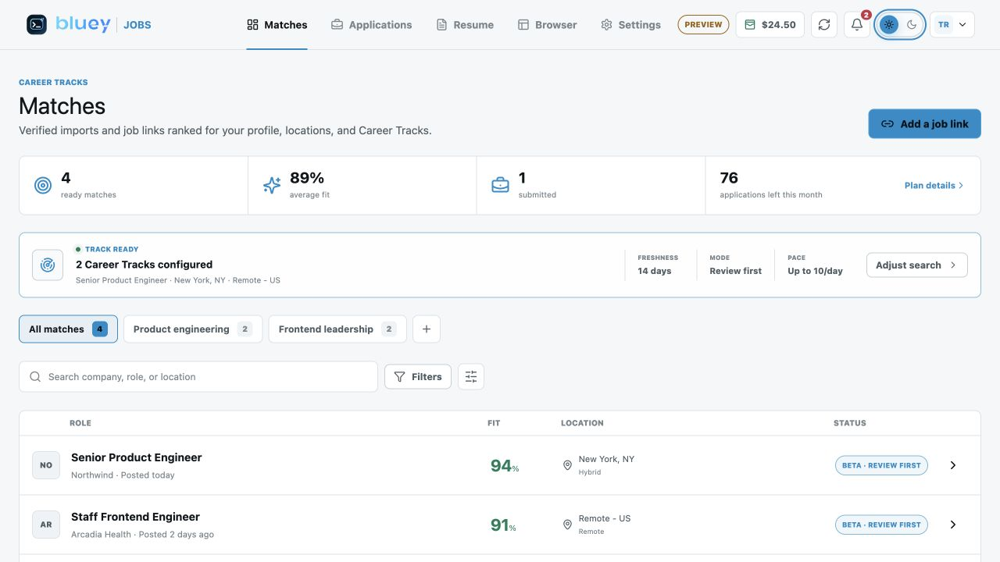
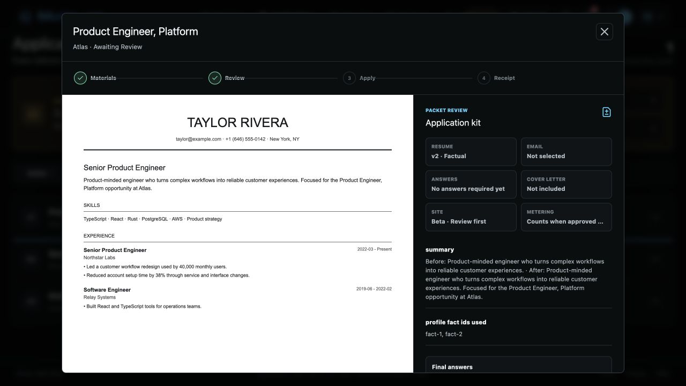
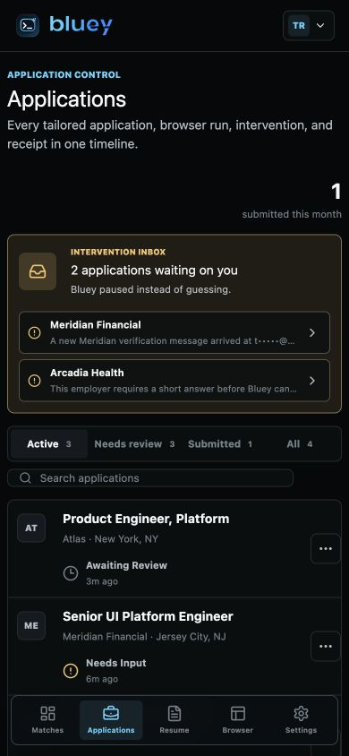
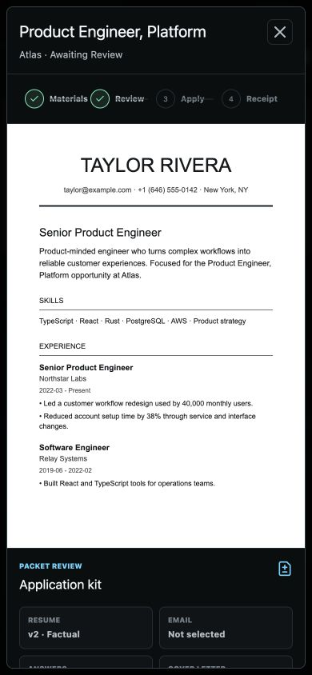
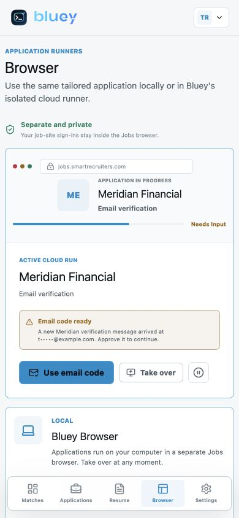

# Round 498 - Jobs P0 Safety, Eligibility, and Receipts

Date: 2026-07-11

Repository: `/Users/uno/Downloads/cue-bluey-jobs`

Branch: `codex/bluey-jobs-20260710`

## Context

This round closes the P0 issues identified in Rounds 492 and 494 while preserving the concurrent Rounds 495-497 application-to-interview, completeness, and candidate-truth work.

The implementation keeps the existing Bluey host overlay, meeting runtime, audio, and native session behavior untouched.

## Review-First Is Now A Server Boundary

An `awaiting_review` packet cannot enter either runner.

- Browser runner selectors contain only `queued` applications.
- The queue API rejects review-pending records.
- Approval is a distinct server endpoint.
- Approval reserves the attempt and meters the unique packet once.
- Regeneration, retry, runner choice, and intervention resume do not meter it again.

Relevant files:

- `jobs/portal/src/lib/application-flow.ts`
- `jobs/portal/src/views/BrowserView.tsx`
- `jobs/portal/src/views/ApplicationsView.tsx`
- `jobs/portal/src/App.tsx`
- `server/src/api/jobs.rs`
- `server/src/db/jobs.rs`

## Server-Owned Job Authority

Public `POST /api/jobs/matches` now accepts a narrow `UserJobInput` containing only user-entered job details. It no longer accepts a trusted `JobPosting` object.

The server owns:

- source classification
- ATS capability
- availability and verification state
- match score and reasons
- missing requirements
- posting freshness
- eligibility decisions

Caller-supplied values such as `greenhouse_certified`, a perfect score, or a fake active timestamp are ignored.

No ATS is currently presented as certified. The five named adapters are labeled **Beta · review required**. LinkedIn and Indeed remain handoff flows, and unknown public sites remain review-only.

## One Eligibility Decision

`JobEligibilityDecision` is the authoritative decision used by workspace Matches, packet preparation, Auto-submit eligibility, approval, runner queueing, and the packet receipt.

It evaluates:

- salary floor
- location and workplace policy
- excluded companies and titles
- employment type
- sponsorship
- freshness and current availability
- live verification
- one active application per company
- local daily limit using the user's timezone offset
- required facts and unsupported claims
- match threshold
- ATS capability

The portal renders this decision; it does not independently decide whether a job is runnable.

## Atomic Attempt Reservations

Migration 0023 adds `jobs_attempt_reservations`.

Reservations are transactional and idempotent. They separate a prepared packet from an actual application attempt and track:

- `reserved`
- `running`
- `released`
- `side_effect_unknown`
- `submitted`

Daily pace and company cooldown checks run inside the same SQLite immediate transaction or Postgres account lock that creates the reservation. Preparing or reviewing a packet does not consume the daily attempt limit.

## Submission Receipts Require Real Evidence

A submitted state is accepted only after the server validates an exact evidence bundle.

Required checks include:

- schema, account, application, and run IDs
- frozen application identity and identity-scoped browser profile
- exact canonical job URL
- exact approved resume version and application email
- adapter and adapter version
- real confirmation text or confirmation URL
- the submitted resume bytes and checksum
- a confirmation screenshot and checksum

The local browser and cloud runner send the exact evidence bytes. The server verifies every checksum, writes account-scoped objects, reads them back, verifies them again, and only then records the receipt and submitted state. It does not invent a confirmation message or pretend a local path is cloud evidence.

Receipt-bearing worker and local-run routes now explicitly allow evidence payloads up to 64 MiB while each object remains constrained by the configured object-storage limit.

## Crash-After-Submit Safety

Employer-facing `runApplication` and `resumeApplication` Temporal activities use `maximumAttempts: 1`.

If connectivity or a worker fails during an employer-facing step, the workflow records `side_effect_unknown`, keeps the browser reservation held for reconciliation, and states that the application will not be submitted again automatically. This prevents a blind second submission.

This is a safety boundary, not a claim that an in-memory browser survives a process loss. Durable browser leases and restartable intervention sessions remain a launch gate below.

## Truthful Packet Review And Copy

Packet review now shows canonical packet data:

- resume version and mode
- real resume diff
- selected application identity
- final answers
- cover-letter state
- ATS capability
- pause reasons
- metering behavior

The product no longer claims that imported feeds are actively searched when no scheduled discovery worker is running. Matches says **Track ready**, and the public/legal copy describes email, calendar, cover-letter, and status features only when they are actually available to the account.

## Onboarding Improvements Preserved

The first-use flow includes:

- an explicit no-resume path
- a Review-first recommendation for the first applications
- an application-kit preview before Auto-submit
- Career Track, location, work authorization, compensation, and identity setup

## Visual Verification

### Dark Desktop Matches

### Light Desktop Matches

### Truthful Packet Review

### Mobile Applications

### Mobile Packet Review

### Mobile Browser Runner

Verified at the default desktop viewport and 390 x 844 mobile viewport:

- no page-level horizontal overflow
- no header control overlap at 1280 px
- compact mobile bottom navigation
- packet dialog remains within the viewport and scrolls internally
- route refresh stays on the selected Jobs route
- zero browser console warnings or errors

## Verification

Passed:

- `npm run typecheck` in `jobs/`
- `npm test` in `jobs/`
  - automation: 64 tests
  - browser: 6 tests
  - runner: 4 tests
  - workflows: 2 tests
  - portal: 6 tests
- `npm run build` in `jobs/`
- `cargo test` in `server/`
  - 305 unit tests
  - 52 integration E2E tests
  - 3 ConnectInfo/GDPR integration tests
- production Vite build
- dark/light desktop browser checks
- 390 x 844 responsive browser checks
- `git diff --check`

The existing Vite large-chunk warning remains; the lazy route split is working, but PDF/DOCX libraries still produce large on-demand chunks.

## Production Launch Gates

These items are deliberately not represented as complete in the UI:

1. Build and certify provider-specific Greenhouse and Lever adapters, then Workday, Ashby, and SmartRecruiters. The current shared form engine remains beta-review only.
2. Run at least one real scheduled discovery source before showing active autonomous search. Public ATS import support alone is not a scheduler.
3. Add distributed runner leases, heartbeats, fencing tokens, preserved intervention-session checkpoints, restart recovery, and side-effect reconciliation across worker/container loss.
4. Provision the production cloud browser pool, R2/S3 evidence storage, Temporal namespace, encryption keys, and operational monitoring.
5. Complete provider OAuth workers before enabling Gmail/Outlook/calendar status promises.
6. Package and sign the macOS and Windows Bluey Browser installers.
7. Run the five-ATS fixture/sandbox/live certification matrix plus cloud load and regional-recovery tests.

## Git State

No commit or push was created in this round, per instruction.
