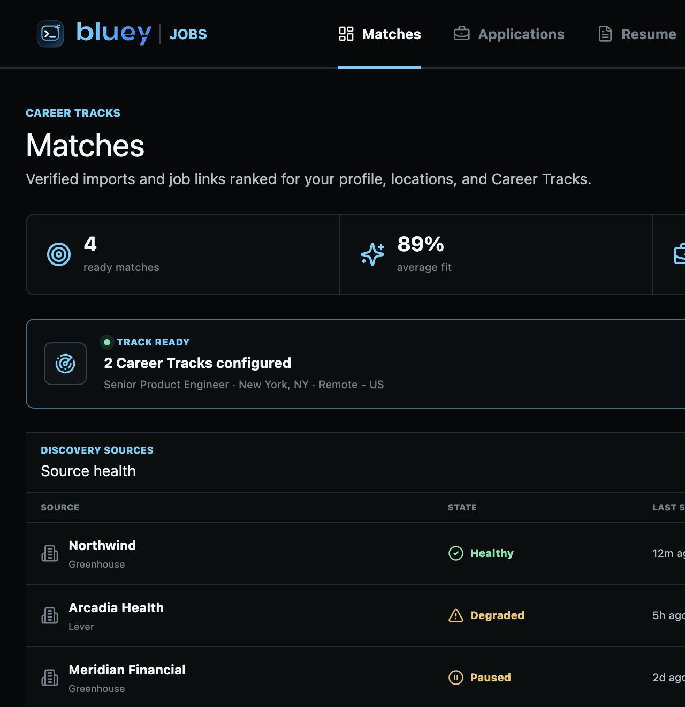
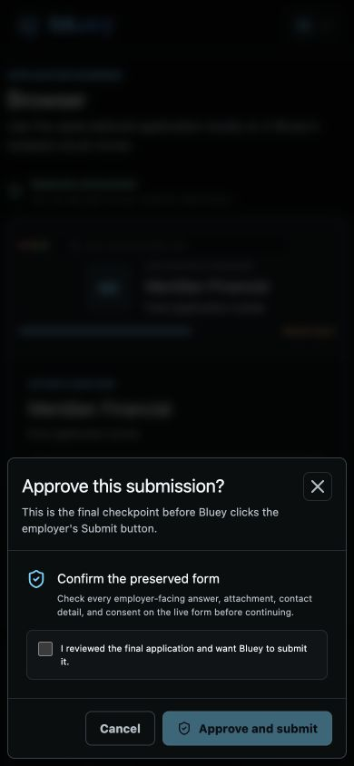

# Round 499 - Jobs Reference Code Deep Audit And Launch Implementation

Date: 2026-07-12
Branch: `codex/bluey-jobs-20260710`
Scope: AIApply, ApplyBlast, downloaded job/browser references, and the Bluey Jobs implementation

## Executive Decision

Bluey Jobs is now suitable for a controlled internal dogfood and a staged,
review-first beta after production infrastructure is provisioned. It is not yet
an honest public claim for unlimited autonomous applications across arbitrary
sites. The code now enforces that distinction instead of relying on UI copy.

The competitive work produced three useful conclusions:

1. AIApply's strongest public idea is a guided path from imported career data
   to a ready-to-review application kit.
2. ApplyBlast's strongest public idea is a visible trust ramp from manual work,
   to review-first assistance, to narrowly enabled automation, plus a tracker
   that makes outcomes understandable.
3. Bluey's opportunity is not to submit more recklessly. It is to combine those
   approachable workflows with stronger candidate truth, crash safety,
   evidence, local/cloud choice, and interview preparation.

## Evidence Boundary

The audit used public pages, authenticated product screens reached without
payment, public client resources, official ATS documentation, and local source
references supplied by the owner. It did not purchase plans, bypass access
controls, defeat CAPTCHA or 2FA, submit a real job application, or claim to know
private competitor services.

Public product behavior is evidence. Minified public clients can show route
names, form fields, and request shapes, but they cannot prove hidden ranking,
scraping, orchestration, retry, model, or anti-abuse implementations. Those
remain unknown unless a competitor publishes them.

Primary public products:

- [AIApply](https://aiapply.co/)
- [ApplyBlast](https://applyblast.com/)
- [Greenhouse Job Board API](https://developers.greenhouse.io/job-board.html)
- [Lever Postings API](https://github.com/lever/postings-api)

The full competitor record is in Rounds 480-485, 491-492, 494, and 496. The
source-code and archive disposition is in Rounds 486-490 and
`jobs/THIRD_PARTY_PROVENANCE.md`.

## Visual Evidence

### Competitor Activation And Trust


### Bluey Result






## Source And License Disposition

Fourteen commit-pinned job-application repositories and ten downloaded
AI/browser archives were reviewed without execution. The privacy and provenance
CI gates fail if candidate data, browser profiles, receipts, credentials,
archives, or unlicensed dependencies enter the release.

Adopted patterns were reimplemented inside Bluey's own contracts:

- public ATS normalization, bounded pagination, and freshness;
- identity-scoped browser profiles and durable run ownership;
- typed interventions instead of guessing unknown answers;
- application packets, answer memory, and evidence-backed receipts;
- source-ledger, citation, and bounded research ideas for future matching.

Research-only or rejected material includes AGPL/proprietary source, private
endpoint automation, stealth or anti-bot bypasses, CAPTCHA solvers, fabricated
candidate facts, raw cookie transfer, and single-user YAML/JSON as production
state. Exact commits, licenses, hashes, and decisions are recorded in:

- `jobs/THIRD_PARTY_PROVENANCE.md`
- `jobs/THIRD_PARTY_NOTICES.md`
- `jobs/automation/THIRD_PARTY_NOTICES.md`

## Implemented Product Contract

### First Session And Review UX

- The portal supports a useful onboarding path, career facts, tracks,
  preferences, application emails, resume baselines, and pasted jobs.
- Matches expose eligibility and discovery-source health before queueing.
- The packet review shows the frozen job, identity, resume version, tailored
  changes, confirmed claims, answers, and blockers.
- Greenhouse and Lever stop at a provider-specific final review. Submission
  requires a separate server approval and an explicit checked confirmation.
- Applications retain immutable receipts and feed the grounded interview-prep
  experience without letting job text become model instructions.

Code: `jobs/portal/src/App.tsx`, `components/Onboarding.tsx`,
`views/MatchesView.tsx`, `views/ApplicationsView.tsx`,
`views/BrowserView.tsx`, `components/InterviewPrepDialog.tsx`, and
`lib/application-flow.ts`.

### Candidate Truth And Company Safety

- A second email, track, or browser profile cannot bypass a prior application
  to the same normalized company.
- A candidate-truth fingerprint follows the person's real employment and
  education history; changing presentation does not create a new person.
- Resume generation omits empty sections and never invents experience.
- Only server-confirmed facts can become verified receipt claims.
- Applying for SDE does not authorize Bluey to fabricate a different resume and
  apply for DE at the same company. A genuinely different person/account is a
  separate identity and policy decision, not an email-field trick.

Code: `server/src/db/jobs.rs` symbols `candidate_truth_fingerprint`,
`evaluate_job_eligibility`, `reserve_application_attempt`,
`upsert_user_fact`, and `confirmed_resume_claim_ids`;
`jobs/automation/src/packet-guards.ts`.

### Discovery

- Greenhouse and Lever discovery sources are server-configured and
  deny-by-default.
- Workers lease durable source records, submit complete snapshots, and commit
  with a fence. Stale workers cannot overwrite a newer snapshot.
- Failed or partial snapshots never close postings. Missing jobs need two
  complete snapshots plus a grace period.
- Source health blocks stale or paused sources from authorizing a new run.

Code: `jobs/automation/src/public-ats.ts`,
`jobs/workflows/src/discovery-worker.ts`, `discovery-runtime.ts`, and
`discovery-provider.ts`; `server/src/api/jobs.rs` discovery worker routes;
`server/src/db/jobs.rs` discovery lease/snapshot functions.

### Provider Execution

- Greenhouse and Lever have explicit review-only state machines and fixtures.
- Workday, Ashby, and SmartRecruiters remain deterministic handoff/generic
  adapters, not falsely labeled certified autonomous integrations.
- Unknown public sites and restricted sites cannot enter unattended submit.
- CAPTCHA, 2FA, assessments, sensitive questions, and unknown required fields
  become interventions. They are never bypassed or guessed.

Code: `jobs/automation/src/providers/greenhouse.ts`, `providers/lever.ts`,
`standard-adapters.ts`, `form-intelligence.ts`, `challenge-handling.ts`, and
`policy.ts`.

### Crash And Duplicate Safety

- Cloud runs use durable database leases bound to account, application, run,
  application identity, browser profile, worker, token hash, and fence.
- A final click atomically moves a lease to `click_started`. A crash afterward
  becomes `side_effect_unknown`; it is never automatically retried.
- Local Browser writes an exclusive, `0600`, fsynced marker before the final
  click and preserves the browser for reconciliation on uncertain outcomes.
- Resume capabilities are server-approved, hash-bound, replay-safe after a
  crash, and do not themselves grant submit authority.
- Network guards reject plaintext non-loopback origins, credentials in URLs,
  localhost/private/link-local/CGNAT targets, unsafe subresources, WebSockets,
  and service workers.

Code: `jobs/runner/src/execution-lease.ts`, `leased-run.ts`,
`browser-network-guard.ts`, and `resume-policy.ts`;
`jobs/browser/src/irreversible-submit.ts`, `local-failure.ts`,
`provider-final-review.ts`, and `browser-network.ts`;
`server/src/db/jobs.rs` execution-lease and local-resume functions.

### Evidence And Durable State

- Submission requires the exact frozen packet, identity, resume, confirmed
  claims, real confirmation text/URL, and every referenced evidence object.
- PDF and PNG objects are byte/type/magic/checksum checked before upload.
- Uploads use request-owned keys and are cleaned after later validation or
  transaction failures without deleting a concurrent committed request.
- Evidence, browser session, reservation, local ticket or cloud lease binding,
  final receipt, and application state commit in one database transaction.
- Replays require the exact request fingerprint; a different receipt conflicts.
- Cloud profile snapshots and durable results use scoped HKDF-SHA256-derived
  AES-256-GCM envelopes. Plaintext and legacy envelopes fail closed.

Code: `server/src/api/jobs.rs` symbols `persist_submission_receipt`,
`preflight_receipt_evidence`, and `submission_terminal_session`;
`server/src/db/jobs.rs` symbol `finalize_submission`;
`jobs/runner/src/crypto-envelope.ts`, `profile-store.ts`, and `result-store.ts`.

### Documents, Privacy, And CI

- ATS PDFs preserve extractable Latin, Chinese/Japanese, and Korean text with
  bundled, pinned OFL fonts and deterministic golden hashes.
- RTL scripts and unsupported shaping fail visibly instead of producing a
  corrupted resume. Referenced PDFs require a meaningful text layer and obey
  byte/page limits.
- Account export includes durable Jobs data but excludes ephemeral tickets,
  leases, and browser secrets. Account deletion covers Jobs rows and objects.
- CI scans the staged tree for credentials, candidate data, browser profiles,
  evidence artifacts, archives, schema drift, dependency licenses, and source
  provenance.

Code: `jobs/automation/src/documents.ts`,
`jobs/automation/tests/documents.test.ts`, `server/src/db/account_data.rs`,
`server/src/db/jobs.rs`, `jobs/scripts/privacy-gate.mjs`,
`check-jobs-schema-parity.mjs`, and `check-provenance-licenses.mjs`.

## Verification

Completed locally on 2026-07-12:

- Jobs JavaScript: 5 workspaces, 212 tests passed.
- Jobs TypeScript: every workspace passed strict typecheck.
- Jobs production build: automation, browser, runner, workflows, and portal.
- Server: 320 unit tests, 61 integration tests, and 3 additional integration
  tests passed, for 384 total Rust tests.
- Rust formatting passed.
- Privacy gate passed.
- SQLite/Postgres Jobs parity passed: 5 tables and 8 indexes.
- Dependency and source-provenance inventory passed: 628 unique JavaScript
  package versions and 14 commit-pinned source repositories.
- CI guard mutation/self-tests passed.
- `git diff --check` passed.
- Desktop and 390 px mobile visual QA passed for source health and final
  submission approval, with no horizontal overflow or dialog clipping.

Postgres branches compile and are schema-checked, but the current automated
integration suite executes SQLite. A production Postgres migration/rollback
smoke remains mandatory before enabling beta traffic.

## Ranked Launch Roadmap

### P0 Before Internal Dogfood

| Recommendation | Customer value | Size | Dependencies | Risk | Bluey modules |
| --- | --- | --- | --- | --- | --- |
| Deploy portal and Jobs API with beta access restricted | Lets the team exercise the real contract without public overclaiming | M | production build, database, Caddy | operational | `web/jobs`, `bluey-jobs-api` |
| Run Postgres migration, backup, restore, and rollback smoke | Protects candidate and receipt data | M | managed Postgres credentials | data loss | `infra/postgres/server-runtime/002_jobs.sql`, `ops/restore-drill-bluey-db.sh` |
| Configure evidence object storage and lifecycle | Makes submitted receipts complete and deletable | M | R2/S3 credentials and deletion policy | privacy | `server/src/object_storage.rs`, Jobs receipt routes |
| Provision one Greenhouse and one Lever source | Proves discovery freshness and provider review in reality | S | real board/site identifiers | provider drift | discovery admin/worker routes |
| Sign and notarize Bluey Browser for the dogfood OS | Gives users a trustworthy local path | L | Apple/Windows signing identities | supply chain | `jobs/browser` |

### P1 Before Invited Beta

| Recommendation | Customer value | Size | Dependencies | Risk | Bluey modules |
| --- | --- | --- | --- | --- | --- |
| Deploy Temporal, workflow gateway, discovery worker, and encrypted runner pool | Enables reliable cloud execution | XL | Temporal, containers, encrypted volume, egress firewall | side effects | `jobs/workflows`, `jobs/runner` |
| Deploy authenticated browser takeover | Lets users solve CAPTCHA, 2FA, assessments, and ambiguity safely | L | session gateway and TLS | account security | workflow gateway, runner, portal Browser view |
| Certify provider versions tenant by tenant | Prevents broad labels from outrunning tested behavior | L | fixture and live sandbox matrix | employer-site drift | provider capability registry |
| Add operational dashboards and alerts | Makes stuck/unknown runs visible before users repeat them | M | metrics/log aggregation | reliability | Jobs API, workflows, runner |
| Complete Gmail and Outlook OAuth outcome ingestion | Improves tracker accuracy and follow-up | L | OAuth apps, webhooks, token storage | mailbox privacy | integrations and tracker |

### P2 Before Public Launch

| Recommendation | Customer value | Size | Dependencies | Risk | Bluey modules |
| --- | --- | --- | --- | --- | --- |
| Finalize public pricing, allowances, refunds, and abuse controls | Predictable value without confusing credits | M | measured infrastructure cost | margin/abuse | billing and plan policy |
| Complete legal review of training, retention, cookies, and employer-site disclosures | Honest informed consent | M | counsel and vendor contracts | legal/privacy | Terms, Privacy, onboarding |
| Build support reconciliation and deletion SLAs | Resolves uncertain submissions without duplicates | M | support tooling and audit logs | trust | interventions, receipts, admin support |
| Expand only with certified ATS adapters | Broader coverage without silent failure | XL | live provider validation | site changes | adapter registry |

### Later Experiments

- rejection feedback that improves matching without inferring protected traits;
- a compact Today queue for reviews, interventions, interviews, and follow-up;
- granular tailoring controls and multiple truthful baseline resumes;
- source-backed company research and interview preparation;
- carefully measured discovery expansion under provider contracts.

## Explicit Non-Goals

- No CAPTCHA, 2FA, assessment, or security-check bypass.
- No stealth automation, fingerprint spoofing, or private competitor endpoints.
- No fabricated experience, credentials, metrics, eligibility, or answers.
- No second application to the same company through a different email, track,
  browser profile, or cosmetically rewritten resume.
- No unattended submit on unknown or uncertified sites.
- No raw cookies, OTPs, resume text, answers, or screenshots in logs.
- No claim that public JavaScript reveals a competitor's hidden backend.
- No copying source whose license or contributor authority is unclear.

## Handoff Prompt

Give the next implementation agent this exact instruction:

```text
Repository: /Users/uno/Downloads/cue-bluey-jobs
Branch: codex/bluey-jobs-20260710

Read first:
- jobs/README.md
- jobs/ARCHITECTURE.md
- jobs/OPERATIONS.md
- jobs/THIRD_PARTY_PROVENANCE.md
- docs/rounds/ROUND-499-JOBS-REFERENCE-CODE-DEEP-AUDIT-AND-LAUNCH-IMPLEMENTATION.md
- docs/rounds/ROUND-500-JOBS-CI-PRIVACY-GATE.md
- docs/rounds/ROUND-501-JOBS-SCHEDULED-DISCOVERY-PROVIDER-STATE-MACHINES-AND-LEASES.md

Do not weaken candidate-truth, same-company, review-first, evidence, lease,
network, privacy, or provenance gates. Do not claim provider certification
without live acceptance evidence.

Start with the remaining production gates in Round 499. Run the Postgres
migration/rollback smoke, configure request-scoped evidence storage, deploy the
Jobs API and restricted portal, then provision one Greenhouse and one Lever
source. Keep BLUEY_JOBS_BETA_ENABLED off for general users until every P0 gate
passes. Record every environment-dependent result and rollback command in a
new numbered round document. Do not commit secrets or real candidate data.
```

## Final Product Position

Bluey Jobs should be the careful application operating system around Bluey's
existing preparation strengths: discover, decide, tailor truthfully, review,
apply once, prove what happened, track outcomes, and prepare for the interview.
That is a more defensible and more useful product than merely increasing an
application counter.
