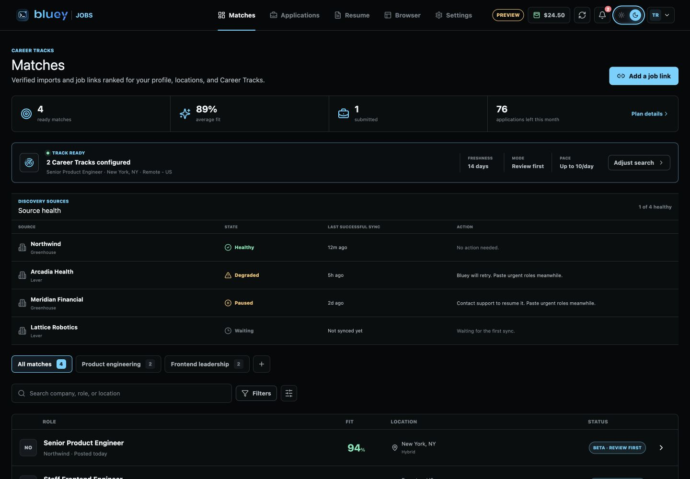
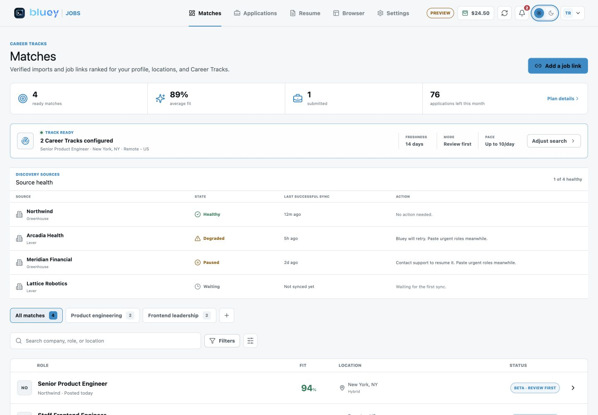
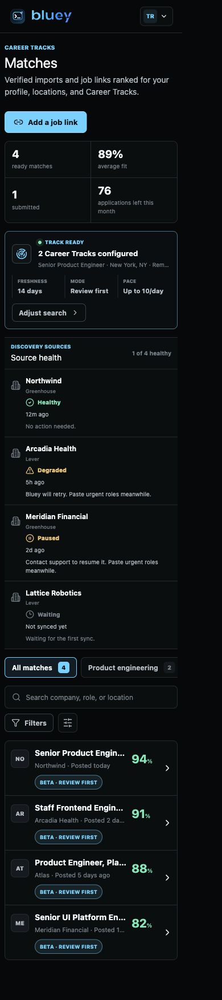

# Round 501 - Jobs Scheduled Discovery, Provider State Machines, and Leases

Date: 2026-07-11

Repository: `/Users/uno/Downloads/cue-bluey-jobs`

Branch: `codex/bluey-jobs-20260710`

## Objective

This round executes the first production-reliability slice from Round 496. It
does not claim public-launch readiness. It replaces library-only discovery and
generic Greenhouse/Lever behavior with a scheduled, server-authoritative
discovery path, provider-specific review-only state machines, and durable
cloud-run submit fencing.

The existing Bluey meeting overlay, native audio, transcription, and session
runtime are untouched.

## Scheduled Discovery

The Jobs API now stores tenant-scoped discovery sources, runs, and source/job
memberships. A separate workflow process leases due sources and polls only
server-configured official Greenhouse and Lever public APIs.

Key boundaries:

- new sources start `waiting`, never implicitly healthy;
- only complete successful snapshots can mark a source healthy;
- failed snapshots degrade or pause a source and never close jobs;
- source leases are exclusive and expire;
- completion/failure reports are replay-safe;
- a changed payload for a completed replay is rejected;
- canonical URLs, company identity, content hashes, snapshot hashes,
  verification times, availability, match score, and eligibility stay
  server-owned;
- missing jobs require two complete misses and a 30-minute grace period before
  expiry;
- stale, paused, degraded, or waiting sources cannot authorize queueing or a
  runner start.

The executable discovery worker now uses the same `DiscoveryWorkerRuntime`
that the test suite exercises. The older duplicate worker loop was removed.
Worker telemetry contains only bounded event names, source fingerprints,
counts, and error codes.

Relevant files:

- `server/src/db/mod.rs`
- `server/src/db/jobs.rs`
- `server/src/api/jobs.rs`
- `infra/postgres/server-runtime/002_jobs.sql`
- `jobs/automation/src/public-ats.ts`
- `jobs/workflows/src/discovery.ts`
- `jobs/workflows/src/discovery-api.ts`
- `jobs/workflows/src/discovery-provider.ts`
- `jobs/workflows/src/discovery-runtime.ts`
- `jobs/workflows/src/discovery-worker.ts`
- `jobs/workflows/tests/discovery.test.ts`
- `jobs/workflows/tests/discovery-runtime.test.ts`

## Greenhouse and Lever State Machines

Greenhouse and Lever no longer resolve to the shared generic adapter. Each has
its own deterministic detect, prepare, fill, validate, submit, and receipt
state machine plus provider-shaped fixtures and negative cases.

Both remain explicitly:

- `beta_review` capability;
- review-only;
- uncertified;
- final-review required;
- fail-closed for ambiguous provider controls, unsupported variants, unknown
  required questions, sensitive questions, sponsorship decisions, CAPTCHA,
  2FA, assessments, closed jobs, and unclear submission confirmation.

No provider is promoted to certified or unattended mode by this round.

Relevant files:

- `jobs/automation/src/providers/greenhouse.ts`
- `jobs/automation/src/providers/lever.ts`
- `jobs/automation/src/execute.ts`
- `jobs/automation/src/policy.ts`
- `jobs/automation/tests/greenhouse-adapter.test.ts`
- `jobs/automation/tests/lever-adapter.test.ts`
- `jobs/automation/tests/provider-beta-adapters.test.ts`
- `jobs/automation/tests/fixtures/greenhouse/`
- `jobs/automation/tests/fixtures/lever/`

## Review and Queue Safety

The P0 boundaries from Round 498 remain enforced:

- `awaiting_review` never appears in local/cloud runner pickers;
- approval is a distinct API action;
- approval reserves and meters one unique packet;
- the queue endpoint rejects an unapproved packet;
- queueing and runner start use the same server-owned eligibility decision;
- source authority is rechecked inside the reservation transaction and again
  before the attempt enters `running`.

## Durable Irreversible-Submit Guard

Cloud runners now claim database-backed execution leases with heartbeats,
fencing tokens, and one active lease per application and identity-scoped
browser profile. The final employer-facing click requires a one-winner
irreversible transition. Expired leases rotate credentials and increment the
fence. A run with uncertain side effects is terminally classified
`side_effect_unknown` and cannot be blindly retried.

The local Bluey Browser also writes an exclusive durable submit marker before
the final click, so a restart cannot silently reacquire submit authority for
the same local run.

Relevant files:

- `server/src/db/jobs.rs`
- `server/src/api/jobs.rs`
- `jobs/runner/src/execution-lease.ts`
- `jobs/runner/src/leased-run.ts`
- `jobs/browser/src/irreversible-submit.ts`
- `jobs/runner/tests/execution-lease.test.ts`
- `jobs/runner/tests/leased-run.test.ts`
- `jobs/browser/tests/irreversible-submit.test.ts`

## Portal Truthfulness

Matches now renders source health separately from Career Track configuration.
The UI can show waiting, healthy, degraded, or paused sources and does not call
an unconfigured track an active search. Unknown and uncertified ATS variants
remain review-only or handoff.

Relevant files:

- `jobs/portal/src/types.ts`
- `jobs/portal/src/data/preview.ts`
- `jobs/portal/src/views/MatchesView.tsx`
- `jobs/portal/src/views/MatchesView.test.tsx`
- `jobs/portal/src/styles.css`

## Verification

Passed in this worktree:

- `cargo fmt --manifest-path server/Cargo.toml -- --check`
- `cargo check --manifest-path server/Cargo.toml --bin bluey-jobs-api`
- `cargo test --manifest-path server/Cargo.toml --lib`: 315 passed
- `cargo test --manifest-path server/Cargo.toml --test integration_e2e jobs_`: 4 passed
- `npm run typecheck` in `jobs/`
- `npm test` in `jobs/`:
  - automation: 117 passed
  - browser: 24 passed
  - runner: 31 passed
  - workflows: 21 passed
  - portal: 14 passed
- `npm run build` in `jobs/`
- `node jobs/scripts/ci-guards-self-test.mjs`
- `node jobs/scripts/privacy-gate.mjs`
- `node jobs/scripts/check-jobs-schema-parity.mjs`
- `node jobs/scripts/check-provenance-licenses.mjs`
- `git diff --check`

The production build reports a non-blocking Vite chunk-size warning for PDF and
document tooling. Those dependencies are already route-loaded, but further
manual chunking remains a performance follow-up rather than a correctness
gate for this reliability round.

## Visual QA

The Matches preview was verified in the in-app browser at 1440 x 1000 and
390 x 844. The source-health states remain legible in dark and light themes,
there is no page-level horizontal overflow, and browser console checks returned
no warnings or errors. The mobile Career Track controls use an intentional
horizontal strip while the page itself remains fixed to the viewport.

Desktop dark:

Desktop light:

Mobile:

## Remaining Launch Gates

This is an invited-beta foundation, not a public unattended launch sign-off.
The remaining gates include:

1. Provision and monitor a real licensed or approved discovery tenant in the
   production environment.
2. Certify representative Greenhouse and Lever tenant variations with sandbox
   and allowlisted dogfood; keep uncertified variants Review-only.
3. Implement and certify provider-specific Workday, Ashby, and
   SmartRecruiters state machines.
4. Provision production R2/S3 evidence storage, malware scanning, retention,
   deletion, and independently verified receipt objects.
5. Deploy the cloud browser pool, takeover transport, queue monitoring,
   adapter canaries, and provider/account/region kill switches.
6. Complete Gmail/Outlook OAuth and evidence-backed outcome workers before
   enabling outcome-tracking promises.
7. Sign and notarize desktop installers, finish threat modeling and
   penetration testing, and exercise backup restoration and incident response.

## Git State

No commit or push was created in this round.
