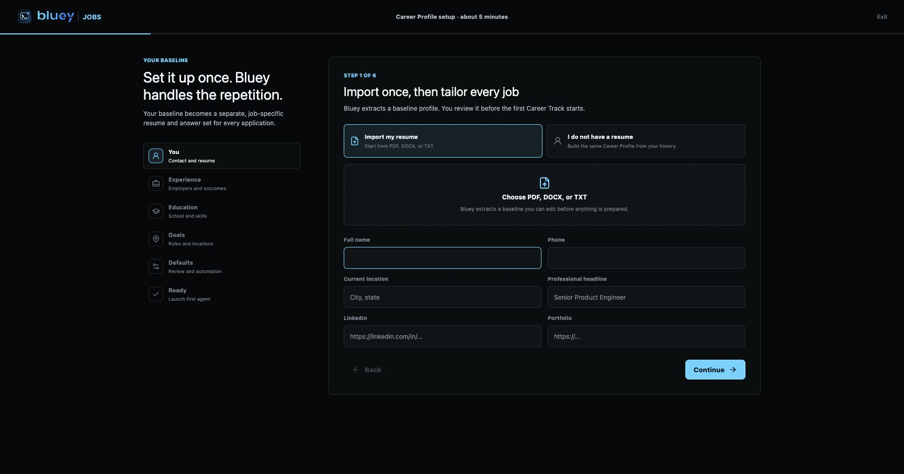

# Round 502: Bluey Jobs Production Deploy

Date: 2026-07-12

## Outcome

Bluey Jobs is deployed at [https://bluey.sh/jobs/](https://bluey.sh/jobs/) as a
staged beta. The portal, independently deployed Jobs API, PostgreSQL schema,
main API integration, Caddy routing, encrypted Jobs configuration, and static
assets are live.

The final deployment has two artifact revisions:

| Artifact | Revision | Production evidence |
| --- | --- | --- |
| Main API and Jobs API binaries | `5698eb2e056a2846b6758cfd0826757c75a720db` | Both local health endpoints report this exact commit. |
| Jobs portal source and static bundle | `a41cdfd6` | `/jobs/` references `assets/index-Bcef-pPV.js`; the asset returns `200`. |

The branch is `codex/bluey-jobs-20260710`. The implementation and competitive
launch audit are in
[Round 499](ROUND-499-JOBS-REFERENCE-CODE-DEEP-AUDIT-AND-LAUNCH-IMPLEMENTATION.md).

## Production Fixes

The deployment smoke test found three failures that SQLite and clean-session
testing did not expose. All three were fixed before acceptance:

1. **PostgreSQL integer flag decoding** (`890ed90d`)
   - Production PostgreSQL stores Jobs boolean flags as `INTEGER`, which the
     Rust PostgreSQL driver exposes as `i32`.
   - The adapter had used `i64`, causing the authenticated workspace request to
     panic while reading entitlements.
   - All affected profile, track, entitlement, packet-metering, and application
     identity reads and writes now use the schema's exact PostgreSQL type in
     `server/src/db/jobs.rs`.

2. **Standalone readiness contract** (`5698eb2e`)
   - The Jobs-only process was healthy but returned `404` for `/health`.
   - `server/src/api/mod.rs` now exposes the standard public health response on
     the isolated Jobs router without exposing main-product routes.
   - The integration test proves `/health` is public, workspace data remains
     authenticated, and `/account/me` is absent from the Jobs-only process.

3. **Concurrent refresh-token rotation** (`a41cdfd6`)
   - Initial portal loading requests workspace and account data concurrently.
     When an access token expired, both requests attempted to consume the same
     single-use refresh token. One succeeded, one failed, and the UI displayed
     `Try again`.
   - `jobs/portal/src/api.ts` now deduplicates concurrent refreshes through one
     shared promise. Both requests retry with the rotated access token.
   - `jobs/portal/src/api.test.ts` reproduces the exact race and asserts one
     refresh call and two successful retries.

## Live Verification

The final signed-in browser test used an already expired access-token flow. The
patched portal refreshed once, retried both initial requests, and rendered the
real onboarding UI without another login. The Jobs API recorded the
authenticated workspace request as `200` in 38 ms with no panic or error.

| Check | Result |
| --- | --- |
| `https://bluey.sh/jobs/` | `200` |
| Public main `/health` | `200`, exact server commit `5698eb2e...` |
| Local Jobs `127.0.0.1:8081/health` | `200`, exact server commit `5698eb2e...` |
| Unauthenticated `/api/jobs/workspace` | `401` |
| Authenticated `/api/jobs/workspace` | `200` |
| Main API | active, enabled, `NRestarts=0` |
| Jobs API | active, enabled, `NRestarts=0` |
| Caddy | active and enabled |
| Jobs listener | loopback only on `127.0.0.1:8081` |
| Root disk after builds | 39% used |

## Verification Suite

The final fixes passed:

- Rust library tests: **320 passed**.
- Rust HTTP integration tests: **62 passed**.
- Jobs portal tests: **15 passed**.
- Jobs portal typecheck and production build: passed.
- Production Rust library and binary clippy with `-D warnings`: passed.
- `cargo fmt --check` and `git diff --check`: passed.

The preceding staged-beta implementation also passed the complete Jobs package
suite (**212 tests**), server test matrix (**384 tests** at that revision),
SQLite/PostgreSQL schema parity, privacy scanning, dependency provenance, CI
guard self-tests, and desktop/mobile visual QA. See Round 499 for that evidence.

## Recovery Evidence

Before schema or service changes, production PostgreSQL was backed up to:

`/var/backups/bluey-api/hourly/bluey-postgres-20260712T082608Z.pgdump`

- Size: `23,940,748` bytes.
- SHA-256: `f34958de4294f6c65547ddbc41d8e183d2e637f84098c3ae38aa7e82cb1e51a0`.
- Restore drill: restored into disposable database
  `bluey_restore_drill_20260712_0826`.
- Restore assertions: `accounts=26`, `usage_events=2033`.
- The disposable database was dropped and absence verified after the drill.

Current binary SHA-256 values:

- `/usr/local/bin/bluey-server`:
  `2a04e3226a87bbf566a135ffc5f41faaedfddc7f477c01dda250b18880a4068d`
- `/usr/local/bin/bluey-jobs-api`:
  `4112912e6d97b7b95f440e2983ef4752f3d58a0ca5407d8347513af604cdf6cc`

Rollback artifacts:

- Main API:
  `/var/backups/bluey-api/bin/bluey-server.before-5698eb2e-20260712T092215Z`
- Jobs API:
  `/var/backups/bluey-api/bin/bluey-jobs-api.before-5698eb2e-20260712T092215Z`
- Portal:
  `/var/www/bluey/backups/jobs-before-a41cdfd6-20260712T092518Z`
- Caddy:
  `/etc/caddy/Caddyfile.previous-jobs-20260712T0853Z`
- Traceable build source:
  `/opt/bluey-build-jobs-5698eb2e`

The binary rollback pair is the previously browser-verified `890ed90d` build.
Restore binaries through temporary files plus atomic `mv`, restart
`bluey-api bluey-jobs-api`, and verify both health endpoints before restoring
Caddy or portal assets. Do not overwrite a currently running executable in
place.

## Live Scope

Live now:

- Bluey-authenticated Jobs onboarding and Career Profile workspace.
- Job-specific resume and packet generation with verified-claim provenance.
- Same-company and candidate-truth enforcement across application emails and
  Career Tracks.
- Application identities, answer memory, interventions, evidence, receipts,
  packet metering, discovery-source health, execution leases, and account
  export/deletion contracts.
- Review-first Greenhouse and Lever automation state machines.
- Restricted Jobs API ingress and independent readiness monitoring.

Still external launch gates, not claims of the current production deployment:

- Provision and operate Temporal discovery/application workers.
- Provision signed local runner distribution and the cloud browser/takeover
  runtime.
- Complete live-site acceptance certification for Workday, Greenhouse, Lever,
  Ashby, and SmartRecruiters across representative tenants.
- Complete Gmail/Outlook and calendar OAuth review, token storage operations,
  revocation, and production callbacks.
- Add authenticated synthetic monitoring for workspace load and alerting for
  Jobs readiness, queue age, interventions, receipt failures, and source health.
- Run invited-user dogfood with support, abuse, cancellation, and deletion
  drills before advertising unattended application submission.

Bluey Jobs should remain described as a staged, review-first beta until those
provider and runtime gates are complete. Security checks, CAPTCHAs, two-factor
authentication, and final employer-facing review remain user interventions;
they are never bypassed.

## Agent Handoff

Continue from `a41cdfd6` on `codex/bluey-jobs-20260710` and read Round 499 plus
this document first. Preserve these launch invariants:

- Never fabricate or mutate candidate facts to fit a job.
- Never evade the same-company guard by changing email, track, or resume.
- Never mark an application submitted without exact resume, identity, browser
  binding, and provider confirmation evidence.
- Never retry an irreversible click when the result is unknown.
- Never bypass CAPTCHA, two-factor authentication, or site security controls.

The next implementation priority is deployment of the worker/browser runtime
behind the existing leases and review gates, followed by live ATS certification
and authenticated production synthetics. Do not redesign the portal before
those operational paths are exercised with invited users.
