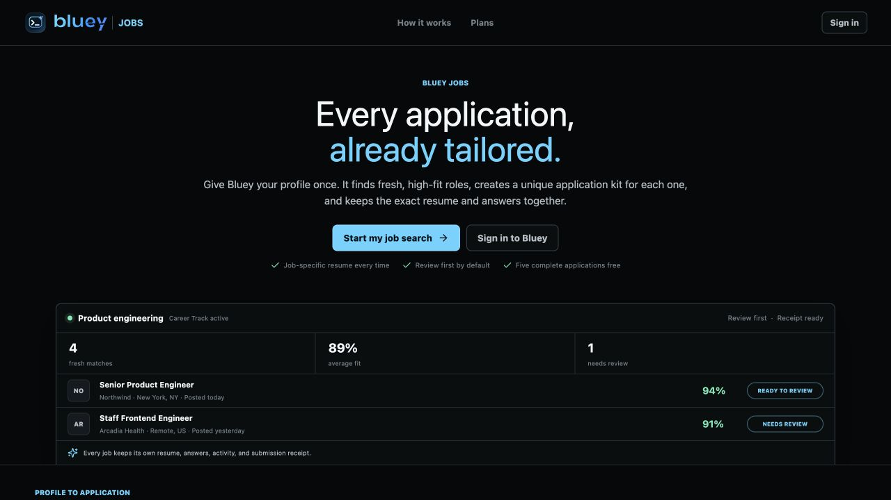
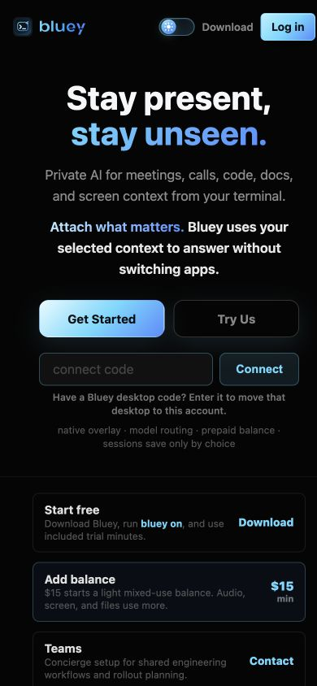

# Round 503 - Jobs Live Staged-Beta Smoke

Date: 2026-07-12

Repository: `/Users/uno/Downloads/cue-bluey-jobs`

Branch: `codex/bluey-jobs-20260710`

Production portal: [https://bluey.sh/jobs/](https://bluey.sh/jobs/)

## Objective

Verify the externally visible staged-beta deployment after Round 502 without
creating an account, entering candidate data, starting a paid flow, or sending
an employer-facing application. This is a safe production smoke, not live ATS
certification.

Source-of-truth revisions:

- branch documentation: `601fa70d`;
- production API binaries: `5698eb2e056a2846b6758cfd0826757c75a720db`;
- production portal source: `a41cdfd6`.

## Passed Contracts

| Check | Result |
| --- | --- |
| `GET /jobs/` | `200`; CSP, HSTS, frame denial, and no-cache HTML headers present |
| Hashed portal JavaScript | `200`; `321,044` bytes |
| Hashed portal CSS | `200`; `92,959` bytes |
| `GET /health` | `200`; exact API commit `5698eb2e...` |
| Unauthenticated `GET /api/jobs/workspace` | `401` with an empty response body |
| Signed-out `/jobs/applications` | Renders public Jobs entry; no workspace data is exposed |
| `/login?next=%2Fjobs` | Renders the Bluey sign-in form and preserves the Jobs return target |
| `/terms` | `200`; distinct Terms page with Jobs, Answer Memory, receipts, billing, and intervention terms |
| `/privacy` | `200`; distinct Privacy page with Jobs data, browser profiles, retention, export, and deletion disclosures |
| Browser console | No warnings or errors on the tested signed-out Jobs, login, Terms, Privacy, and legacy route views |

The signed-out Jobs portal renders its product preview, plans, review-first
defaults, and legal links without exposing authenticated account state.



## Finding 1 - Cloud Runtime Is Advertised Before It Is Operational

Severity: P1 product-truth correction before inviting external beta users.

Round 502 correctly identifies Temporal workers, the signed local/cloud browser
runtime, and live ATS certification as remaining external gates. The live Jobs
landing nevertheless says:

- `let the cloud runner continue while your computer is off`;
- `Keep applications moving in the background`;
- `local + cloud` under the paid Cloud plan.

The authenticated Browser view also describes the background runner as an
available execution path. That overstates the deployed operational scope even
though the server correctly remains review-first and gated.

Source locations:

- `jobs/portal/src/App.tsx:702`
- `jobs/portal/src/App.tsx:712`
- `jobs/portal/src/views/BrowserView.tsx:80`
- `jobs/portal/src/views/SettingsView.tsx:231`

Recommended correction until the runtime gate is complete:

- label Cloud as `Invited beta` or `Coming during beta`;
- replace background-execution promises with `Join the Cloud runner beta`;
- keep pricing non-purchasable unless the account has the operational feature
  flag and an available runner pool.

Acceptance test: a signed-out or unentitled user cannot reasonably conclude
that paying today starts unattended cloud applications.

## Finding 2 - `/JobApply` Does Not Canonicalize to `/jobs`

Severity: P2 routing and analytics correction.

`GET /JobApply` returns the legacy Bluey home application with status `200` and
keeps the browser at `https://bluey.sh/JobApply`. It does not redirect to the
canonical Jobs portal required by the product contract.



The Caddy template currently includes `/JobApply*` in the general HTML matcher:

- `ops/Caddyfile.example:14`
- `ops/Caddyfile.example:49-52`

Recommended correction before the general static handler:

```caddyfile
@legacy_jobs path /JobApply /JobApply/*
redir @legacy_jobs /jobs 308
```

Acceptance tests:

- `/JobApply` returns `308` with `Location: /jobs`;
- `/JobApply/anything` returns `308` with `Location: /jobs`;
- `/jobs/` still returns the Jobs SPA;
- query parameters are either intentionally preserved or explicitly removed.

## Untested By Design

This smoke did not create a production user, upload a resume, verify an email,
connect a mailbox, create a paid checkout, queue a browser run, or submit to an
employer. Those actions require a dedicated invited-beta test account and, for
the final employer-facing click, an explicitly approved sandbox or test job.

The next safe real-world matrix is:

1. Provision one non-admin invited-beta test account.
2. Complete onboarding with synthetic candidate facts and documents.
3. Exercise one real public Greenhouse source and one real public Lever source.
4. Verify hard-filter, same-company, identity, packet, Answer Memory, and
   review-first behavior without final submission.
5. Use employer-owned sandbox applications for final-click, receipt,
   crash-after-submit, and duplicate-delivery certification.

## Outcome

Production delivery, authentication boundaries, and the signed-out experience
are healthy. The deployment remains suitable for internal review-first dogfood.
Correct the two truthful-routing issues above before presenting the current
portal as an operational Cloud-plan beta.

No product code, production configuration, commit, push, or deployment was
changed during this smoke test.
