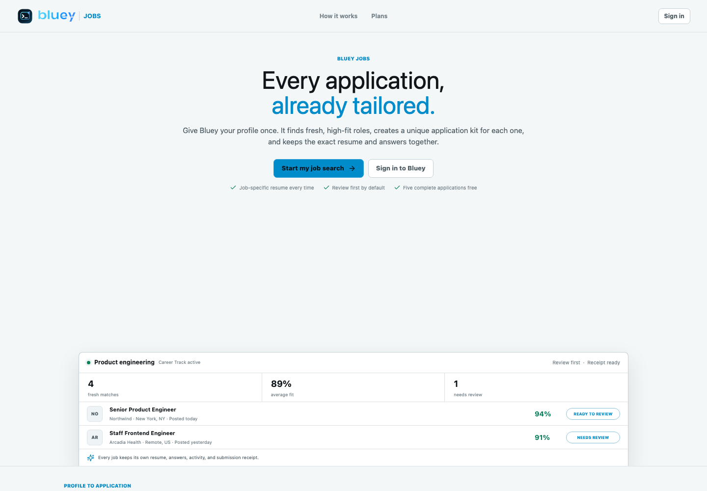
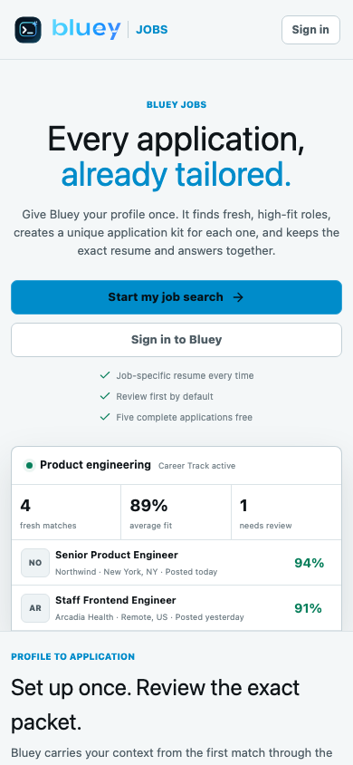

# Round 518 - Bluey Cloudflare Edge Activation And Origin Lock

Date: 2026-07-12

Status: **PRODUCTION VERIFIED**

Repository: `/Users/uno/Downloads/cue`

Integrated branch: `codex/bluey-round506-release-reconcile-20260712`

Edge evidence source: `codex/bluey-jobs-20260710` commit
`a5467d9443ccbbe461e45f43db380448d0e503e6`

Round 506's source controls and Round 508's origin release are now backed by an
enforcing Cloudflare edge, production Turnstile, an origin firewall, and live
desktop/mobile verification. This round also records and resolves one important
compatibility incident: Cloudflare Free Bot Fight Mode issued a JavaScript
Managed Challenge to Bluey's native clients. It was disabled and replaced by
narrow controls that do not require a browser runtime.

This does not claim that public content is impossible to copy. It prevents
direct-origin bypass, blocks self-identifying AI crawlers, limits high-rate API
enumeration, keeps private Jobs worker routes off the public surface, and
preserves Bluey's own API and installer traffic.

## Source And Release Identity

- Edge/security source commit:
  `0368822987a7b636821447371f848e00653cfa2f`
- Branch is pushed but is not merged to `main`.
- Original Round 506 release ID: `round506-f9b8ba3dcda9`
- Original Round 506 web archive SHA-256:
  `7fb9d115a1c0407755c940f95edd951a39a2bfb7520a0749fe307fc8a67eac07`
- Original Round 506 main API SHA-256:
  `87f092675d74a9af88a2c68145283622ad1ce3e201fa57f98926e25eb23edaa0`
- Original Round 506 Jobs API SHA-256:
  `1eacf9a6a349e366fcc0c23fdaa0965287590a63ead41c4aa057773bb248af25`
- Original Round 506 Caddy SHA-256:
  `2b36267138ea1254746e8fd202800929b196bb3fec73f46b49c1a50ca05bf0c5`

A later coordinated release updated production after Round 506. The final
coordinated release is `round517-16098a0014c2`, built from source commit
`16098a0014c2278c3ac38727fe2240b0d860234f`. The live identities captured at
the end of this round are:

| Artifact | Live SHA-256 |
| --- | --- |
| `/usr/local/bin/bluey-server` | `cfd483339258f214f59add688a343f7a351ea05c9f7ec2bdec0ab3dd490bb358` |
| `/usr/local/bin/bluey-jobs-api` | `7201dd4f8b9b674c946ab5c301d5a4a15efbfaadc8bd8e3e4644b5cab2b86b84` |
| `/etc/caddy/Caddyfile` | `91bfba4d2266825d3d31a81ae2c125ee279c1393370afca9ccefd2419ddeae70` |
| `/var/www/bluey/index.html` | `2cf1ea9ce511e1d0d33e1c014eaf8eb77e628083d0a6141289ac96595692fc64` |
| `/var/www/bluey/jobs/index.html` | `c0152f506d7c2a9526c586ce5fea6092a475f413beb149836d8f4bf7dda319cf` |

The live main and Jobs `/health` responses identify the coordinated API source
as `16098a0014c2278c3ac38727fe2240b0d860234f`. The edge activation did not
republish or overwrite the signed native `0.1.99` artifacts.

## Cloudflare Edge State

Cloudflare is authoritative and proxied for `bluey.sh` and `www.bluey.sh`.

- Zone ID: `5964e509a85cde9fd634836af18af45a`
- Nameservers: `jim.ns.cloudflare.com`, `zita.ns.cloudflare.com`
- TLS mode: Full (strict)
- Public IPv4: `104.21.80.64`, `172.67.174.188`
- Public IPv6: `2606:4700:3031::6815:5040`,
  `2606:4700:3033::ac43:aebc`
- AI Crawl Control blocks Training, Search, and Agent behavior classes.
- Known AI crawler blocking is enabled.
- Conventional Googlebot remains allowed for the current SEO posture.
- Browser Integrity Check remains enabled.

Cloudflare's managed `robots.txt` policy is combined with Bluey's origin
policy. The effective response is `200 text/plain`, blocks known AI crawlers,
and reserves search while denying AI input/training through Content Signals.
`/llms.txt` remains intentionally retired with `410`.

### API burst rule

The active Cloudflare rate-limit rule is:

```text
Name: Bluey API burst protection
Expression: starts_with(http.request.uri.path, "/api/")
Threshold: 60 requests per 10 seconds per IP
Action: block for 10 seconds
```

A production-origin probe sent 70 unauthenticated workspace requests and
received 67 `401` responses followed by 3 `429` responses. This proves the
edge limit engages without replacing the application's authentication
boundary.

### Bot Fight Mode incident

Cloudflare Free Bot Fight Mode was briefly enabled. It returned
`cf-mitigated: challenge` and HTTP `403` to all of the following, including on
`/health`:

- `bluey-cloud-client/0.1.99`
- `bluey-cli/0.1.99`
- a modern browser User-Agent
- ordinary curl

Free Bot Fight Mode cannot be reliably skipped by a narrow WAF rule on the
current plan. It was therefore disabled. It must not be re-enabled while native
clients use the public hostname. AI crawler controls, Caddy crawler denial,
Turnstile, the API burst rule, application rate limits, and the origin firewall
remain active.

## Turnstile

A managed widget named `Bluey Production` is configured for `bluey.sh` and
`www.bluey.sh`. Production holds these values in the root-owned API environment:

- `BLUEY_TURNSTILE_SITE_KEY`
- `BLUEY_TURNSTILE_SECRET_KEY`
- `BLUEY_REQUIRE_TURNSTILE=1`

No secret value is recorded in source, this document, screenshots, or command
output. Existing `BLUEY_LOG_STORAGE=r2` and
`BLUEY_SQUARE_APPLICATION_ID_EXPECTED` settings remain present. Strict cloud
preflight completed with zero warnings, and `/auth/captcha/config` returns
`200` with `provider=turnstile`.

## Origin Lock

The historical origin addresses are:

- IPv4: `165.227.77.152`
- IPv6: `2604:a880:800:14:0:3:f7:d000`

UFW now permits HTTPS only from Cloudflare's official IPv4 and IPv6 ranges.
SSH recovery remains open. HTTP remains available for Caddy's redirect and
certificate flow; it returns only `308` to the public HTTPS hostname.

The official Cloudflare range set used for the firewall has SHA-256:

```text
5eb51ed95fcb87928e641c1561737d2c421a31a7cff0e315d47c1c7dd91035a2
```

Final UFW evidence is stored at:

```text
/var/backups/bluey-api/releases/round506-f9b8ba3dcda9-20260712T203301Z/ufw-after-cloudflare-final.txt
```

Its SHA-256 is:

```text
cd1cd2bc7116f32087c9e00ad087e8533eef4df39bdfedb30879c6cb22978ca6
```

Final bypass probes:

| Probe | Result |
| --- | --- |
| Direct IPv4 HTTPS with `Host: bluey.sh` | connection timeout, HTTP `000` |
| Direct IPv6 HTTPS with `Host: bluey.sh` | connection timeout, HTTP `000` |
| Direct IPv4 HTTP with `Host: bluey.sh` | `308 https://bluey.sh/` only |
| Direct IPv6 HTTP with `Host: bluey.sh` | `308 https://bluey.sh/` only |

## Live Verification

### Native and crawler compatibility

| Request | Result |
| --- | --- |
| `/health`, UA `bluey-cloud-client/0.1.99` | `200` |
| `/health`, UA `bluey-cli/0.1.99` | `200` |
| `/auth/captcha/config`, native UA | `200` |
| unsigned `/account/me`, native UA | `401` |
| `/api/jobs/internal/discovery/lease`, native UA | `404` |
| `/`, GPTBot | `403` |
| `/`, OAI-SearchBot | `403` |
| `/`, ChatGPT-User | `403` |
| `/`, ClaudeBot | `403` |
| `/`, PerplexityBot | `403` |
| `/`, Googlebot | `200` |

### Public route matrix

| Path | Status | Content type | X-Robots-Tag |
| --- | ---: | --- | --- |
| `/` | 200 | `text/html` | marketing surface, indexable |
| `/jobs/` | 200 | `text/html` | `noindex, nofollow, noarchive, nosnippet` |
| `/account` | 200 | `text/html` | `noindex, nofollow, noarchive, nosnippet` |
| `/api/jobs/workspace` | 401 | none | `noindex, nofollow, noarchive, nosnippet` |
| `/api/jobs/internal/discovery/lease` | 404 | none | `noindex, nofollow, noarchive, nosnippet` |
| `/llms.txt` | 410 | none | n/a |
| `/robots.txt` | 200 | `text/plain` | n/a |
| `/assets/does-not-exist.js.map` | 404 | none | n/a |
| `/jobs/assets/does-not-exist.js.map` | 404 | none | `noindex, nofollow, noarchive, nosnippet` |
| `/install.sh` | 200 | `application/x-shellscript` | n/a |
| `/install.ps1` | 200 | `application/x-powershell` | n/a |
| `/latest.json` | 200 | `application/json` | n/a |
| `/latest.json.sig` | 200 | `application/pgp-signature` | n/a |

### Services

`bluey-api`, `bluey-jobs-api`, and `caddy` are active, enabled, and report
`NRestarts=0` after the final edge changes.

### Browser QA

The live Jobs public experience was captured through Cloudflare in Chromium at
1440 x 1000 and 390 x 844. Both views are nonblank, correctly framed, and free
of incoherent overlap or horizontal clipping. Neither received a Cloudflare
challenge page.





## Backups

- PostgreSQL:
  `/var/backups/bluey-api/hourly/bluey-postgres-20260712T203301Z.pgdump`
- Release snapshot:
  `/var/backups/bluey-api/releases/round506-f9b8ba3dcda9-20260712T203301Z`
- The release snapshot includes pre-change UFW, iptables, ip6tables,
  environment, binaries, Caddy, and web-root evidence.

## Rollback

If Cloudflare or the origin firewall must be rolled back:

1. Add an emergency `ufw allow 443/tcp` rule **before** changing authoritative
   DNS so the origin does not become unreachable.
2. Restore the prior Namecheap DNS posture or pause the Cloudflare proxy.
3. Restore UFW/iptables/ip6tables from the release snapshot and verify SSH
   recovery before closing the active shell.
4. Disable the `Bluey API burst protection` rule if legitimate native/API
   bursts are blocked; leave application authentication and rate limits active.
5. Do not use Free Bot Fight Mode as the fallback because it breaks native API
   clients with a JavaScript challenge.
6. If application rollback is also required, follow Round 508's binary,
   Caddyfile, environment, and web-root restore procedure.
7. Re-run `/health`, captcha config, unsigned account, public worker, crawler,
   installer, signature, and direct-origin checks before declaring recovery.

## Final Gate

The Round 506 live edge gate is now green for the current staged beta posture:

- AI Training, Search, and Agent crawler categories are blocked at the edge.
- Self-identifying AI crawlers are denied while conventional Googlebot works.
- Native Bluey clients are not subjected to a blanket JavaScript challenge.
- A spoofed client traversing `/api/` at high velocity is rate-limited.
- Direct-origin HTTPS bypass fails on IPv4 and IPv6.
- Turnstile, shared API limits, private worker boundaries, static 404/410
  behavior, and noindex policy remain active.
- Normal desktop/mobile Jobs, installers, signed metadata, and health endpoints
  remain available.

Future Cloudflare changes must preserve the native client compatibility matrix
and be rolled out in observe/challenge mode before any blanket blocking action.
