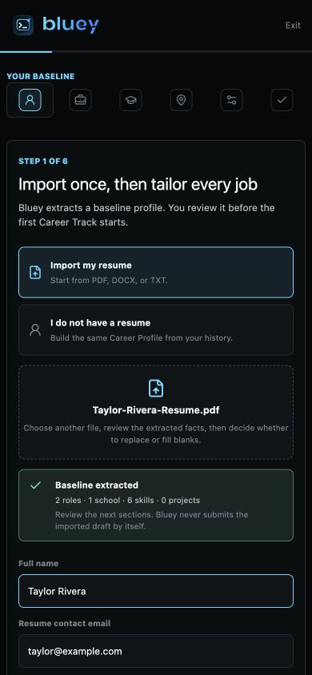
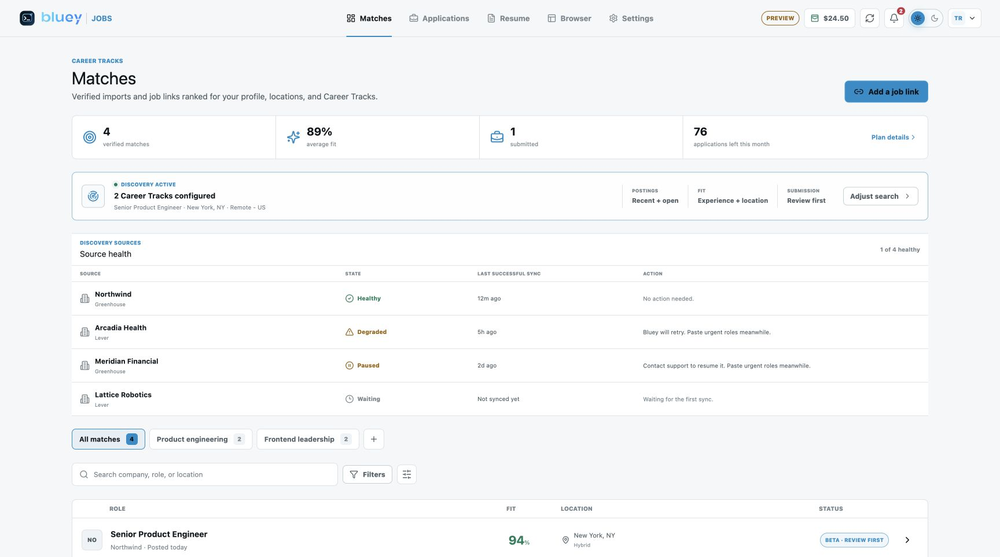
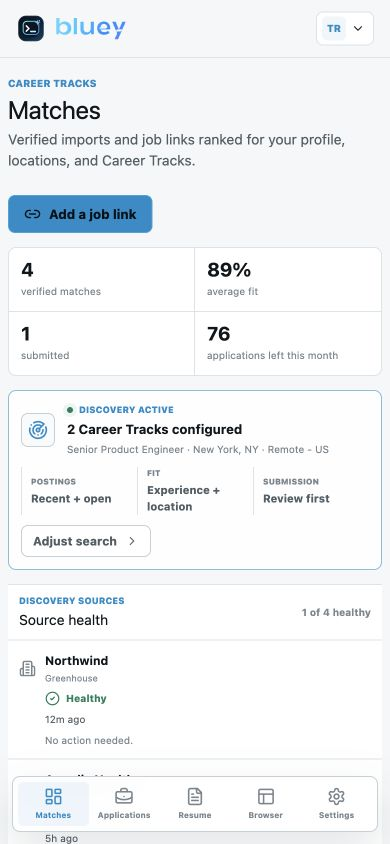

# Round 539 - Jobs resume parser, location, role, and match policy

Date: 2026-07-17

Status: implementation and predeployment verification complete

Repository: `/Users/uno/Downloads/cue-round536-mainline-refactor`

## Objective

Make the Bluey Jobs baseline setup reliable for real candidate resumes and remove
search controls that should be owned by Bluey. The work covers the seven reported
problems together: employment extraction, nationwide location suggestions,
skills/certification presentation, canonical target roles, experience-aware search,
server-owned pace and thresholds, and a truthful Matches activation flow.

This round changes only the Jobs portal, Jobs data/policy layer, tests, and committed
Jobs browser bundle. It does not change the Bluey meeting overlay, native audio,
signed desktop release, or main Bluey answer runtime.

## Candidate experience

### Resume import

- Company-first headings such as `Company, Software Engineer` now populate Company
  and Title separately.
- Title-first international headings such as
  `Director of Clinical Operations, Hyderabad, India` now retain the title and move
  the city/country into Location.
- Wrapped certification levels such as `Professional` and `Specialty` are joined to
  the certification above instead of becoming separate certifications.
- Imported facts remain an editable baseline. Bluey does not submit an imported
  draft by itself.

### Locations

The typeahead now lazy-loads a committed 2025 United States Census Gazetteer data
set. It contains 32,238 suggestions covering incorporated places, Census-designated
places, full state/territory names, and abbreviations. Existing resume and profile
locations remain first in the suggestion order.

Source:

`https://www2.census.gov/geo/docs/maps-data/data/gazetteer/2025_Gazetteer/2025_Gaz_place_national.zip`

The generated artifact is `jobs/portal/public/us-locations.json`, produced by
`scripts/generate-jobs-us-locations.mjs`. The same artifact is published under
`web/jobs/us-locations.json` and fetched only when a location field is focused.

### Roles and seniority

- Target-role suggestions use full role families rather than resume headings with
  seniority embedded in them.
- Common aliases normalize on input and save: `SWE` and `SDE` become
  `Software Engineer`; `PM` becomes `Product Manager`; equivalent mappings cover
  frontend, backend, full stack, DevOps, SRE, data engineering, machine learning,
  QA, technical product management, CRA, and CRC.
- A role not in the curated list can still be entered and is stored for that Career
  Track. Existing custom roles are not discarded.
- Resume job titles keep their original seniority. Canonicalization applies only to
  target role families and Career Track search policy.

Bluey derives completed experience from non-overlapping employment months. A role
is eligible when its explicit or inferred experience requirement overlaps the
candidate's current completed experience range: one year below through two years
above. Jobs outside that range are hard-filtered server-side instead of being shown
as attractive matches.

### Skills and certifications

- Skills remain removable chips, show the total count, and collapse after twelve
  entries with a clear `more`/`show less` control.
- Certifications use full-width rows so long credential names stay readable.
- Both fields use icon controls with accessible remove labels and keep typeahead
  suggestions available.

### Bluey-owned search policy

Candidates no longer edit `Applications per day`, `Auto-submit threshold`, or job
freshness. The current server-owned policy is:

- recent, open postings no older than 14 days;
- experience fit from one year below to two years above completed experience;
- at most 10 application attempts per day; and
- 80 percent as the internal auto-submit eligibility threshold.

The onboarding and Settings UI explain the policy but do not present editable
numeric controls. The server overwrites client-supplied values with the same policy
and enforces the hard filters when a match is created, prepared, or queued.

Review first remains the product default. The threshold is not represented as a
promise that a runner will submit before the packet has passed all hard filters and
review gates.

## Matches behavior

Matches no longer claims that discovery is active merely because a Career Track
exists.

- `Discovery active` appears only when at least one configured source is healthy.
- Waiting, degraded, and paused sources remain visible with their real state.
- If no source is configured, Bluey says so and offers the truthful immediate path:
  paste a job link.
- The empty state shows the activation sequence:
  `Verify posting -> Hard filters -> Rank fit -> Review kit`.
- Once a source produces verified jobs, the same view ranks them by role,
  experience, location, and the other server-owned eligibility rules.

There is no manufactured match data and no background-search claim when production
discovery credentials are absent.

## Supplied resume verification

Two owner-authorized local documents were tested through the real browser import
path. Their files and private contents were not copied into source control.

### DOCX clinical resume

Observed extraction after this change:

- five employment records with company, title, dates, and international/US
  locations separated correctly;
- one education record;
- 41 skills; and
- five certifications, including wrapped AWS level names joined correctly.

### PDF software resume

Observed extraction after this change:

- three employment records with company/title/location separated correctly;
- two education records;
- 26 skills; and
- three projects.

Both imports completed all six onboarding steps and entered Matches without being
returned to step one.

## Visual verification

All committed screenshots use synthetic preview data.

### Mobile onboarding, dark theme



### Desktop Matches, light theme



### Mobile Matches, light theme



Desktop and 390 by 844 mobile checks confirmed readable fields, stable chips,
single-column policy cards, usable bottom navigation, and no horizontal overflow.

## Verification

```text
Jobs portal tests             10 files, 45 tests passed
Jobs portal typecheck         passed
Jobs portal production build  passed, 2,281 modules transformed
Jobs database tests           39 passed
Jobs server strict Clippy      passed with -D warnings
Location data test            32,238 records and national spot checks passed
git diff --check              passed
Published source maps         none
```

Focused server tests cover experience derivation, eligibility blocking, atomic
daily attempt limits, canonical job deduplication, source-health gates, review-first
state transitions, and server-owned search pace.

## Deployment boundary

The portal bundle and Jobs API must be deployed from the same committed source.
Because `server/src/db/jobs.rs` changes eligibility and defaults, this is not a
static-only release. Deployment must:

1. reconcile this source onto the current `origin/main` without replacing concurrent
   answer-runtime work;
2. create a fresh PostgreSQL backup and binary/portal rollback snapshot;
3. build `bluey-jobs-api` from the exact source commit;
4. publish new hashed Jobs assets before atomically replacing `index.html`;
5. restart only `bluey-jobs-api`;
6. verify local and public health, auth boundaries, crawler controls, source-map
   404 behavior, and the signed-in onboarding/Matches flow; and
7. leave the main API, Caddy, Cloudflare, and signed native artifacts unchanged.

Production hashes, backup paths, live checks, and rollback evidence belong in the
following numbered deployment round after the exact source commit is known.
