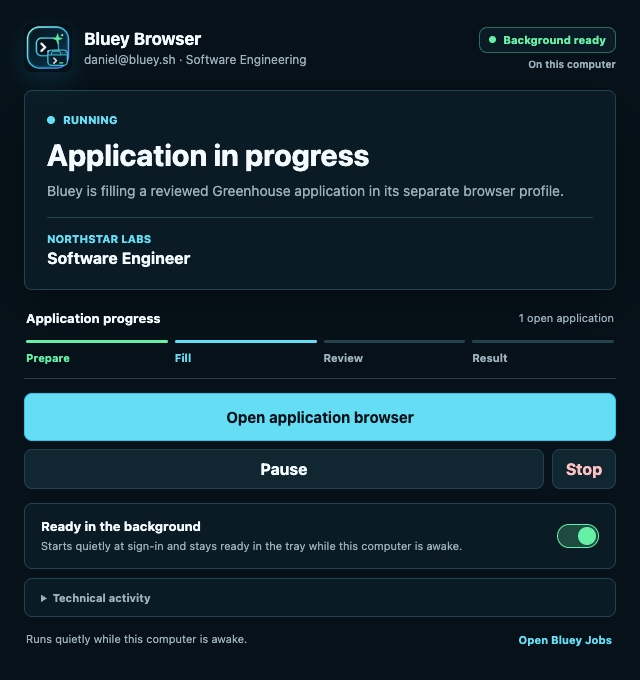
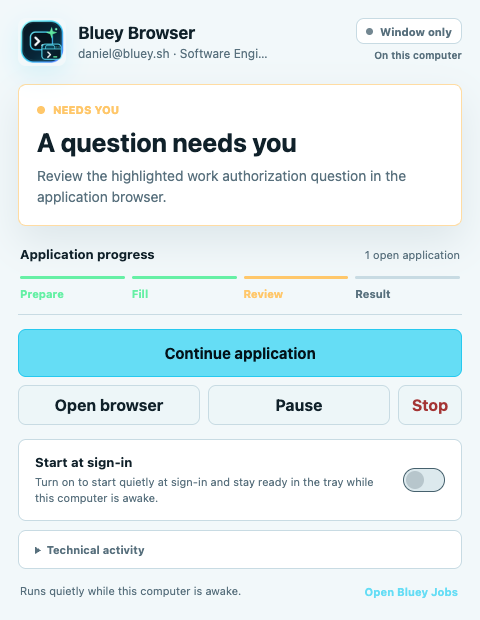

# Round 554: Bluey Browser Controller And Background Polish

Date: 2026-07-20

## Outcome

Bluey Browser now has a compact controller built around the existing Bluey
Browser platform icon. The controller presents one clear application state,
one primary next action, a short four-step progress view, and an explicit
background-readiness state. The same state is reflected in the operating-system
tray so users can act without reopening the full window.

This round changes the local Browser shell and presentation only. It does not
enable employer-facing automation, local Browser distribution, cloud Browser
distribution, or model generation. The existing meeting overlay, audio,
desktop session behavior, Jobs portal, Jobs API, and discovery worker are
untouched.

## Product Changes

The controller now provides:

- a crisp Bluey Browser logo and compact brand lockup;
- a visible `Background ready` or `Window only` state;
- direct language that local background work continues only while the computer
  is awake;
- one primary next action without repeating the same browser command below it;
- a compact progress strip for Prepare, Fill, Review, and Result;
- clear running, intervention, paused, completed, offline, and unknown-result
  states;
- polished light and dark themes with stable dimensions and no decorative
  gradients;
- an expandable technical-activity section that stays out of the main flow.

The tray now provides:

- current Bluey Browser status in both the tooltip and menu;
- Show controller;
- Open current application when a browser run exists;
- Pause or Resume applications;
- Keep ready in background;
- Open Bluey Jobs;
- Quit Bluey Browser.

The background preference remains opt-in. On packaged macOS and Windows builds,
turning it on synchronizes the operating-system login item and makes closing the
window hide Bluey Browser to the tray. Turning it off removes that login item
and restores quit-on-close behavior. Linux keeps explicit close-to-tray support
without claiming managed start-at-sign-in.

## Safety And Truth Boundaries

Local Bluey Browser can stay ready after its controller window is hidden. It
cannot work while the computer is asleep or off. New local work is admitted
only while the machine is awake, online, and unlocked. A protected final-submit
reconciliation is never interrupted merely because the window is hidden.

The controller renderer remains sandboxed and receives only sanitized display
state through the action-only preload bridge. It does not receive application
answers, resume contents, credentials, claim tickets, scoped capabilities, or
other employer-facing packet data.

## Visual Evidence

Dark running state at 640 by 680:

Light intervention state at 480 by 620:

The screenshots use synthetic company, role, identity, and activity labels. No
real account or application data is present.

## Verification

Passed locally:

- Browser TypeScript typecheck;
- 100 Browser tests across 26 files;
- production Browser renderer build;
- controller copy and background-state tests;
- tray status and action-state tests;
- renderer CSP, sandbox, accessible-logo, and background-switch checks;
- 640 by 680 dark-mode visual check;
- 480 by 620 light-mode visual check;
- `git diff --check`.

Screenshot SHA-256 values:

- running dark:
  `a1752b4f0c7f3f29ab3da2c812f662b6e06d44a52e5a380f96bd2eb990054ff3`;
- intervention light:
  `7c6d87f9dd924670c740df1914a07ec4595781c866236bf38f786935b51fdf89`.

## Release Boundary

Bluey Browser remains test-only and undistributed. This source change is ready
for mainline review, but it does not alter the three production Jobs feature
flags and does not publish a Browser installer. Packaging, physical Windows
verification, signing, runtime certification, and a deliberate distribution
decision remain separate release gates.
